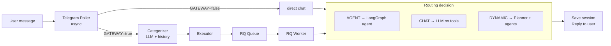

# CLAUDE.md

This file provides guidance to Claude Code (claude.ai/code) when working with code in this repository.

## Project Overview

Telegram Bot that bridges Telegram messaging with LLM providers via LangChain. Supports OpenAI, Anthropic, and any OpenAI-compatible endpoint (Venice.ai, Ollama, etc.). Uses FastAPI + RQ for background task processing with Redis.

**Architecture Flow:**


## Commands

### Run the Application

**Terminal 1 - Start Redis:**
```bash
# macOS: brew services start redis
# Linux: sudo systemctl start redis
redis-cli ping  # Should return PONG
```

**Terminal 2 - Start RQ Worker:**
```bash
source .venv/bin/activate
rq worker high default low browser
```

**Terminal 3 - Start Telegram Bot:**
```bash
source .venv/bin/activate
python -m app.main
```

**Optional - RQ Dashboard (monitoring):**
```bash
rq-dashboard  # Opens at http://localhost:9181
```

### Setup
```bash
python3 -m venv .venv
source .venv/bin/activate
pip install -r requirements.txt
cp .env.example .env
# Edit .env with your TELEGRAM_BOT_TOKEN, ALLOWED_USER_IDS, and LLM settings
```

## Code Architecture

```
app/
├── __init__.py
├── main.py              # Entry point - starts poller + optional API
├── config.py            # Pydantic settings
├── bot/
│   ├── poller.py        # Telegram polling (python-telegram-bot)
│   └── handlers.py      # Command & message handlers
├── gateway/             # Gateway for agent routing
│   ├── __init__.py
│   ├── router.py        # Route dataclasses + categorizer output parser
│   ├── planner.py       # LLM-based dynamic planning
│   ├── executor.py      # Enqueue tasks to RQ
│   └── confirmation.py  # Redis-backed confirmations
├── agents/              # LangGraph agent definitions
│   ├── __init__.py
│   ├── base.py          # Agent factory (LangGraph react agents + AgentWrapper)
│   ├── system_agent.py  # Shell, file, process tools
│   ├── browser_agent.py # Playwright browser tools
│   ├── search_agent.py  # Web search via SearXNG
│   └── research_agent.py# Analysis and summarization
├── tools/               # LangChain tool definitions
│   ├── __init__.py
│   ├── system.py        # shell_execute, file_read/write, disk_usage, etc.
│   ├── browser.py       # navigate, screenshot, click, type, get_page_text
│   ├── search.py        # web_search, web_search_news, web_search_images (SearXNG)
│   └── research.py      # analyze_text, compare_items
├── api/                 # Optional - for future web UI
│   ├── health.py        # Health check endpoints
│   └── sessions.py      # REST API for sessions
├── services/
│   ├── telegram.py      # Bot API client (sync, for workers)
│   ├── llm.py           # LangChain LLM factory + service
│   ├── sessions.py      # Session logic
│   └── tokens.py        # Token counting
├── models/
│   ├── database.py      # Database models
│   └── schemas.py       # Pydantic schemas
├── db/
│   └── repository.py    # Data access layer
└── tasks/
    ├── queues.py        # RQ queue definitions
    ├── chat.py          # Chat processing tasks
    ├── categorizer.py   # LangChain-based message categorization
    └── agent_tasks.py   # LangGraph agent execution tasks
```

### Key Components

- **app/config.py** - Pydantic settings loaded from `.env`
- **app/bot/handlers.py** - Telegram command handlers (`/start`, `/clear`, `/stats`, `/context`, `/pending`, `/confirm_*`, `/cancel_*`)
- **app/bot/poller.py** - Telegram polling setup
- **app/services/llm.py** - LangChain LLM factory (`create_llm()`) and `LLMService` wrapper
- **app/gateway/router.py** - Route dataclasses (`ExecutionStrategy`, `RouteResult`) and `parse_categorizer_output()` helper
- **app/gateway/planner.py** - LLM-based dynamic planning for complex tasks
- **app/gateway/executor.py** - Enqueues tasks to appropriate RQ queues
- **app/gateway/confirmation.py** - Redis-backed confirmation for sensitive actions
- **app/services/sessions.py** - Session management with compression
- **app/tasks/categorizer.py** - LangChain categorizer: invokes LLM with system prompt + conversation context, parses result, enqueues execution
- **app/tasks/chat.py** - Background tasks for RQ workers
- **app/tasks/agent_tasks.py** - LangGraph agent execution (system, browser, research agents)
- **app/agents/base.py** - Creates LangGraph react agents via `AgentWrapper` (wraps `langgraph.prebuilt.create_react_agent`)

### Gateway Routing

When `GATEWAY_ENABLED=true`, messages are classified by a LangChain LLM categorizer with conversation context:

1. Handler enqueues `categorize_and_execute` task on the `high` queue
2. RQ worker loads recent conversation history from SQLite
3. Invokes LLM with categorizer system prompt + context
4. Parses JSON output into a `RouteResult`
5. Enqueues the real execution task via `Executor.execute()`

| Strategy | Description | Example |
|----------|-------------|---------|
| **AGENT** | Direct agent tasks | "run df", "go to google.com", "search for X", "analyze this" |
| **DYNAMIC_PLAN** | Complex multi-step tasks | "find houses and compare them" |
| **CHAT** | Everything else | Regular conversation |

The LLM also determines if confirmation is needed (buy, delete, send, install, reboot).

### RQ Queues

- `high` - Commands, categorization (fast processing)
- `default` - Normal chat messages, agent tasks
- `low` - Compression, cleanup tasks
- `browser` - Browser agent tasks (single worker for Playwright)

## Key Technical Details

- Uses LangChain for LLM interactions (chat, categorization, planning)
- Uses LangGraph for agent execution (`langgraph.prebuilt.create_react_agent`)
- Supports multiple LLM providers: OpenAI, Anthropic, OpenAI-compatible (Venice.ai, Ollama, etc.)
- Agents receive conversation history from SQLite for context continuity
- Agent responses are saved back to the session for cross-strategy context
- Categorizer receives recent history to correctly route follow-up messages
- All messages processed via RQ workers for consistent architecture
- Automatic conversation compression when tokens exceed threshold
- SQLite for session persistence (`sessions.db`)
- Redis for task queue (`localhost:6379`)

## Configuration

Key environment variables (see `.env.example`):

```bash
# Required
TELEGRAM_BOT_TOKEN=your_bot_token
ALLOWED_USER_IDS=123456789  # Comma-separated

# LLM (choose provider)
LLM_PROVIDER=openai_compatible  # openai, anthropic, openai_compatible
LLM_MODEL=your-model-name
LLM_API_KEY=your_api_key
LLM_BASE_URL=http://127.0.0.1:8000/v1  # For openai_compatible
LLM_TEMPERATURE=0.7

# Optional: cheaper model for categorization
CATEGORIZER_MODEL=

# Redis
REDIS_HOST=localhost
REDIS_PORT=6379

# Task settings
JOB_TIMEOUT=300  # 5 minutes

# Gateway settings
GATEWAY_ENABLED=true                    # Enable agent routing
CONFIRMATION_TIMEOUT_MINUTES=5          # Confirmation expiry
CHROME_PROFILE_PATH=~/.config/agent-chrome-profile
BROWSER_HEADLESS=true

# Optional API
API_ENABLED=false
API_PORT=8080

# SearXNG (for web search)
SEARXNG_BASE_URL=http://localhost:8888
```

## Platform REST API

The `platform/` directory contains a Django project with a django-ninja REST API at `/api/v1/`.

### API Structure

```
platform/apps/workflows/api/
├── __init__.py      # NinjaAPI instance + router wiring
├── auth.py          # Bearer token auth backend
├── auth_views.py    # POST /auth/token/ endpoint
├── schemas.py       # Pydantic in/out schemas
├── workflows.py     # Workflow CRUD router
├── nodes.py         # Node + Edge CRUD (nested under workflow)
├── triggers.py      # Trigger CRUD (nested under workflow)
├── executions.py    # Execution list/detail/cancel
└── credentials.py   # Credential CRUD + LLM provider/model list
```

### API Endpoints

All under `/api/v1/`, authenticated via Bearer token (`Authorization: Bearer <key>`).

- **Auth** — `POST /auth/token/` (obtain Bearer token), `GET /auth/me/` (current user)
- **Workflows** — `GET/POST /workflows/`, `GET/PATCH/DELETE /workflows/{slug}/`
- **Nodes** — `GET/POST /workflows/{slug}/nodes/`, `PATCH/DELETE /workflows/{slug}/nodes/{node_id}/`
- **Edges** — `GET/POST /workflows/{slug}/edges/`, `PATCH/DELETE /workflows/{slug}/edges/{id}/`
- **Triggers** — `GET/POST /workflows/{slug}/triggers/`, `PATCH/DELETE /workflows/{slug}/triggers/{id}/`
- **Executions** — `GET /executions/`, `GET /executions/{id}/`, `POST /executions/{id}/cancel/`
- **Credentials** — `GET/POST /credentials/`, `GET/PATCH/DELETE /credentials/{id}/`
- **LLM Providers** — `GET /credentials/llm-providers/`
- **LLM Models** — `GET /credentials/llm-models/?provider_id=`

### Platform Model Design

**Credentials** are global — any user on the machine can use any credential. The `user_profile` FK on `BaseCredentials` tracks who created it, not ownership.

**Trigger credentials:** Each `WorkflowTrigger` has an optional `credential` FK to `BaseCredentials`. This is how triggers (Telegram, email, webhooks, etc.) reference their integration credentials. Bot token resolution for delivery goes through `execution.trigger.credential.telegram_credential.bot_token`.

**LLM resolution:** LLM configuration lives entirely on `ComponentConfig` (per-node). Each agent-type node must have both `llm_model` and `llm_credential` set on its config. There are no workflow-level LLM defaults.

**Trigger-scoped execution:** When a trigger fires, the builder only compiles nodes reachable downstream from that trigger (BFS over direct edges). Unconnected nodes on the same canvas are ignored. This allows a single workflow to have multiple trigger branches and unused nodes without causing build errors. The `trigger_node_id` FK on `WorkflowExecution` is passed through the cache and builder.

**Enum-typed API schemas:** `component_type`, `trigger_type`, and `edge_type` fields use `Literal` types in Pydantic schemas for validation, backed by Django `TextChoices` on the model side.

### Running Platform Tests

```bash
cd platform
source ../.venv/bin/activate
export FIELD_ENCRYPTION_KEY=$(python -c "from cryptography.fernet import Fernet; print(Fernet.generate_key().decode())")
python -m pytest tests/ -v
```

## React Frontend

The `platform/frontend/` directory contains a React SPA for managing workflows visually.

**Stack:** React + Vite + TypeScript, Shadcn/ui, @xyflow/react (React Flow v12), TanStack Query, React Router

### Frontend Structure

```
platform/frontend/src/
├── api/                    # TanStack Query hooks + fetch client
│   ├── client.ts           # Bearer token injection, 401 redirect
│   ├── auth.ts             # login(), fetchMe() → token + user info
│   ├── workflows.ts        # useWorkflows(), useCreateWorkflow(), etc.
│   ├── nodes.ts            # useCreateNode(), useUpdateNode(), useDeleteNode()
│   ├── edges.ts            # useCreateEdge(), useUpdateEdge(), useDeleteEdge()
│   ├── triggers.ts         # useCreateTrigger(), useDeleteTrigger()
│   ├── executions.ts       # useExecutions(), useExecution() (auto-refresh)
│   └── credentials.ts      # useCredentials(), useLLMModels(), useLLMProviders()
├── components/
│   ├── ui/                 # Shadcn components (auto-generated)
│   └── layout/
│       ├── AppLayout.tsx   # Collapsible sidebar + user menu
│       └── ProtectedRoute.tsx
├── features/
│   ├── auth/               # AuthProvider, LoginPage
│   ├── workflows/
│   │   ├── DashboardPage.tsx          # Workflow list table + create/delete
│   │   ├── WorkflowEditorPage.tsx     # Three-panel editor layout
│   │   └── components/
│   │       ├── WorkflowCanvas.tsx     # React Flow canvas with custom nodes
│   │       ├── NodePalette.tsx        # Click-to-add node types
│   │       └── NodeDetailsPanel.tsx   # Right sidebar config form
│   ├── credentials/        # CredentialsPage (table + create dialog)
│   ├── executions/         # ExecutionsPage, ExecutionDetailPage
│   └── settings/           # SettingsPage (theme selector)
├── hooks/
│   └── useTheme.ts         # Dark mode hook (system/light/dark, persisted to localStorage)
├── types/models.ts         # TS types mirroring Django schemas
├── App.tsx                 # Routes
└── main.tsx                # QueryClient + AuthProvider + Router
```

### Running the Frontend

```bash
cd platform/frontend
npm install
npm run dev          # Dev server (proxies /api to Django at :8000)
npm run build        # Production build to dist/ (served by Django)
```

In development, run Vite alongside Django. Without Vite, run `npm run build` and access via Django directly.

### Frontend Routes

| Route | Page |
|-------|------|
| `/login` | Login form |
| `/` | Workflow dashboard (list) |
| `/workflows/:slug` | Workflow editor (canvas) |
| `/credentials` | Credentials management |
| `/executions` | Execution list |
| `/executions/:id` | Execution detail + logs |
| `/settings` | Settings (appearance/theme) |

### Workflow Node Visual Design

Nodes on the canvas use Font Awesome icons and color-coded borders by component type.

**Node handle layout:**
- **Left handle** (circle): target/input connection
- **Right handle** (circle): source/output connection
- **Bottom handles** (diamond): sub-component connections (model, tools, memory, output_parser)
- **Top handle** (diamond, `ai_model` only): source connection to other nodes

**Trigger nodes** strip the `trigger_` prefix in display (e.g., `trigger_telegram` shows as `telegram`). All trigger nodes share orange (`#f97316`) borders. Node labels strip the `<component_type>_` prefix to show only the hash/suffix.

**AI-type nodes** (`simple_agent`, `planner_agent`, `categorizer`, `router`, `extractor`) have fixed 250px width with a separator line and bottom sub-component pills:

| Node | model | tools | memory | output_parser |
|------|-------|-------|--------|---------------|
| simple_agent | yes | yes | yes | no |
| planner_agent | yes | yes | yes | no |
| categorizer | yes | no | yes | yes |
| router | yes | no | yes | yes |
| extractor | yes | no | yes | yes |

**Sub-component handle colors:**
- model: `#3b82f6` (blue)
- tools: `#10b981` (green)
- memory: `#f59e0b` (amber)
- output_parser: `#94a3b8` (slate)

**`ai_model` node** has only a top diamond handle (source) — it connects upward to nodes that need a model.

## Documentation

- `docs/dev_plan_gateway.md` - Gateway architecture plan and roadmap
- `docs/dev_plan_gui.md` - React GUI implementation plan (completed)
