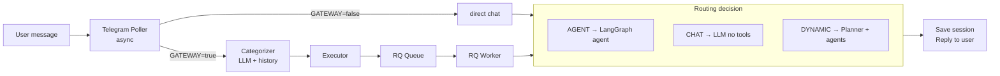

# CLAUDE.md

This file provides guidance to Claude Code (claude.ai/code) when working with code in this repository.

## Project Overview

Telegram Bot that bridges Telegram messaging with LLM providers via LangChain. Supports OpenAI, Anthropic, and any OpenAI-compatible endpoint (Venice.ai, Ollama, etc.). Uses FastAPI + RQ for background task processing with Redis.

**Architecture Flow:**


## Commands

### Run the Application

**Terminal 1 - Start Redis:**
```bash
# macOS: brew services start redis
# Linux: sudo systemctl start redis
redis-cli ping  # Should return PONG
```

**Terminal 2 - Start RQ Worker:**
```bash
source .venv/bin/activate
rq worker high default low browser
```

**Terminal 3 - Start Telegram Bot:**
```bash
source .venv/bin/activate
python -m app.main
```

**Optional - RQ Dashboard (monitoring):**
```bash
rq-dashboard  # Opens at http://localhost:9181
```

### Setup
```bash
python3 -m venv .venv
source .venv/bin/activate
pip install -r requirements.txt
cp .env.example .env
# Edit .env with your TELEGRAM_BOT_TOKEN, ALLOWED_USER_IDS, and LLM settings
```

## Code Architecture

```
app/
├── __init__.py
├── main.py              # Entry point - starts poller + optional API
├── config.py            # Pydantic settings
├── bot/
│   ├── poller.py        # Telegram polling (python-telegram-bot)
│   └── handlers.py      # Command & message handlers
├── gateway/             # Gateway for agent routing
│   ├── __init__.py
│   ├── router.py        # Route dataclasses + categorizer output parser
│   ├── planner.py       # LLM-based dynamic planning
│   ├── executor.py      # Enqueue tasks to RQ
│   └── confirmation.py  # Redis-backed confirmations
├── agents/              # LangGraph agent definitions
│   ├── __init__.py
│   ├── base.py          # Agent factory (LangGraph react agents + AgentWrapper)
│   ├── system_agent.py  # Shell, file, process tools
│   ├── browser_agent.py # Playwright browser tools
│   ├── search_agent.py  # Web search via SearXNG
│   └── research_agent.py# Analysis and summarization
├── tools/               # LangChain tool definitions
│   ├── __init__.py
│   ├── system.py        # shell_execute, file_read/write, disk_usage, etc.
│   ├── browser.py       # navigate, screenshot, click, type, get_page_text
│   ├── search.py        # web_search, web_search_news, web_search_images (SearXNG)
│   └── research.py      # analyze_text, compare_items
├── api/                 # Optional - for future web UI
│   ├── health.py        # Health check endpoints
│   └── sessions.py      # REST API for sessions
├── services/
│   ├── telegram.py      # Bot API client (sync, for workers)
│   ├── llm.py           # LangChain LLM factory + service
│   ├── sessions.py      # Session logic
│   └── tokens.py        # Token counting
├── models/
│   ├── database.py      # Database models
│   └── schemas.py       # Pydantic schemas
├── db/
│   └── repository.py    # Data access layer
└── tasks/
    ├── queues.py        # RQ queue definitions
    ├── chat.py          # Chat processing tasks
    ├── categorizer.py   # LangChain-based message categorization
    └── agent_tasks.py   # LangGraph agent execution tasks
```

### Key Components

- **app/config.py** - Pydantic settings loaded from `.env`
- **app/bot/handlers.py** - Telegram command handlers (`/start`, `/clear`, `/stats`, `/context`, `/pending`, `/confirm_*`, `/cancel_*`)
- **app/bot/poller.py** - Telegram polling setup
- **app/services/llm.py** - LangChain LLM factory (`create_llm()`) and `LLMService` wrapper
- **app/gateway/router.py** - Route dataclasses (`ExecutionStrategy`, `RouteResult`) and `parse_categorizer_output()` helper
- **app/gateway/planner.py** - LLM-based dynamic planning for complex tasks
- **app/gateway/executor.py** - Enqueues tasks to appropriate RQ queues
- **app/gateway/confirmation.py** - Redis-backed confirmation for sensitive actions
- **app/services/sessions.py** - Session management with compression
- **app/tasks/categorizer.py** - LangChain categorizer: invokes LLM with system prompt + conversation context, parses result, enqueues execution
- **app/tasks/chat.py** - Background tasks for RQ workers
- **app/tasks/agent_tasks.py** - LangGraph agent execution (system, browser, research agents)
- **app/agents/base.py** - Creates LangGraph react agents via `AgentWrapper` (wraps `langgraph.prebuilt.create_react_agent`)

### Gateway Routing

When `GATEWAY_ENABLED=true`, messages are classified by a LangChain LLM categorizer with conversation context:

1. Handler enqueues `categorize_and_execute` task on the `high` queue
2. RQ worker loads recent conversation history from SQLite
3. Invokes LLM with categorizer system prompt + context
4. Parses JSON output into a `RouteResult`
5. Enqueues the real execution task via `Executor.execute()`

| Strategy | Description | Example |
|----------|-------------|---------|
| **AGENT** | Direct agent tasks | "run df", "go to google.com", "search for X", "analyze this" |
| **DYNAMIC_PLAN** | Complex multi-step tasks | "find houses and compare them" |
| **CHAT** | Everything else | Regular conversation |

The LLM also determines if confirmation is needed (buy, delete, send, install, reboot).

### RQ Queues

- `high` - Commands, categorization (fast processing)
- `default` - Normal chat messages, agent tasks
- `low` - Compression, cleanup tasks
- `browser` - Browser agent tasks (single worker for Playwright)

## Key Technical Details

- Uses LangChain for LLM interactions (chat, categorization, planning)
- Uses LangGraph for agent execution (`langgraph.prebuilt.create_react_agent`)
- Supports multiple LLM providers: OpenAI, Anthropic, OpenAI-compatible (Venice.ai, Ollama, etc.)
- Agents receive conversation history from SQLite for context continuity
- Agent responses are saved back to the session for cross-strategy context
- Categorizer receives recent history to correctly route follow-up messages
- All messages processed via RQ workers for consistent architecture
- Automatic conversation compression when tokens exceed threshold
- SQLite for session persistence (`sessions.db`)
- Redis for task queue (`localhost:6379`)

## Configuration

Key environment variables (see `.env.example`):

```bash
# Required
TELEGRAM_BOT_TOKEN=your_bot_token
ALLOWED_USER_IDS=123456789  # Comma-separated

# LLM (choose provider)
LLM_PROVIDER=openai_compatible  # openai, anthropic, openai_compatible
LLM_MODEL=your-model-name
LLM_API_KEY=your_api_key
LLM_BASE_URL=http://127.0.0.1:8000/v1  # For openai_compatible
LLM_TEMPERATURE=0.7

# Optional: cheaper model for categorization
CATEGORIZER_MODEL=

# Redis
REDIS_HOST=localhost
REDIS_PORT=6379

# Task settings
JOB_TIMEOUT=300  # 5 minutes

# Gateway settings
GATEWAY_ENABLED=true                    # Enable agent routing
CONFIRMATION_TIMEOUT_MINUTES=5          # Confirmation expiry
CHROME_PROFILE_PATH=~/.config/agent-chrome-profile
BROWSER_HEADLESS=true

# Optional API
API_ENABLED=false
API_PORT=8080

# SearXNG (for web search)
SEARXNG_BASE_URL=http://localhost:8888
```

## Platform REST API

The `platform/` directory contains a FastAPI application with SQLAlchemy ORM and Alembic migrations.

**Stack:** FastAPI, SQLAlchemy 2.0, Alembic, Pydantic, RQ (Redis Queue), Uvicorn

### Platform Structure

```
platform/
├── main.py              # FastAPI app entry point (routers, CORS, static files)
├── config.py            # Pydantic Settings (DATABASE_URL, REDIS_URL, etc.)
├── database.py          # SQLAlchemy engine + SessionLocal + get_db()
├── auth.py              # Bearer token auth dependency (HTTPBearer → UserProfile)
├── api/                 # REST endpoint routers
│   ├── auth.py          # POST /token/, GET /me/, POST /setup/
│   ├── workflows.py     # Workflow CRUD + GET /node-types/ + POST /validate/
│   ├── nodes.py         # Node + Edge CRUD (nested under workflow)
│   ├── executions.py    # Execution list/detail/cancel + chat
│   ├── credentials.py   # Credential CRUD + test + LLM models
│   └── _helpers.py      # Response serialization helpers
├── models/              # SQLAlchemy ORM models
│   ├── user.py          # UserProfile, APIKey
│   ├── credential.py    # BaseCredential, LLMProviderCredential, TelegramCredential, etc.
│   ├── workflow.py      # Workflow, WorkflowCollaborator
│   ├── node.py          # WorkflowNode, WorkflowEdge, ComponentConfig hierarchy
│   ├── execution.py     # WorkflowExecution, ExecutionLog, PendingTask
│   ├── conversation.py  # Conversation
│   ├── tool.py          # ToolDefinition, WorkflowTool
│   ├── code.py          # CodeBlock, CodeBlockVersion, CodeBlockTest
│   └── git.py           # GitRepository, GitCommit, GitSyncTask
├── schemas/             # Pydantic schemas
│   ├── node_io.py       # NodeStatus, NodeResult, NodeInput
│   ├── node_types.py    # DataType, PortDefinition, NodeTypeSpec, NODE_TYPE_REGISTRY
│   └── node_type_defs.py# Registers all 23 built-in node types
├── services/            # Business logic
│   ├── orchestrator.py  # Node execution, state management, WebSocket events
│   ├── topology.py      # Workflow DAG analysis (BFS reachability)
│   ├── builder.py       # Compiles Workflow → LangGraph CompiledGraph
│   ├── executor.py      # WorkflowExecutor + RQ job wrappers
│   ├── expressions.py   # Jinja2 template resolver for node config
│   ├── cache.py         # Redis-backed graph caching
│   ├── delivery.py      # Routes results to Telegram, webhooks, etc.
│   ├── llm.py           # create_llm_from_db(), resolve_llm_for_node()
│   └── state.py         # WorkflowState (LangGraph MessagesState)
├── handlers/            # Event/trigger handlers
│   ├── __init__.py      # dispatch_event() - unified trigger dispatch
│   ├── telegram.py      # TelegramTriggerHandler
│   ├── webhook.py       # Incoming webhook endpoint
│   └── manual.py        # Manual execution endpoint
├── components/          # LangGraph node component implementations (20 files)
├── tasks/               # RQ job wrappers
├── triggers/            # Trigger resolver
├── validation/          # EdgeValidator (type compatibility checks)
├── ws/                  # WebSocket endpoints + broadcast helper
├── alembic/             # Database migrations
└── frontend/            # React SPA
```

### Running the Platform

```bash
cd platform
source ../.venv/bin/activate
uvicorn main:app --host 0.0.0.0 --port 8000 --reload
```

### API Endpoints

All under `/api/v1/`, authenticated via Bearer token (`Authorization: Bearer <key>`).

- **Auth** — `POST /auth/token/`, `GET /auth/me/`, `GET /auth/setup-status/`, `POST /auth/setup/`
- **Workflows** — `GET/POST /workflows/`, `GET/PATCH/DELETE /workflows/{slug}/`, `POST /workflows/{slug}/validate/`, `GET /workflows/node-types/`
- **Nodes** — `GET/POST /workflows/{slug}/nodes/`, `PATCH/DELETE /workflows/{slug}/nodes/{node_id}/`
- **Edges** — `GET/POST /workflows/{slug}/edges/`, `PATCH/DELETE /workflows/{slug}/edges/{edge_id}/`
- **Executions** — `GET /executions/`, `GET /executions/{id}/`, `POST /executions/{id}/cancel/`, `POST /executions/batch-delete/`
- **Chat** — `POST /workflows/{slug}/chat/`, `DELETE /workflows/{slug}/chat/history`
- **Credentials** — `GET/POST /credentials/`, `GET/PATCH/DELETE /credentials/{id}/`, `POST /credentials/{id}/test/`, `GET /credentials/{id}/models/`, `POST /credentials/batch-delete/`
- **Memory** — `GET/POST /<type>/batch-delete/` for facts, episodes, procedures, users; `GET /checkpoints/`, `POST /checkpoints/batch-delete/`
- **Users** — `GET /users/agents/`, `POST /users/agents/batch-delete/`

**Pagination:** All list endpoints accept `limit` and `offset` query params and return `{"items": [...], "total": N}` instead of flat arrays. Default page size on the frontend is 50.

### Global WebSocket

A single persistent authenticated WebSocket at `GET /ws/?token=<api_key>` replaces per-execution WebSocket connections and GET-after-POST refetches.

**Backend files:**
- `platform/ws/global_ws.py` — WebSocket endpoint with Redis pub/sub fan-out, ping/pong heartbeat (30s), token auth on connect
- `platform/ws/broadcast.py` — Sync `broadcast(channel, event_type, data)` helper for publishing from API endpoints and RQ workers

**Subscription protocol:**
- Client sends `{"type":"subscribe","channel":"workflow:<slug>"}` or `execution:<id>`
- Client sends `{"type":"unsubscribe","channel":"..."}`
- Server sends `{"type":"subscribed/unsubscribed","channel":"..."}`
- Server sends `{"type":"ping"}`, client responds `{"type":"pong"}`

**Event types pushed via broadcast:**
- `node_created`, `node_updated`, `node_deleted` — from node API mutations
- `edge_created`, `edge_updated`, `edge_deleted` — from edge API mutations
- `workflow_updated` — from workflow API mutations
- `node_status` — per-node execution status (`pending`, `running`, `success`, `failed`, `skipped`) from orchestrator
- `execution_completed`, `execution_failed`, `execution_interrupted` — from orchestrator via Redis

**Frontend:**
- `platform/frontend/src/lib/wsManager.ts` — Singleton `WebSocketManager` with exponential backoff reconnection, auto-resubscribe, and TanStack Query cache updates (`setQueryData` for nodes/edges, `invalidateQueries` for executions)
- `platform/frontend/src/hooks/useWebSocket.ts` — `useWebSocket()` (connect on mount) and `useSubscription(channel)` (subscribe/unsubscribe reactively)
- Node/edge mutation hooks no longer use `onSuccess` query invalidation — updates arrive via WebSocket
- `useExecution()` no longer uses `refetchInterval` polling — updates arrive via WebSocket
- ChatPanel uses `wsManager.registerHandler()` for execution completion instead of per-execution WebSocket

### Platform Model Design

**Credentials** are global — any user on the machine can use any credential. The `user_profile` FK on `BaseCredential` tracks who created it, not ownership. Sensitive fields use `EncryptedString` (Fernet) via `FIELD_ENCRYPTION_KEY`.

**LLM resolution:** LLM configuration lives entirely on `ComponentConfig` (per-node). Each agent-type node must have both `llm_model` and `llm_credential` set on its config. There are no workflow-level LLM defaults. Resolution via `services/llm.py`: `resolve_llm_for_node()`.

**Trigger-scoped execution:** When a trigger fires, the builder only compiles nodes reachable downstream from that trigger (BFS over direct edges via `services/topology.py`). Unconnected nodes on the same canvas are ignored. This allows a single workflow to have multiple trigger branches and unused nodes without causing build errors.

**Agent conversation memory:** Agent nodes support optional `conversation_memory` (boolean in `extra_config`). When enabled, a `SqliteSaver` checkpointer (`platform/checkpoints.db`, lazy singleton) persists conversation history across executions. Thread ID is constructed from `user_profile_id`, `telegram_chat_id`, and `workflow_id` so the same user talking to the same workflow gets continuity. The system prompt is delivered via both `create_react_agent(prompt=SystemMessage(...))` (for the `system` role) and a `HumanMessage` fallback with a stable ID (for providers like Venice.ai that ignore the system role). The stable ID prevents duplication across checkpointer invocations via LangGraph's `add_messages` reducer. Toggle is exposed in the frontend's NodeDetailsPanel as "Conversation Memory" switch (agent nodes only).

**Enum-typed API schemas:** `component_type`, `trigger_type`, and `edge_type` fields use `Literal` types in Pydantic schemas for validation.

**Component output convention:** Components return flat dicts with their port values (e.g., `{"output": content}`, `{"category": cat, "raw": raw_text}`). The orchestrator wraps all non-underscore keys into `node_outputs[node_id]` automatically. Reserved underscore-prefixed keys control side effects:
- `_route` — sets `state["route"]` for conditional edge routing
- `_messages` — appended to `state["messages"]` (LangGraph message list)
- `_state_patch` — dict merged into global state (e.g., `{"user_context": {...}}`), excluding protected keys (`messages`, `node_outputs`, `node_results`)

Components no longer receive or use their own `node_id`. Legacy format (returning `node_outputs` directly) is still supported for backwards compatibility.

**Per-edge conditional routing:** Conditional edges carry a `condition_value` string field on each `WorkflowEdge` row (instead of the legacy `condition_mapping` dict on a single edge). Only `switch` nodes can originate conditional edges. The builder and orchestrator match `state["route"]` against each edge's `condition_value` to determine the next node. Legacy `condition_mapping` fallback is preserved.

**Jinja2 expression resolution:** Before executing a component, the orchestrator resolves `{{ nodeId.portName }}` template expressions in `system_prompt` and `extra_config` values via `services/expressions.py`. Context variables include all upstream `node_outputs` (keyed by node_id) and `trigger` (with `text`, `payload`). The `trigger` shorthand always refers to whichever trigger fired the current execution, useful in multi-trigger workflows (e.g., chat + telegram triggers feeding the same downstream nodes). Undefined variables gracefully fall back to the original template string. Jinja2 filters (e.g., `| upper`) are supported. The frontend `{ }` variable picker button (ExpressionTextarea) is available on System Prompt, Code Snippet, and Extra Config fields.

### Running Platform Tests

```bash
cd platform
source ../.venv/bin/activate
export FIELD_ENCRYPTION_KEY=$(python -c "from cryptography.fernet import Fernet; print(Fernet.generate_key().decode())")
python -m pytest tests/ -v
```

## React Frontend

The `platform/frontend/` directory contains a React SPA for managing workflows visually.

**Stack:** React + Vite + TypeScript, Shadcn/ui, @xyflow/react (React Flow v12), TanStack Query, React Router

### Frontend Structure

```
platform/frontend/src/
├── api/                    # TanStack Query hooks + fetch client
│   ├── client.ts           # Bearer token injection, 401 redirect
│   ├── auth.ts             # login(), fetchMe() → token + user info
│   ├── workflows.ts        # useWorkflows(), useCreateWorkflow(), etc.
│   ├── nodes.ts            # useCreateNode(), useUpdateNode(), useDeleteNode()
│   ├── edges.ts            # useCreateEdge(), useUpdateEdge(), useDeleteEdge()
│   ├── triggers.ts         # useCreateTrigger(), useDeleteTrigger()
│   ├── executions.ts       # useExecutions(), useExecution(), useBatchDeleteExecutions()
│   ├── credentials.ts      # useCredentials(), useLLMModels(), useLLMProviders(), useBatchDeleteCredentials()
│   ├── memory.ts           # useMemoryFacts/Episodes/Procedures/Users/Checkpoints(), batch delete hooks
│   ├── users.ts            # useAgentUsers(), useBatchDeleteAgentUsers()
│   └── chat.ts             # useSendChat(), useChatHistory(), useDeleteChatHistory()
├── components/
│   ├── ui/                 # Shadcn components (auto-generated, incl. checkbox, pagination-controls)
│   ├── ExpressionTextarea.tsx  # Textarea with { } button for inserting Jinja2 variable expressions
│   ├── VariablePicker.tsx      # Popover picker: BFS upstream nodes → clickable {{ nodeId.port }} items
│   └── layout/
│       ├── AppLayout.tsx   # Collapsible sidebar + user menu
│       └── ProtectedRoute.tsx
├── features/
│   ├── auth/               # AuthProvider, LoginPage
│   ├── workflows/
│   │   ├── DashboardPage.tsx          # Workflow list table + create/delete
│   │   ├── WorkflowEditorPage.tsx     # Three-panel editor layout
│   │   └── components/
│   │       ├── WorkflowCanvas.tsx     # React Flow canvas with custom nodes
│   │       ├── NodePalette.tsx        # Click-to-add node types
│   │       └── NodeDetailsPanel.tsx   # Right sidebar config form
│   ├── credentials/        # CredentialsPage (table + create dialog)
│   ├── executions/         # ExecutionsPage, ExecutionDetailPage (expandable log rows)
│   ├── memories/           # MemoriesPage (Facts, Episodes, Checkpoints, Procedures, Users tabs)
│   ├── users/              # AgentUsersPage (agent user management)
│   └── settings/           # SettingsPage (theme selector)
├── hooks/
│   ├── useTheme.ts         # Dark mode hook (system/light/dark, persisted to localStorage)
│   └── useWebSocket.ts     # useWebSocket() + useSubscription(channel) for global WS
├── lib/
│   └── wsManager.ts        # Singleton WebSocketManager (reconnect, subscribe, cache updates)
├── types/models.ts         # TS types mirroring API schemas
├── App.tsx                 # Routes
└── main.tsx                # QueryClient + AuthProvider + Router
```

### Running the Frontend

```bash
cd platform/frontend
npm install
npm run dev          # Dev server (proxies /api to FastAPI at :8000)
npm run build        # Production build to dist/ (served by FastAPI static mount)
```

In development, run Vite alongside FastAPI. Without Vite, run `npm run build` and access via FastAPI directly.

### Frontend Routes

| Route | Page |
|-------|------|
| `/login` | Login form |
| `/` | Workflow dashboard (list) |
| `/workflows/:slug` | Workflow editor (canvas) |
| `/credentials` | Credentials management |
| `/executions` | Execution list |
| `/executions/:id` | Execution detail + logs |
| `/memories` | Memory management (Facts, Episodes, Checkpoints, Procedures, Users) |
| `/agent-users` | Agent user management |
| `/settings` | Settings (appearance/theme) |

### Workflow Node Visual Design

Nodes on the canvas use Font Awesome icons and color-coded borders by component type.

**Node handle layout:**
- **Left handle** (circle): target/input connection
- **Right handle** (circle): source/output connection
- **Bottom handles** (diamond): sub-component connections (model, tools, memory, output_parser)
- **Top handle** (diamond, `ai_model` only): source connection to other nodes

**Trigger nodes** strip the `trigger_` prefix in display (e.g., `trigger_telegram` shows as `telegram`). All trigger nodes share orange (`#f97316`) borders. Node labels strip the `<component_type>_` prefix to show only the hash/suffix.

**AI-type nodes** (`agent`, `categorizer`, `router`, `extractor`) have fixed 250px width with a separator line and bottom sub-component pills:

| Node | model | tools | memory | output_parser |
|------|-------|-------|--------|---------------|
| agent | yes | yes | yes | no |
| categorizer | yes | no | yes | yes |
| router | yes | no | yes | yes |
| extractor | yes | no | yes | yes |

**Sub-component handle colors:**
- model: `#3b82f6` (blue)
- tools: `#10b981` (green)
- memory: `#f59e0b` (amber)
- output_parser: `#94a3b8` (slate)

**`ai_model` node** has only a top diamond handle (source) — it connects upward to nodes that need a model.

**Tool nodes** are sub-components that provide LangChain tools to agents:

| Tool Type | Description | Config (`extra_config`) |
|-----------|-------------|-------------------------|
| `run_command` | Execute shell commands | — |
| `http_request` | Make HTTP requests | `method`, `headers`, `timeout` |
| `web_search` | Search via SearXNG | `searxng_url` (required) |
| `calculator` | Evaluate math expressions | — |
| `datetime` | Get current date/time | `timezone` (optional) |

Tool nodes connect to agents via the **tools** handle (diamond, green). At build time, the agent queries `edge_label="tool"` edges, loads each connected tool node's factory, and registers the resulting LangChain `@tool` functions for LLM function calling. When the agent invokes a tool, WebSocket `node_status` events are published so the tool node shows running/success/failed badges on the canvas.

**Switch node** (`switch`): A flow-control node that evaluates rules against input data and routes to different downstream nodes via conditional edges. Each rule has a `field`, `operator`, and `value`; the first matching rule's `route` value is emitted as `_route`. Each conditional edge carries a `condition_value` matching one route. Falls back to a `default` route if no rules match. Listed in the "Routing" category in the NodePalette.

**Node output display:** After a successful execution, nodes that produced output show a clickable "output" link (emerald green) that opens a Popover with the pretty-printed JSON output. Failed nodes show a clickable "error" link (red) with error details and error_code. Node outputs are tracked via `node_status` WebSocket events with `status === "success"` and `data.output`, or `status === "failed"` and `data.error`/`data.error_code`.

**Execution log expansion:** On the ExecutionDetailPage, log rows with an `output` field show a chevron toggle that expands to reveal the full output (string or pretty-printed JSON) in a `<pre>` block.

### Node I/O Standardisation

Standardised schemas for node inputs/outputs, a node type registry with port definitions, edge validation, and real-time node status events.

**Core schemas** (`platform/schemas/`):
- `node_io.py` — `NodeStatus` enum, `NodeError`, `NodeResult` (with `success()`/`failed()`/`skipped()` factories), `NodeInput`
- `node_types.py` — `DataType` enum, `PortDefinition`, `NodeTypeSpec`, `NODE_TYPE_REGISTRY` dict
- `node_type_defs.py` — Registers all built-in node types with their port definitions

**Edge validation** (`platform/validation/edges.py`):
- `EdgeValidator.validate_edge()` — checks type compatibility between source outputs and target inputs
- `EdgeValidator.validate_workflow_edges()` — validates all edges in a workflow
- `EdgeValidator.validate_required_inputs()` — checks nodes have required sub-component connections (e.g., model)
- Edge creation API (`POST /workflows/{slug}/edges/`) returns 422 on type mismatch
- `POST /workflows/{slug}/validate/` runs full workflow validation

**Orchestrator integration** (`platform/services/orchestrator.py`):
- Node results wrapped in `NodeResult` with status, data, error_code, metadata
- `node_results` dict stored in Redis execution state per node
- `node_status` WebSocket events published with `NodeStatus` enum values
- `ExecutionLog` includes `error_code` and `metadata` fields

**Frontend** (`platform/frontend/src/`):
- `types/nodeIO.ts` — TypeScript interfaces mirroring Python schemas
- `WorkflowCanvas.tsx` — Tracks node execution status via WebSocket, applies color-coded borders and status badges (spinning circle=running, checkmark=success, X=failed, dash=idle). Badges only shown on executable nodes (driven by `executable` flag from `/workflows/node-types/` API).
- `api/executions.ts` — `useValidateWorkflow(slug)` mutation hook
- `lib/wsManager.ts` — Handles `node_status` events

## Documentation

- `docs/dev_plan_gateway.md` - Gateway architecture plan and roadmap
- `docs/dev_plan_gui.md` - React GUI implementation plan (completed)
