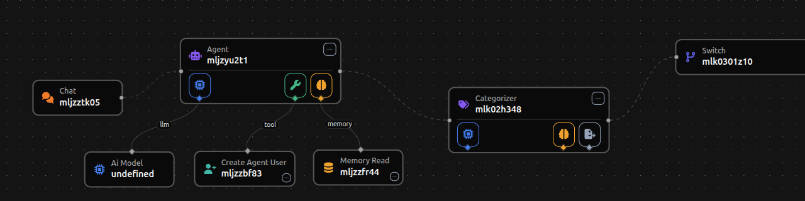

<p align="center">
  
</p>

<p align="center">
  <strong>Build, connect, and orchestrate LLM-powered agents — visually.</strong>
</p>

<p align="center">
  <a href="https://github.com/theuselessai/Pipelit/actions/workflows/ci.yml"></a>
  <a href="https://app.codecov.io/gh/theuselessai/Pipelit"></a>
  <a href="#license"></a>
</p>

---

Pipelit is a self-hosted workflow automation platform for designing LLM agent pipelines on a drag-and-drop canvas. Wire up triggers, agents, tools, and routing logic — then watch them execute in real time with live WebSocket status updates on every node.

<!-- TODO: Add a screenshot of the workflow editor here -->
<!-- <p align="center"></p> -->

---

## Highlights

|  |  |  |
|:---:|:---:|:---:|
| **Visual Canvas** | **Multi-Trigger** | **LLM Agents** |
| Drag-and-drop React Flow editor with node palette, config panel, and live execution badges | Telegram, webhooks, chat, scheduled intervals, manual — all unified as workflow nodes | LangGraph react agents with tool-calling: shell, HTTP, web search, calculator, datetime, and more |
| **Conditional Routing** | **Scheduled Execution** | **Real-time Updates** |
| Switch nodes evaluate rules and route to different branches via conditional edges | Recurring runs with configurable interval, retry with exponential backoff, pause/resume, and crash recovery | Single global WebSocket pushes node status, execution events, and canvas mutations — no polling |
| **Cost Tracking** | **Conversation Memory** | **Self-Improving Agents** |
| Per-execution token counting and USD cost calculation with Epic-level budget enforcement | Optional per-agent conversation persistence across executions via SQLite checkpointer | Agents can read epics/tasks, spawn child workflows, modify their own graphs, and schedule future work |

---

## Quick Start

### Prerequisites

- Python 3.10+
- Redis 8.0+ (includes RediSearch natively — see [Redis Setup](#redis-setup))
- Node.js 18+

### 1. Install

```bash
git clone git@github.com:theuselessai/Pipelit.git
cd Pipelit

# Backend
python3 -m venv .venv && source .venv/bin/activate
pip install -r platform/requirements.txt

# Frontend
cd platform/frontend && npm install
```

### 2. Configure

```bash
# Generate an encryption key for credential storage
echo "FIELD_ENCRYPTION_KEY=$(python -c 'from cryptography.fernet import Fernet; print(Fernet.generate_key().decode())')" >> .env
```

Or create a `.env` file in the project root with at minimum:

```env
FIELD_ENCRYPTION_KEY=<your-generated-key>
REDIS_URL=redis://localhost:6379/0
```

### 3. Start Services

Start Redis, then open three terminals:

```bash
# Terminal 1 — Backend
cd platform && source ../.venv/bin/activate
uvicorn main:app --host 0.0.0.0 --port 8000 --reload

# Terminal 2 — RQ Worker (executes workflows and scheduled jobs)
cd platform && source ../.venv/bin/activate
rq worker workflows --with-scheduler

# Terminal 3 — Frontend (dev)
cd platform/frontend
npm run dev    # http://localhost:5173, proxies /api to :8000
```

The backend auto-creates the database on first startup.

### 4. First Login

Open `http://localhost:5173` — the setup wizard will prompt you to create your admin account.

> **Production:** Skip the frontend dev server — run `cd platform/frontend && npm run build` once, then access the app directly at `http://localhost:8000` (FastAPI serves the built SPA).

---

## Stack

| Layer | Technologies |
|-------|-------------|
| **Backend** | FastAPI, SQLAlchemy 2.0, Alembic, Pydantic, RQ (Redis Queue) |
| **Frontend** | React, Vite, TypeScript, Shadcn/ui, React Flow (@xyflow/react v12), TanStack Query |
| **Execution** | LangGraph, LangChain, Redis pub/sub, WebSocket |
| **Auth** | Bearer token API keys, TOTP-based MFA |

---

## Features

### Visual Workflow Editor
Design agent pipelines on an interactive React Flow canvas. Add nodes from the palette, configure them in the side panel, and connect them with typed edges. Live execution badges show running/success/failed status on each node.

### Triggers
Every trigger is a first-class workflow node:

| Trigger | Description |
|---------|-------------|
| **Chat** | Built-in web chat interface |
| **Telegram** | Bot integration with webhook support |
| **Webhook** | Accept external HTTP payloads |
| **Scheduler** | Recurring interval execution with retry, backoff, and pause/resume |
| **Manual** | One-click execution from the UI |

### Agent Components

| Component | Description |
|-----------|-------------|
| **Agent** | LangGraph react agent with system prompt, tools, and optional conversation memory |
| **Categorizer** | Classifies input into predefined categories |
| **Router** | Routes messages to different branches based on content |
| **Extractor** | Extracts structured data from unstructured text |
| **Switch** | Rule-based conditional routing with per-edge condition values |
| **Loop** | Iterates over collections, executing a body node per item |
| **Spawn & Await** | Launches a child workflow and waits for its result |

### Tools
Agents can call any combination of built-in tools:

`run_command` | `http_request` | `web_search` | `calculator` | `datetime` | `epic_tools` | `task_tools` | `workflow_discover` | `workflow_create`

### Jinja2 Expressions
Reference upstream node outputs in prompts and config fields with `{{ nodeId.portName }}` syntax. Full Jinja2 filter support. The editor provides a variable picker and syntax highlighting.

### Cost Tracking & Budgets
Automatic token counting and USD cost calculation per execution. Set token or USD budgets on Epics — the orchestrator gates every node execution against the budget before running.

### Scheduled Execution
Create recurring jobs that fire workflow triggers at configurable intervals. Self-rescheduling via RQ `enqueue_in()` — no external cron needed. Features exponential backoff on failure, pause/resume, and automatic recovery of missed jobs on startup.

### Security
- Encrypted credential storage (Fernet)
- TOTP-based MFA with rate limiting and account lockout
- Bearer token authentication
- Agent-to-agent identity verification via TOTP

---

## API

All endpoints under `/api/v1/`, authenticated via `Authorization: Bearer <key>`.

| Resource | Endpoints |
|----------|-----------|
| **Auth** | `POST /auth/token/`, `GET /auth/me/`, `POST /auth/setup/` |
| **Workflows** | `GET/POST /workflows/`, `GET/PATCH/DELETE /workflows/{slug}/`, `POST .../validate/` |
| **Nodes** | `GET/POST /workflows/{slug}/nodes/`, `PATCH/DELETE .../nodes/{node_id}/` |
| **Edges** | `GET/POST /workflows/{slug}/edges/`, `PATCH/DELETE .../edges/{id}/` |
| **Executions** | `GET /executions/`, `GET .../executions/{id}/`, `POST .../cancel/` |
| **Chat** | `POST /workflows/{slug}/chat/`, `DELETE .../chat/history` |
| **Credentials** | `GET/POST /credentials/`, `GET/PATCH/DELETE .../credentials/{id}/`, `POST .../test/` |
| **Schedules** | `GET/POST /schedules/`, `GET/PATCH/DELETE .../schedules/{id}/`, `POST .../pause/`, `POST .../resume/` |
| **Memory** | Facts, episodes, procedures, users, checkpoints — all with batch delete |

All list endpoints return `{"items": [...], "total": N}` with `limit`/`offset` pagination.

---

## Testing

```bash
cd platform
source ../.venv/bin/activate
export FIELD_ENCRYPTION_KEY=$(python -c "from cryptography.fernet import Fernet; print(Fernet.generate_key().decode())")
python -m pytest tests/ -v
```

---

## Redis Setup

Pipelit requires **Redis 8.0+** which includes RediSearch natively. Older versions will fail with `unknown command 'FT._LIST'`.

<details>
<summary><strong>Installing Redis 8.0+</strong></summary>

```bash
# Docker (easiest)
docker run -d --name redis -p 6379:6379 redis:8

# Debian/Ubuntu
curl -fsSL https://packages.redis.io/gpg | sudo gpg --dearmor -o /usr/share/keyrings/redis-archive-keyring.gpg
sudo chmod 644 /usr/share/keyrings/redis-archive-keyring.gpg
echo "deb [signed-by=/usr/share/keyrings/redis-archive-keyring.gpg] https://packages.redis.io/deb $(lsb_release -cs) main" \
  | sudo tee /etc/apt/sources.list.d/redis.list
sudo apt-get update && sudo apt-get install redis

# macOS
brew install redis && brew services start redis
```

Verify: `redis-cli MODULE LIST` should include the `search` (ft) module.

</details>

<details>
<summary><strong>Removing older Redis</strong></summary>

```bash
# Debian/Ubuntu
sudo systemctl stop redis-server && sudo systemctl disable redis-server
sudo apt remove --purge redis-server

# macOS
brew services stop redis && brew uninstall redis

# Docker
docker stop redis && docker rm redis
```

</details>

<details>
<summary><strong>Workaround without Redis 8</strong></summary>

Enable `conversation_memory` on agent nodes that use `spawn_and_await`. This switches the checkpointer from RedisSaver to SqliteSaver, bypassing the RediSearch requirement.

</details>

---

## License

MIT
