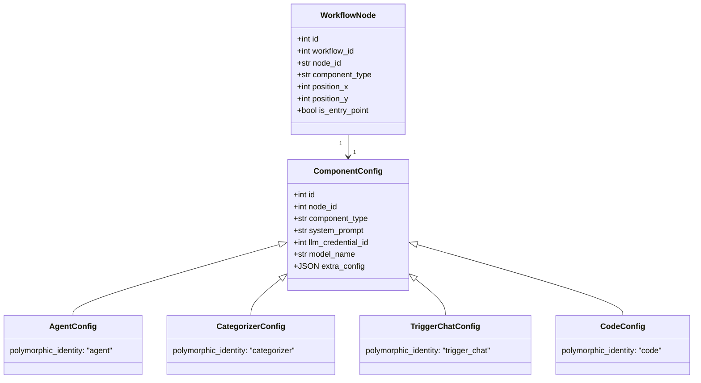
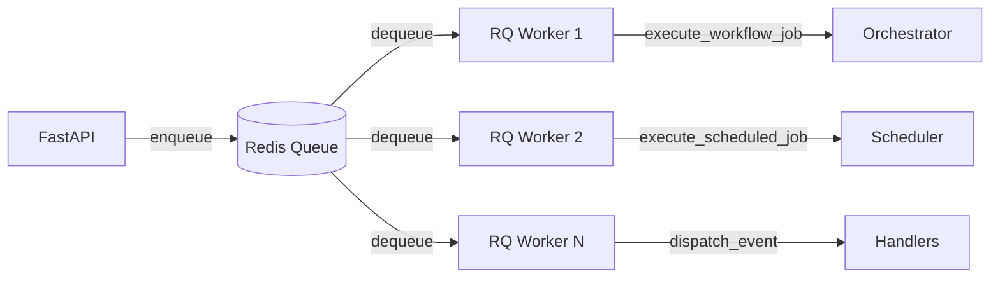

# Backend Architecture

The Pipelit backend is a FastAPI application with SQLAlchemy ORM, Alembic migrations, RQ background processing, and Redis for pub/sub, caching, and execution state.

## Directory Structure

```
platform/
├── main.py              # FastAPI app entry point (routers, CORS, static files)
├── config.py            # Pydantic Settings (DATABASE_URL, REDIS_URL, etc.)
├── database.py          # SQLAlchemy engine + SessionLocal + get_db()
├── auth.py              # Bearer token auth dependency (HTTPBearer -> UserProfile)
├── api/                 # REST endpoint routers
│   ├── auth.py          # POST /token/, GET /me/, POST /setup/
│   ├── workflows.py     # Workflow CRUD + GET /node-types/ + POST /validate/
│   ├── nodes.py         # Node + Edge CRUD (nested under workflow)
│   ├── executions.py    # Execution list/detail/cancel + chat
│   ├── credentials.py   # Credential CRUD + test + LLM models
│   ├── schedules.py     # ScheduledJob CRUD + pause/resume/batch-delete
│   └── _helpers.py      # Response serialization helpers
├── models/              # SQLAlchemy ORM models
│   ├── user.py          # UserProfile, APIKey
│   ├── credential.py    # BaseCredential, LLMProviderCredential, TelegramCredential
│   ├── workflow.py      # Workflow, WorkflowCollaborator
│   ├── node.py          # WorkflowNode, WorkflowEdge, ComponentConfig hierarchy
│   ├── execution.py     # WorkflowExecution, ExecutionLog, PendingTask
│   ├── scheduled_job.py # ScheduledJob (self-rescheduling recurring jobs)
│   ├── conversation.py  # Conversation
│   ├── tool.py          # ToolDefinition, WorkflowTool
│   ├── code.py          # CodeBlock, CodeBlockVersion, CodeBlockTest
│   └── git.py           # GitRepository, GitCommit, GitSyncTask
├── schemas/             # Pydantic schemas
│   ├── node_io.py       # NodeStatus, NodeResult, NodeInput
│   ├── node_types.py    # DataType, PortDefinition, NodeTypeSpec, NODE_TYPE_REGISTRY
│   ├── node_type_defs.py# Registers all 23+ built-in node types
│   └── schedule.py      # ScheduledJobCreate/Update/Out, BatchDeleteSchedulesIn
├── services/            # Business logic
│   ├── orchestrator.py  # Node execution, state management, WebSocket events
│   ├── topology.py      # Workflow DAG analysis (BFS reachability)
│   ├── builder.py       # Compiles Workflow -> LangGraph CompiledGraph
│   ├── executor.py      # WorkflowExecutor + RQ job wrappers
│   ├── expressions.py   # Jinja2 template resolver for node config
│   ├── cache.py         # Redis-backed graph caching
│   ├── delivery.py      # Routes results to Telegram, webhooks, etc.
│   ├── llm.py           # create_llm_from_db(), resolve_llm_for_node()
│   ├── scheduler.py     # Self-rescheduling scheduler (execute, backoff, recovery)
│   └── state.py         # WorkflowState (LangGraph MessagesState)
├── handlers/            # Event/trigger handlers
│   ├── __init__.py      # dispatch_event() - unified trigger dispatch
│   ├── telegram.py      # TelegramTriggerHandler
│   ├── webhook.py       # Incoming webhook endpoint
│   └── manual.py        # Manual execution endpoint
├── components/          # LangGraph node component implementations (20+ files)
├── tasks/               # RQ job wrappers
├── triggers/            # Trigger resolver
├── validation/          # EdgeValidator (type compatibility checks)
├── ws/                  # WebSocket endpoints + broadcast helper
├── alembic/             # Database migrations
└── frontend/            # React SPA (built and served as static files)
```

## FastAPI Application Structure

### Entry Point (`main.py`)

The FastAPI app is created in `main.py`, which:

1. Creates the `FastAPI` instance with CORS middleware
2. Registers all API routers under `/api/v1/`
3. Mounts the WebSocket endpoint at `/ws/`
4. Serves the built frontend from `frontend/dist/` as a static file mount
5. Includes startup/shutdown lifecycle hooks for Redis connections and scheduler recovery

### Configuration (`config.py`)

Application settings use Pydantic `BaseSettings`, loading from environment variables:

- `DATABASE_URL` -- SQLAlchemy connection string (default: SQLite)
- `REDIS_URL` -- Redis connection for RQ, pub/sub, and caching
- `FIELD_ENCRYPTION_KEY` -- Fernet key for encrypting credential secrets
- `SECRET_KEY` -- Application secret for token generation

### Authentication (`auth.py`)

All API endpoints use Bearer token authentication via FastAPI's `HTTPBearer` dependency:

```python
# Every protected endpoint receives the current user via dependency injection
async def get_current_user(
    credentials: HTTPAuthorizationCredentials = Security(security),
    db: Session = Depends(get_db),
) -> UserProfile:
    token = credentials.credentials
    api_key = db.query(APIKey).filter_by(key_hash=hash_key(token)).first()
    if not api_key:
        raise HTTPException(status_code=401)
    return api_key.user_profile
```

There is no session auth, OAuth, or basic auth anywhere in the system. Agent users are created without passwords via `create_agent_user` and authenticated solely through API keys.

## SQLAlchemy Models

### Polymorphic Node Configuration

The node system uses SQLAlchemy's single-table polymorphic inheritance for component configurations. This allows each component type to have its own configuration class while sharing a single database table.



Every new component type requires registration in four places:

1. **SQLAlchemy** -- A `_*Config` class with `polymorphic_identity`
2. **Pydantic** -- A `Literal` type in the schema for validation
3. **Node Type Registry** -- A `register_node_type()` call with port definitions
4. **Frontend** -- TypeScript type definition in `types/models.ts`

### Credential Model

Credentials are global -- any user on the machine can use any credential. The `user_profile_id` FK tracks who created a credential, not ownership.

Sensitive fields (API keys, tokens) use `EncryptedString`, a custom SQLAlchemy type that encrypts/decrypts with Fernet via `FIELD_ENCRYPTION_KEY`:

```python
class LLMProviderCredential(BaseCredential):
    api_key = Column(EncryptedString)  # Encrypted at rest
    provider = Column(String)          # "openai", "anthropic", etc.
```

### Edge Model

Edges connect nodes with typed connections:

| Edge Label | Purpose | Example |
|------------|---------|---------|
| `""` (empty) | Data flow between nodes | trigger -> agent |
| `"llm"` | Model connection | ai_model -> agent |
| `"tool"` | Tool connection | run_command -> agent |
| `"memory"` | Memory connection | memory_read -> agent |
| `"output_parser"` | Parser connection | output_parser -> categorizer |
| `"loop_body"` | Loop body flow | loop -> body_node |
| `"loop_return"` | Loop return flow | body_node -> loop |

Conditional edges carry a `condition_value` string on each `WorkflowEdge` row. Only `switch` nodes can originate conditional edges.

## Pydantic Schemas

### Request/Response Validation

All API endpoints use Pydantic models for input validation and output serialization. Component types, trigger types, and edge types use `Literal` types:

```python
class NodeCreate(BaseModel):
    node_id: str
    component_type: Literal[
        "agent", "categorizer", "router", "extractor",
        "trigger_chat", "trigger_telegram", "trigger_webhook",
        "code", "switch", "loop", ...
    ]
    config: ComponentConfigData | None = None
```

### Pagination

All list endpoints return paginated responses:

```json
{
    "items": [...],
    "total": 42
}
```

Endpoints accept `limit` and `offset` query parameters. The default frontend page size is 50.

## Background Processing with RQ

RQ (Redis Queue) handles all background job processing. Workflow executions, scheduled jobs, and trigger dispatches run as RQ jobs to keep the API server responsive.



Key RQ job types:

- **`execute_workflow_job`** -- Runs a complete workflow execution
- **`execute_node_job`** -- Runs a single node (used for re-invocations after subworkflow completion)
- **`execute_scheduled_job`** -- Runs a scheduled job, then self-reschedules via `Queue.enqueue_in()`
- **`dispatch_event`** -- Routes incoming events (Telegram messages, webhooks) to the appropriate trigger handler

### Self-Rescheduling Scheduler

The scheduler implements recurring workflow execution without external cron. Each `ScheduledJob` stores its interval, repeat count, retry config, and status (`active` / `paused` / `done` / `dead`).

The `execute_scheduled_job()` function runs as an RQ job: it dispatches the workflow trigger, handles success/failure with exponential backoff (capped at 10x interval), and calls `_enqueue_next()` to schedule itself again. Deterministic RQ job IDs (`sched-{id}-n{repeat}-rc{retry}`) prevent duplicate enqueues.

On startup, `recover_scheduled_jobs()` re-enqueues any active jobs whose `next_run_at` is in the past.

## Redis Usage

Redis serves four distinct roles:

### 1. Pub/Sub (WebSocket Broadcasting)

The `broadcast()` helper publishes events to Redis channels. The WebSocket endpoint subscribes to channels on behalf of connected clients and forwards messages. This allows events from RQ workers (running in separate processes) to reach frontend clients.

### 2. Job Queue (RQ)

Standard RQ job queue for background processing. Workers dequeue and execute jobs.

### 3. Graph Cache

Compiled LangGraph graphs are cached in Redis keyed by workflow ID and a hash of the workflow's structure. Cache is invalidated when nodes or edges change.

### 4. Execution State

During execution, per-node state (outputs, results, route values) is stored in Redis. This allows the orchestrator to resume execution after interruptions and enables multi-step workflows where later nodes reference earlier outputs. State is cleaned up after execution completes.

## Alembic Migrations

Schema changes use Alembic with SQLAlchemy autogeneration:

```bash
cd platform
alembic revision --autogenerate -m "description"
alembic upgrade head
```

!!! warning "SQLite Caution"
    `batch_alter_table` operations in SQLite can cascade and delete data. Always test migrations against existing data, not just empty databases. Check for conflicting migration heads before creating new migrations.

## LLM Resolution

LLM configuration lives entirely on `ComponentConfig` (per-node). Each agent-type node must have both `llm_model` and `llm_credential` set on its config. There are no workflow-level LLM defaults.

Resolution is handled by `services/llm.py`:

```python
def resolve_llm_for_node(node: WorkflowNode, db: Session) -> BaseChatModel:
    """Load the LLM for a node from its ComponentConfig."""
    config = node.component_config
    credential = db.query(LLMProviderCredential).get(config.llm_credential_id)
    return create_llm_from_db(
        credential=credential,
        model_name=config.model_name,
        extra_config=config.extra_config or {},
    )
```
