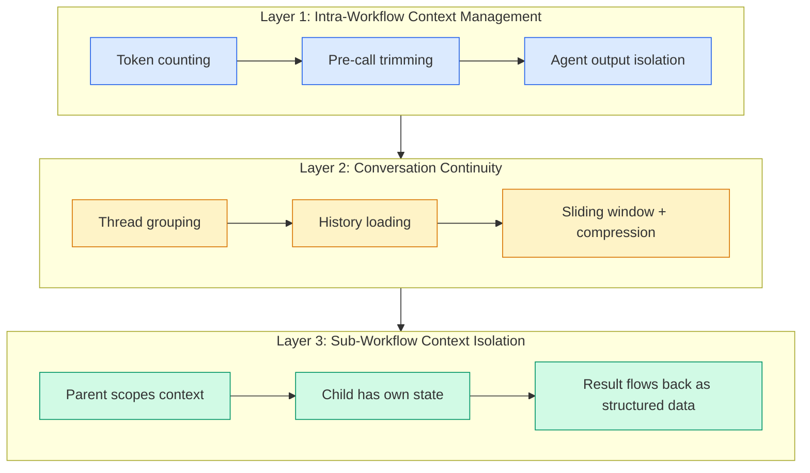
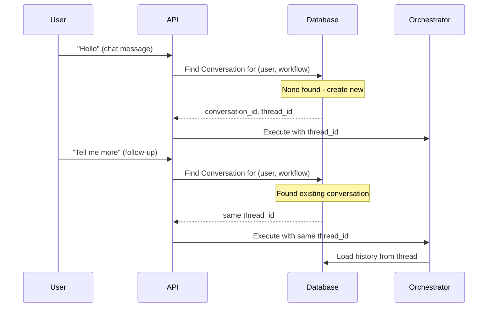

# Context Management

Managing LLM context windows is one of the most critical challenges in a multi-node workflow platform. This page describes Pipelit's three-layer architecture for context management: intra-workflow trimming, cross-execution conversation continuity, and sub-workflow context isolation.

## The Problem

### Unbounded Messages Within a Single Execution

All nodes in a workflow share `state["messages"]`. Each node appends to it. Agent components dump all intermediate ReAct messages (tool calls, tool results, reasoning steps) into shared state. A 5-node workflow with 2 agents can accumulate 50+ messages before hitting the final node, easily exceeding context windows.

### No Conversation Continuity Across Executions

Each chat message creates a new `WorkflowExecution` with a random thread ID. The initial state contains only the current message -- no history. Redis state is deleted after execution completes.

### Sub-Workflows Have No Context Isolation

When a parent workflow invokes a child, the child should not inherit the parent's raw message history. It needs a scoped context with only the relevant input.

## Three-Layer Architecture



## Layer 1: Intra-Workflow Context Management

**Goal:** Prevent context overflow within a single execution. Zero schema changes required.

### Token Counting Service

The `platform/services/context.py` module provides:

```python
def count_message_tokens(msg: AnyMessage) -> int:
    """Count tokens in a single message using tiktoken cl100k_base.
    Handles str/list content and tool_calls."""

def count_messages_tokens(messages: list) -> int:
    """Sum token counts across all messages."""

def get_context_window(model_name: str, extra_config: dict) -> int:
    """Look up context window size for a model.
    Uses extra_config["context_window"] override if set,
    otherwise a lookup table, defaulting to 128K."""

def trim_messages(
    messages: list,
    model_name: str,
    max_tokens: int,
    extra_config: dict,
    system_messages: list,
) -> list:
    """Keep the most recent messages that fit within
    context_window - response_reserve - system_tokens."""
```

### Pre-Call Trimming

Before every LLM call, agent and AI model components trim the message list:

```python
# Inside agent.py, ai_model.py, react_agent.py:
messages = trim_messages(
    messages,
    model_name=config.model_name,
    max_tokens=get_context_window(config.model_name, extra_config),
    extra_config=extra_config,
    system_messages=[system_prompt_message],
)
```

The context window can be overridden per-node via `extra_config["context_window"]` without any schema migration.

### Agent Output Isolation

Agent nodes return only their final AI response to shared state, not the full ReAct loop:

```python
# BEFORE: Pollutes shared state with 10-20 intermediate messages
return {"_messages": out_messages, ...}

# AFTER: Only the final answer enters shared state
return {"_messages": [final_ai_message], ...}
```

This prevents intermediate tool_call/tool_result messages from consuming context budget for downstream nodes. The full ReAct trace is still logged in `ExecutionLog` for debugging.

!!! note "Token Usage Tracking"
    Pipelit also tracks actual token usage from LLM providers via `platform/services/token_usage.py`. This uses LangChain `usage_metadata` (provider-reported actuals, not tiktoken estimates) for cost tracking and budget enforcement. This is complementary to -- but separate from -- the pre-call context trimming described here.

## Layer 2: Conversation Continuity

**Goal:** Multi-turn chat where each execution has access to conversation history. Requires schema changes.

### Thread-Based Execution Grouping

The existing `Conversation` model is activated to group executions into threads:



When a chat message arrives, the system finds or creates a conversation thread for the `(user_profile_id, workflow_id)` pair. All executions within that thread share the same `thread_id`.

### History Loading

The orchestrator loads conversation history when building initial state:

```python
def _build_initial_state(execution) -> dict:
    history_messages = _load_thread_history(
        thread_id=execution.thread_id,
        limit=20,            # Last 20 messages
        max_tokens=16000,    # Or token-budgeted
    )
    messages = history_messages + [HumanMessage(content=trigger_text)]
    return {"messages": messages, ...}
```

### History Persistence

After execution completes, the conversation turn is persisted:

```python
class ConversationMessage(Base):
    id: int                  # Primary key
    conversation_id: int     # FK -> Conversation
    execution_id: str        # FK -> WorkflowExecution
    role: str                # "human" | "ai"
    content: str
    token_count: int
    created_at: datetime
```

### Sliding Window and Compression

For long conversations, a context budget is applied:

- **Phase 1 (Simple):** Keep the last N messages that fit the token budget (reuses `trim_messages` from Layer 1)
- **Phase 2 (Advanced):** LLM-based compression -- summarize old messages, keep recent ones verbatim

### Agent Conversation Memory (Current Implementation)

Agent nodes already support optional `conversation_memory` via `extra_config`. When enabled, a `SqliteSaver` checkpointer (`platform/checkpoints.db`) persists conversation history across executions.

The thread ID is constructed from `user_profile_id`, `telegram_chat_id`, and `workflow_id` so the same user talking to the same workflow gets continuity. The system prompt uses both a `SystemMessage` and a `HumanMessage` fallback (for providers like Venice.ai that ignore the system role), with a stable ID to prevent duplication via LangGraph's `add_messages` reducer.

## Layer 3: Sub-Workflow Context Isolation

**Goal:** Parent workflows can invoke child workflows with scoped context. Each child has its own state. Results flow back as structured data.

### Context Scoping (Parent to Child)

The parent decides what context to pass to the child:

```python
def _scope_context(parent_state: dict, node: WorkflowNode) -> dict:
    """Build trigger payload for child workflow."""
    extra = node.component_config.extra_config or {}
    input_source = extra.get("input_source", "last_message")

    if input_source == "last_message":
        messages = parent_state.get("messages", [])
        text = messages[-1].content if messages else ""
    elif input_source == "node_output":
        source_node = extra.get("source_node_id")
        text = str(parent_state.get("node_outputs", {}).get(source_node, ""))
    else:
        text = ""

    return {
        "text": text,
        "parent_execution_id": parent_state["execution_id"],
        "user_context": parent_state.get("user_context", {}),
    }
```

What the child receives:

- **Trigger payload** -- The parent's current output or a user-configured subset
- **User context** -- Inherited from parent's state
- **Not messages** -- The child starts with a fresh message list

### Result Aggregation (Child to Parent)

The child execution produces a `final_output`. The parent receives it as:

- A structured dict in `node_outputs` (for downstream nodes to reference via Jinja2)
- An `AIMessage` summary in `messages` (for conversational continuity)

### Execution Relationship

A `parent_execution_id` FK on `WorkflowExecution` enables:

- Tracing execution trees
- Cancellation cascading (cancel parent cancels children)
- Debugging nested workflows in the execution detail view

## Implementation Phases

| Phase | Layer | Scope | Dependencies |
|-------|-------|-------|-------------|
| **Phase A** | Layer 1 | Token counting, pre-call trimming, agent output filtering | None |
| **Phase B** | Layer 2a-2b | Thread grouping + history loading | Phase A (for `trim_messages`) |
| **Phase C** | Layer 2c-2d | History persistence + compression | Phase B |
| **Phase D** | Layer 3 | Sub-workflow implementation | Phase A |

Phase A is self-contained and delivers immediate value. Phases B through D can proceed in any order after A.

## Key Design Decisions

1. **Trimming over compression (Layer 1).** No LLM calls for compression. Fast, deterministic, predictable. Compression is deferred to Layer 2.

2. **Agent output isolation is always-on.** No downstream node needs intermediate tool_call messages. The full trace remains in execution logs.

3. **Context window via `extra_config`.** No schema migration needed. Users optionally set `{"context_window": 32000}` on an ai_model node. Otherwise, auto-detected from model name.

4. **Thread grouping via existing Conversation model.** Activating the unused model avoids creating a new one. `ConversationMessage` is added for per-turn storage.

5. **Child workflows get scoped context, not raw messages.** Clean boundary. Parent decides what to pass via `extra_config`. Child starts fresh.

6. **Memory system stays orthogonal.** The memory system (facts, episodes, procedures) provides long-term knowledge. Context management provides short-term conversation flow. They complement but do not replace each other.
