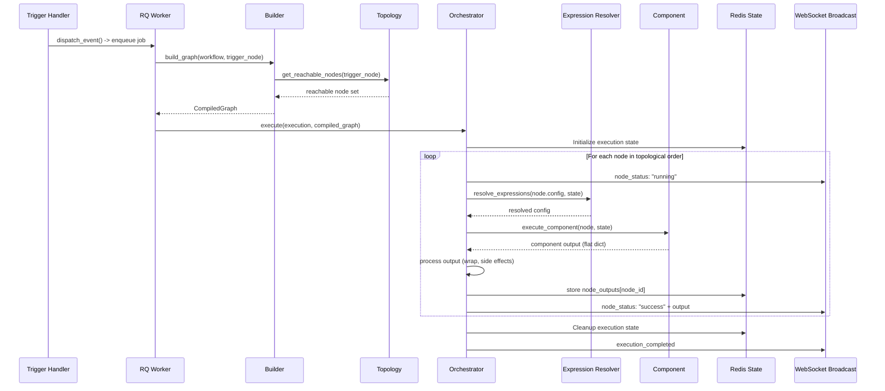
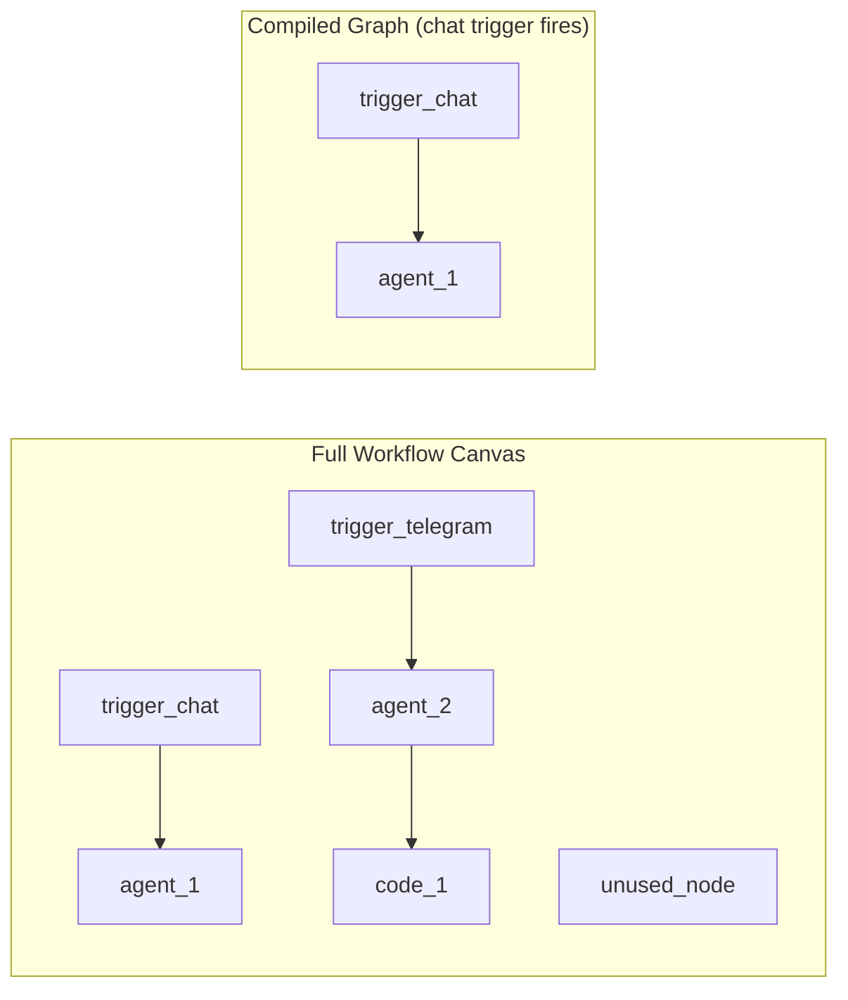

# Execution Engine

The execution engine is the core of Pipelit's runtime. It compiles workflow graphs, resolves execution order, manages state, executes node components, and broadcasts real-time status events. This page covers each service in detail.

## Execution Pipeline Overview



## Builder (`services/builder.py`)

The builder compiles a `Workflow` database model into a LangGraph `CompiledGraph`. This is the bridge between Pipelit's database representation and LangGraph's execution model.

### Trigger-Scoped Compilation

When a trigger fires, the builder only compiles nodes **reachable downstream** from that specific trigger. This is a critical design decision:

- A single workflow can have multiple trigger branches (e.g., a chat trigger and a Telegram trigger feeding different agent chains)
- Unused nodes on the canvas do not cause build errors
- Each trigger activation produces a minimal, focused execution graph



In this example, when the chat trigger fires, only `trigger_chat` and `agent_1` are compiled. `trigger_telegram`, `agent_2`, `code_1`, and `unused_node` are all excluded.

### Compilation Steps

1. **Load** workflow nodes and edges from the database
2. **BFS reachability** from the trigger node (via `topology.py`)
3. **Filter** nodes and edges to the reachable set
4. **Resolve** LLM configurations for AI-type nodes
5. **Load** tool factories for connected tool nodes
6. **Build** LangGraph state graph with node functions and edge routing
7. **Compile** and optionally cache the result in Redis

### Graph Caching

Compiled graphs are cached in Redis keyed by workflow ID and a structural hash. The cache is invalidated whenever nodes or edges are modified (detected via WebSocket-broadcast mutations).

## Topology Analyzer (`services/topology.py`)

The topology service provides BFS-based graph analysis:

```python
def get_reachable_nodes(
    trigger_node_id: str,
    edges: list[WorkflowEdge],
) -> set[str]:
    """BFS from trigger node following direct edges.
    Returns the set of node_ids reachable downstream."""
```

This is used by the builder for trigger-scoped compilation and by the orchestrator to determine execution order.

## Orchestrator (`services/orchestrator.py`)

The orchestrator is the execution engine's core. It walks through nodes in topological order, resolves template expressions, executes components, manages state, and broadcasts events.

### Execution Lifecycle

For each node in the execution:

1. **Status broadcast** -- Publish `node_status: "pending"` then `"running"` via WebSocket
2. **Expression resolution** -- Resolve `{{ nodeId.portName }}` Jinja2 templates in `system_prompt` and `extra_config`
3. **Component execution** -- Call the component factory to get the node function, then execute it
4. **Output processing** -- Process the component's return dict:
    - Non-underscore keys are wrapped into `node_outputs[node_id]`
    - `_route` sets `state["route"]` for conditional routing
    - `_messages` are appended to `state["messages"]`
    - `_state_patch` is merged into global state
5. **Result recording** -- Wrap output in a `NodeResult` with status, data, error code, and metadata
6. **State storage** -- Store `node_outputs` and `node_results` in Redis
7. **Status broadcast** -- Publish `node_status: "success"` (with output) or `"failed"` (with error)

### State Management

Execution state is stored in Redis during execution:

```python
state = {
    "messages": [...],              # LangGraph message list
    "node_outputs": {               # Per-node output data
        "trigger_chat_abc": {"text": "hello", "payload": {...}},
        "agent_def": {"output": "response text"},
    },
    "node_results": {               # Per-node execution results
        "trigger_chat_abc": NodeResult(status="success", ...),
    },
    "route": "category_a",          # Current route for conditional edges
    "execution_id": "exec_xyz",
    "user_context": {...},          # User info from trigger
}
```

### Subworkflow Handling

When a node returns `{"_subworkflow": {...}}`, the orchestrator:

1. Creates a child `WorkflowExecution`
2. Enqueues the child execution as an RQ job
3. Sets the parent node status to `"waiting"`
4. Releases the RQ worker (non-blocking)
5. When the child completes, injects the result into `state["_subworkflow_results"]`
6. Re-enqueues the parent node for continuation

### Error Handling

Failed nodes are wrapped in `NodeResult.failed()` with:

- `error` -- Human-readable error message
- `error_code` -- Machine-readable error classification
- `metadata` -- Additional context (stack trace, timing)

The orchestrator decides whether to skip downstream nodes or halt the entire execution based on the error severity and the node's position in the graph.

## Expression Resolver (`services/expressions.py`)

Before executing a component, the orchestrator resolves Jinja2 template expressions in `system_prompt` and `extra_config` values.

### Template Syntax

```
{{ nodeId.portName }}     -- Reference a specific node's output port
{{ trigger.text }}        -- The trigger's text input
{{ trigger.payload }}     -- The trigger's full payload
{{ trigger.payload.key }} -- A specific key from the trigger payload
```

### Context Variables

The expression context includes:

| Variable | Source | Example |
|----------|--------|---------|
| `<node_id>` | `node_outputs[node_id]` | `{{ agent_abc.output }}` |
| `trigger` | The trigger that fired this execution | `{{ trigger.text }}` |

The `trigger` shorthand always refers to whichever trigger fired the current execution, which is useful in multi-trigger workflows where chat and Telegram triggers feed the same downstream nodes.

### Jinja2 Features

- Standard filters are supported: `{{ trigger.text | upper }}`
- Undefined variables gracefully fall back to the original template string (no errors)
- Nested access works: `{{ node.output.nested.key }}`

### Frontend Integration

The frontend provides an `ExpressionTextarea` component with a `{ }` button that opens a `VariablePicker` popover. The picker performs BFS over upstream nodes and presents clickable `{{ nodeId.port }}` items for insertion.

## Executor (`services/executor.py`)

The executor is the top-level wrapper around the orchestrator, responsible for:

1. **Job setup** -- Loading the workflow, execution, and related data from the database
2. **Graph building** -- Calling the builder to compile the LangGraph graph
3. **Execution dispatch** -- Calling the orchestrator to execute the graph
4. **Finalization** -- Updating the execution status, persisting costs, and broadcasting completion events
5. **Cleanup** -- Removing execution state from Redis

### RQ Job Wrappers

```python
def execute_workflow_job(execution_id: str):
    """RQ job entry point for full workflow execution."""

def execute_node_job(execution_id: str, node_id: str):
    """RQ job entry point for single-node re-invocation
    (used after subworkflow completion)."""
```

## State Model (`services/state.py`)

The workflow state extends LangGraph's `MessagesState`:

```python
class WorkflowState(MessagesState):
    """Global state passed through the LangGraph execution."""
    messages: Annotated[list[AnyMessage], add_messages]
    node_outputs: dict[str, dict]
    node_results: dict[str, NodeResult]
    route: str
    execution_id: str
    user_context: dict
```

The `messages` field uses LangGraph's `add_messages` reducer, which handles deduplication via stable message IDs. This is critical for conversation memory where the system prompt is re-injected on each invocation.

## Component Output Convention

Components return flat dicts with their port values:

```python
# Simple component
return {"output": "processed text"}

# Multi-port component
return {"category": "spam", "raw": "original text", "confidence": 0.95}
```

The orchestrator automatically wraps all non-underscore keys into `node_outputs[node_id]`.

### Reserved Underscore Keys

| Key | Effect |
|-----|--------|
| `_route` | Sets `state["route"]` for conditional edge routing |
| `_messages` | Appended to `state["messages"]` (LangGraph message list) |
| `_state_patch` | Dict merged into global state (excluding protected keys) |
| `_subworkflow` | Signals subworkflow delegation to orchestrator |
| `_token_usage` | Token usage data accumulated by orchestrator for cost tracking |

Components no longer receive or use their own `node_id`. Legacy format (returning `node_outputs` directly) is still supported for backwards compatibility.

## Conditional Routing

### Switch Node

The `switch` node evaluates rules against input data and emits a `_route` value:

```python
rules = [
    {"field": "trigger.payload.type", "operator": "equals", "value": "urgent", "route": "fast_path"},
    {"field": "trigger.payload.type", "operator": "equals", "value": "normal", "route": "standard"},
]
# Falls back to "default" route if no rules match
```

### Per-Edge Condition Values

Each conditional edge carries a `condition_value` string. The orchestrator matches `state["route"]` against each outgoing edge's `condition_value` to determine the next node:

```mermaid
graph LR
    Switch[switch] -->|condition_value="fast_path"| Agent1[urgent_agent]
    Switch -->|condition_value="standard"| Agent2[normal_agent]
    Switch -->|condition_value="default"| Log[logger]
```

Only `switch` nodes can originate conditional edges. This is enforced by the edge creation API.
