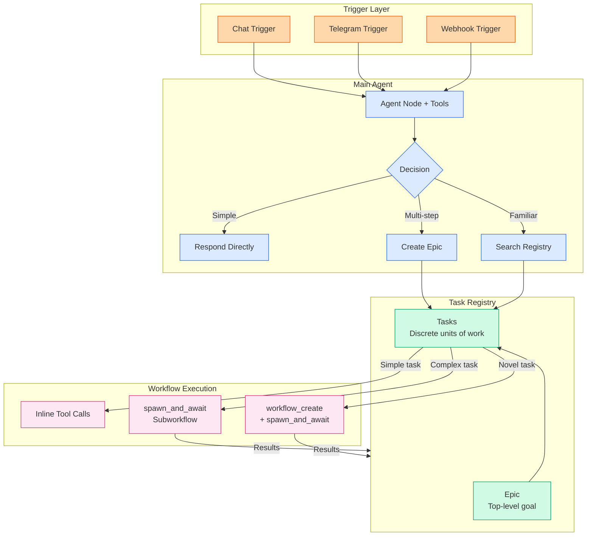
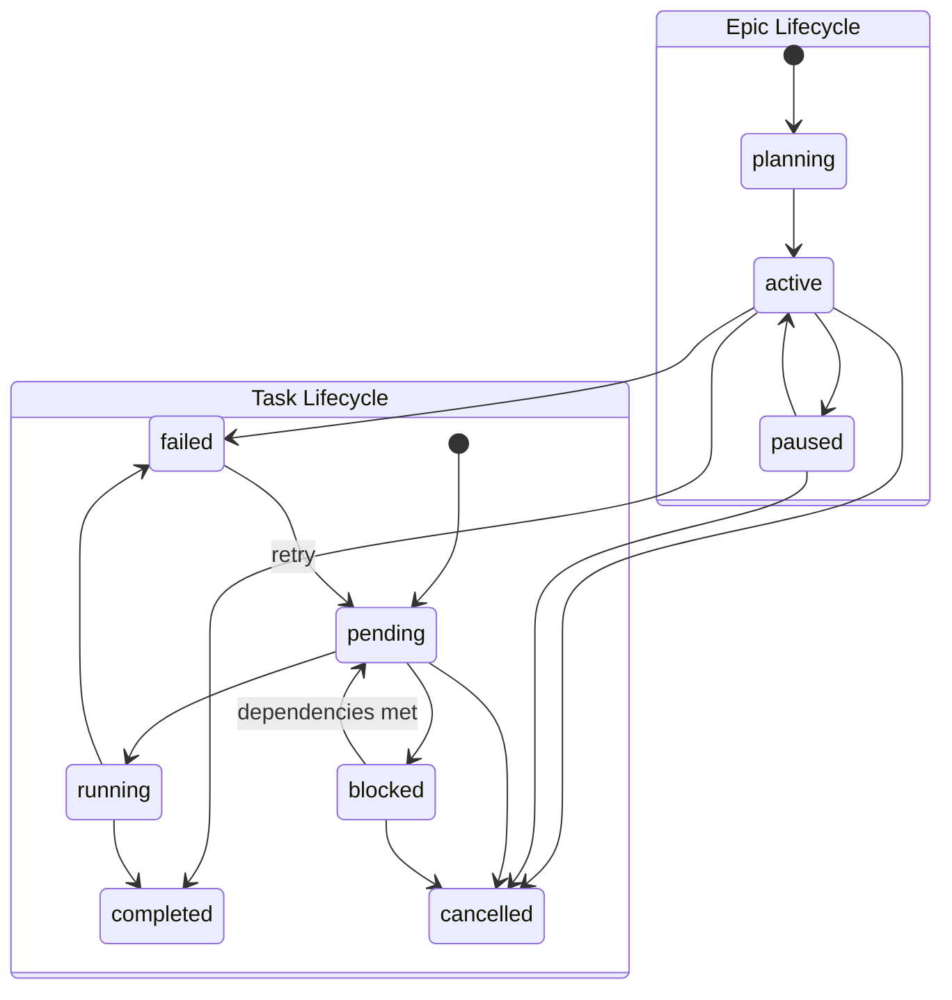
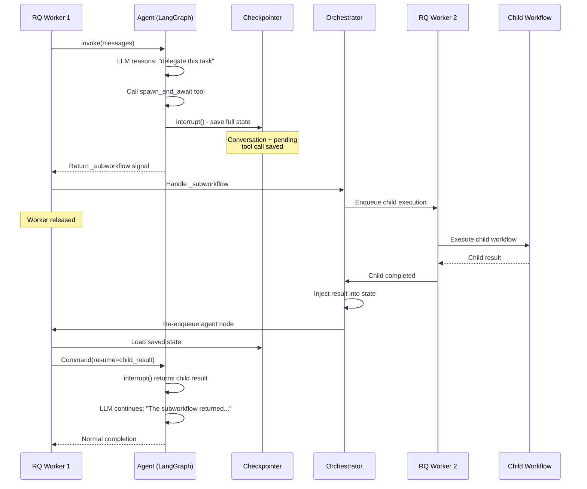

# Multi-Agent Delegation

Pipelit supports hierarchical multi-agent task delegation. An agent can receive a complex goal, decompose it into tasks, create or discover workflows to execute those tasks, track progress through a persistent registry, and learn from outcomes.

This architecture builds entirely on Pipelit's existing primitives (workflow CRUD, agent nodes, tool sub-components, subworkflow execution) with the addition of a task registry and specialized agent tools.

## Architecture Overview



## Key Architectural Decisions

### Workflows Over Agents

The unit of delegation is **workflows**, not individual agents. Agents are single nodes. Workflows are composable graphs with triggers, tools, routing, and memory -- strictly more expressive. An agent delegating to a workflow subsumes delegating to an agent.

### Dynamic Subworkflows Over JSON Plans

Agents create **executable workflow graphs**, not static JSON task plans. A dynamically created subworkflow IS the plan AND is immediately executable:

- Nodes = subtasks
- Edges = dependencies
- Fan-out topology = parallel groups

This eliminates the "plan then interpret then execute" pipeline.

### Two-Level Task Hierarchy

The registry uses two levels only -- Epics and Tasks:

- **Epic** = Top-level goal (e.g., "Write comprehensive tests for platform auth"). Spans multiple tasks, tracks budget, aggregates cost.
- **Task** = Discrete unit of work (e.g., "Analyze coverage gaps in auth module"). Maps to one workflow execution or one inline tool call sequence.
- **Subtask** = Nodes within a workflow. Already exist as workflow internals. Not modeled in the registry.

## Task Registry

### Epic Model

```python
class Epic(Base):
    __tablename__ = "epics"

    id: str                     # ULID primary key (ep_xxxxxxxxxxxx)
    title: str                  # Short goal name
    description: str            # Detailed goal, constraints, criteria
    tags: list                  # For discovery (JSON column)
    status: str                 # planning | active | paused | completed | failed | cancelled
    priority: int               # 1=critical, 2=high, 3=medium, 4=low

    # Budget tracking
    budget_tokens: int | None   # Token ceiling
    budget_usd: float | None    # USD ceiling
    spent_tokens: int           # Running total from child tasks
    spent_usd: float            # Running total from child tasks
    agent_overhead_tokens: int  # Main agent's reasoning cost

    # Progress
    total_tasks: int
    completed_tasks: int
    failed_tasks: int
```

### Task Model

```python
class Task(Base):
    __tablename__ = "tasks"

    id: str                     # ULID primary key (tk_xxxxxxxxxxxx)
    epic_id: str                # FK -> epics
    title: str
    status: str                 # pending | blocked | running | completed | failed | cancelled

    # Workflow linkage
    workflow_slug: str | None   # Assigned workflow
    execution_id: str | None    # Current execution (soft reference)
    workflow_source: str        # inline | existing | created | template

    # Dependencies
    depends_on: list            # List of task IDs (JSON column)

    # Requirements for workflow matching
    requirements: dict          # {"model": "gpt-4", "tools": ["code"], ...}

    # Cost tracking
    actual_tokens: int
    actual_usd: float
    retry_count: int
    max_retries: int
```

### Status Lifecycles



### Cost Aggregation

Costs roll up automatically from Task to Epic:

```python
def sync_epic_costs(epic: Epic):
    tasks = epic.tasks
    epic.spent_tokens = sum(t.actual_tokens for t in tasks)
    epic.spent_usd = sum(t.actual_usd for t in tasks)
    epic.total_tasks = len(tasks)
    epic.completed_tasks = sum(1 for t in tasks if t.status == "completed")
    epic.failed_tasks = sum(1 for t in tasks if t.status == "failed")
```

Budget is checked before spawning new tasks:

```python
def check_budget(epic: Epic, estimated_tokens: int) -> tuple[bool, str]:
    if epic.budget_tokens and (epic.spent_tokens + estimated_tokens > epic.budget_tokens):
        return False, "Would exceed token budget"
    return True, "ok"
```

## Agent Tools

### Registry Tools

These are registered as tool sub-components and connected to agent nodes via tool edges:

| Tool | Function Name | Description |
|------|--------------|-------------|
| `epic_create` | `create_epic` | Create a tracked epic with budget and tags |
| `epic_status` | `epic_status` | Get progress, cost, and task breakdown |
| `epic_update` | `update_epic` | Transition status, adjust budget, record outcome |
| `epic_search` | `search_epics` | Search past epics by description and tags |
| `task_create` | `create_task` | Create a task with dependencies and requirements |
| `task_list` | `list_tasks` | List tasks filtered by epic, status, or tags |
| `task_update` | `update_task` | Update status, add notes, record results |
| `task_cancel` | `cancel_task` | Cancel task and its running execution |

### `spawn_and_await`

The critical delegation tool. Spawns a subworkflow execution and returns results using LangGraph's `interrupt()` primitive -- **no RQ workers are blocked**.



### Dual Checkpointer Strategy

`spawn_and_await` requires a checkpointer to save/restore agent state during interrupt/resume. Two backends are used depending on configuration:

| Scenario | Checkpointer | Storage | Thread ID | Lifecycle |
|----------|-------------|---------|-----------|-----------|
| `conversation_memory` ON | `SqliteSaver` | SQLite (`checkpoints.db`) | `{user_id}:{chat_id}:{workflow_id}` | Permanent -- conversation history persists |
| `conversation_memory` OFF + has `spawn_and_await` | Redis checkpointer | Redis | `exec:{execution_id}:{node_id}` | Ephemeral -- auto-expires with 1h TTL |
| Neither | None | -- | -- | One-shot, no checkpointing |

### `workflow_create`

Creates workflows programmatically from a YAML DSL specification. Supports two modes:

1. **Create from scratch** -- Full DSL with trigger, steps, tools, and model declarations
2. **Fork and patch** -- Start from an existing workflow, apply incremental modifications

See the [Workflow DSL](workflow-dsl.md) page for the full specification.

### `workflow_discover`

Searches existing workflows with gap-analysis scoring against declared requirements:

```python
# Agent calls workflow_discover with requirements
discover_workflows(
    query="webhook verification",
    requirements='{"trigger": "webhook", "tools": ["code"]}'
)

# Returns ranked results with gap analysis
[{
    "slug": "moltbook-verify",
    "match_score": 0.95,
    "has": ["code", "webhook"],
    "missing": [],
    "extra": ["http_request"],
    "success_rate": 0.92,
}]
```

Three-tier reuse decision:

| Match Score | Action |
|-------------|--------|
| >= 0.95 | **Reuse as-is** -- `spawn_and_await` directly |
| >= 0.50 | **Fork and patch** -- `workflow_create` with `based_on` + `patches` |
| < 0.50 | **Create from scratch** -- `workflow_create` with full DSL |

## Execution Walkthrough

A concrete trace showing the full architecture handling: "Read moltbook.com/skill.md and follow the instructions to join Moltbook."

### Step 1: Agent Creates Epic

```
Tool: epic_create({
    title: "Join Moltbook",
    description: "Read moltbook.com/skill.md and follow join instructions",
    tags: ["moltbook", "onboarding"]
})
-> { epic_id: "ep_01JKXYZ" }
```

### Step 2: Research Task (Inline)

```
Tool: task_create({ epic_id: "ep_01JKXYZ", title: "Fetch and analyze skill.md" })
Tool: http_request({ url: "https://moltbook.com/skill.md" })
Tool: task_update({ task_id: "tk_01JKABC", status: "completed",
    result_summary: "Join requires: register, submit profile, verify webhook" })
```

### Step 3: Registration Task (Inline)

```
Tool: task_create({ epic_id: "ep_01JKXYZ", title: "Register with Moltbook API" })
Tool: http_request({ url: "https://moltbook.com/api/register", method: "POST", ... })
Tool: task_update({ task_id: "tk_01JKDEF", status: "completed" })
```

### Step 4: Webhook Task (Dynamic Workflow Creation)

```
Tool: task_create({
    epic_id: "ep_01JKXYZ",
    title: "Set up webhook for verification",
    depends_on: ["tk_01JKDEF"]
})
Tool: workflow_create({
    dsl: "name: Moltbook Webhook\ntrigger:\n  type: webhook\nsteps:\n  ..."
})
Tool: task_update({ task_id: "tk_01JKGHI", status: "completed",
    workflow_slug: "moltbook-verify" })
```

### Step 5: Epic Completed

```
Tool: epic_update({
    epic_id: "ep_01JKXYZ",
    status: "completed",
    result_summary: "Registered with Moltbook. Webhook endpoint live."
})
```

### Next Time: Reuse

When a similar request arrives ("Set up a webhook for ServiceX"):

```
Tool: epic_search({ query: "webhook verification" })
-> Returns ep_01JKXYZ with workflow "moltbook-verify"

Tool: workflow_discover({ requirements: {"trigger": "webhook", "tools": ["code"]} })
-> [{"slug": "moltbook-verify", "match_score": 0.95}]

Tool: workflow_create({
    dsl: "based_on: moltbook-verify\npatches:\n  - action: update_prompt\n    ..."
})
```

Fork instead of reinvent. The proven structure is preserved.

## Integration Points

### Orchestrator Cost Sync

After a child execution completes, token usage and USD costs are synced from the execution to the task, then rolled up to the epic:

```
Child execution completes
  -> _persist_execution_costs() writes to WorkflowExecution
  -> _sync_task_costs() writes to Task
  -> sync_epic_costs() rolls up to Epic
  -> _check_budget() gates next task
```

### WebSocket Events

New channels and event types for real-time task tracking:

- Channel `epic:<epic_id>` carries `task_created`, `task_updated`, `epic_updated` events
- Agents subscribed to epic channels receive real-time status updates

### Feedback Loop

After an epic completes successfully, it is persisted as procedural memory:

```python
memory_write(
    key=f"procedure:{epic.id}",
    value={
        "goal": epic.title,
        "tags": epic.tags,
        "workflow_ids": [t.workflow_id for t in epic.tasks],
        "success_rate": epic.completed_tasks / epic.total_tasks,
    },
    fact_type="procedure"
)
```

Future agents discover successful patterns via both the registry (structured query through `epic_search`) and memory (semantic search through `memory_read`).
