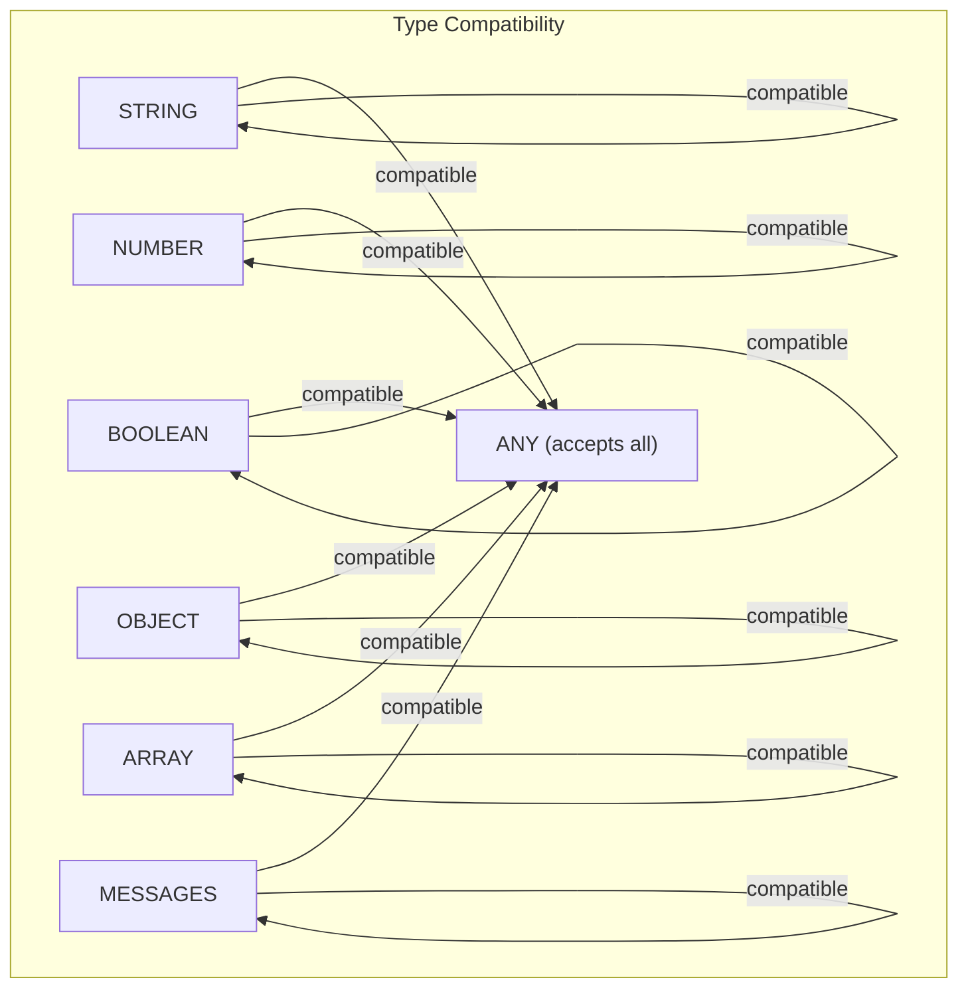

# Node I/O Standardization

Pipelit uses a standardized type system for node inputs and outputs. This enables compile-time edge validation, a node type registry with port definitions, and consistent error handling across all component types.

## Core Schemas

All I/O schemas are defined in `platform/schemas/`:

- `node_io.py` -- `NodeStatus`, `NodeError`, `NodeResult`, `NodeInput`
- `node_types.py` -- `DataType`, `PortDefinition`, `NodeTypeSpec`, `NODE_TYPE_REGISTRY`
- `node_type_defs.py` -- Registers all 23+ built-in node types with their port definitions

## DataType Enum

Every port has a data type that determines what kind of data it produces or accepts:

| DataType | Description | Example |
|----------|-------------|---------|
| `STRING` | Text content | Agent output, code snippet result |
| `NUMBER` | Numeric value | Calculator result, confidence score |
| `BOOLEAN` | True/false | Filter pass/fail |
| `OBJECT` | JSON object | Trigger payload, structured extraction |
| `ARRAY` | JSON array | Loop items, search results |
| `MESSAGES` | LangGraph message list | Conversation history |
| `ANY` | Accepts any type | Generic pass-through |

## PortDefinition

Each port on a node is defined with:

```python
class PortDefinition(BaseModel):
    name: str           # Port name (e.g., "output", "category")
    data_type: DataType # Type of data on this port
    required: bool      # Whether this input must be connected
    description: str    # Human-readable description
```

Example -- an agent node has one output port:

```python
outputs=[
    PortDefinition(
        name="output",
        data_type=DataType.STRING,
        required=False,
        description="The agent's response text",
    )
]
```

A categorizer node has two output ports:

```python
outputs=[
    PortDefinition(name="category", data_type=DataType.STRING, ...),
    PortDefinition(name="raw", data_type=DataType.STRING, ...),
]
```

## NodeTypeSpec and the Registry

Each component type is registered as a `NodeTypeSpec`:

```python
class NodeTypeSpec(BaseModel):
    component_type: str        # "agent", "trigger_chat", "code", etc.
    display_name: str          # "Agent", "Chat Trigger", "Code"
    description: str           # Human-readable description
    category: str              # "ai", "trigger", "logic", "tool", "sub_component"
    inputs: list[PortDefinition]
    outputs: list[PortDefinition]
    executable: bool           # Whether this node runs during execution
    config_schema: dict | None # JSON Schema for extra_config
```

All specs are collected in `NODE_TYPE_REGISTRY`, a dict keyed by `component_type`. This registry is:

- Served via `GET /workflows/node-types/` for the frontend
- Used by `EdgeValidator` for type compatibility checks
- Used by the orchestrator to determine which nodes are executable

### Registration Example

```python
register_node_type(NodeTypeSpec(
    component_type="agent",
    display_name="Agent",
    description="LLM-powered agent with tool calling",
    category="ai",
    inputs=[
        PortDefinition(name="input", data_type=DataType.STRING, required=True),
    ],
    outputs=[
        PortDefinition(name="output", data_type=DataType.STRING),
    ],
    executable=True,
))
```

## Edge Validation

The `EdgeValidator` class in `platform/validation/edges.py` enforces type safety at edge creation time.

### Type Compatibility Matrix



A source output port is compatible with a target input port if:

- The target input accepts `ANY`, or
- The source output type matches the target input type exactly

### Validation Methods

```python
class EdgeValidator:
    @staticmethod
    def validate_edge(
        source_node: WorkflowNode,
        target_node: WorkflowNode,
        edge_label: str,
    ) -> tuple[bool, str]:
        """Check type compatibility for a single edge."""

    @staticmethod
    def validate_workflow_edges(
        workflow_id: int, db: Session,
    ) -> list[str]:
        """Validate all edges in a workflow. Returns list of errors."""

    @staticmethod
    def validate_required_inputs(
        workflow_id: int, db: Session,
    ) -> list[str]:
        """Check that nodes have required sub-component connections
        (e.g., agent must have a model connected)."""
```

### API Integration

- **Edge creation** (`POST /workflows/{slug}/edges/`) -- Returns `422 Unprocessable Entity` if the edge would create a type mismatch
- **Workflow validation** (`POST /workflows/{slug}/validate/`) -- Runs full validation including all edges and required inputs

### Bypass Rules

Certain edge labels bypass type-compatibility validation:

- `loop_body` -- Loop to body node (flow control)
- `loop_return` -- Body node back to loop (flow control)
- `llm` -- Model connection (sub-component)
- `tool` -- Tool connection (sub-component)
- `memory` -- Memory connection (sub-component)
- `output_parser` -- Parser connection (sub-component)

## NodeResult

Every node execution produces a `NodeResult`:

```python
class NodeResult(BaseModel):
    status: NodeStatus        # success | failed | skipped
    data: dict | None         # Output data (on success)
    error: str | None         # Error message (on failure)
    error_code: str | None    # Machine-readable error code
    metadata: dict | None     # Timing, token usage, etc.

    @classmethod
    def success(cls, data: dict, **metadata) -> "NodeResult": ...

    @classmethod
    def failed(cls, error: str, error_code: str, **metadata) -> "NodeResult": ...

    @classmethod
    def skipped(cls, reason: str) -> "NodeResult": ...
```

### NodeStatus Enum

| Status | Description |
|--------|-------------|
| `pending` | Node is queued for execution |
| `running` | Node is currently executing |
| `success` | Node completed successfully |
| `failed` | Node encountered an error |
| `skipped` | Node was skipped (upstream failure or route mismatch) |

These statuses are broadcast via WebSocket `node_status` events and displayed as color-coded badges on the canvas:

- **Running** -- Spinning circle animation
- **Success** -- Green checkmark
- **Failed** -- Red X
- **Skipped** -- Gray dash

Badges are only shown on executable nodes (driven by the `executable` flag from the node type registry).

## Component Output Convention

Components return flat dicts. The orchestrator handles all wrapping and side effects:

```python
# Simple output
return {"output": "Hello, world!"}

# Multi-port output
return {
    "category": "technical",
    "raw": "Original question about Python decorators",
    "confidence": 0.92,
}

# Output with side effects
return {
    "output": "Routed to fast path",
    "_route": "fast_path",                    # Sets state["route"]
    "_messages": [AIMessage(content="...")],   # Appends to messages
    "_state_patch": {"user_context": {...}},   # Merges into state
}
```

### Processing Rules

1. All keys **without** an underscore prefix become `node_outputs[node_id][key]`
2. `_route` sets `state["route"]` for downstream conditional edges
3. `_messages` entries are appended to `state["messages"]`
4. `_state_patch` dict is merged into state, excluding protected keys (`messages`, `node_outputs`, `node_results`)
5. `_subworkflow` triggers the orchestrator's subworkflow delegation flow
6. `_token_usage` is accumulated into `state["_execution_token_usage"]` for cost tracking

## Frontend Integration

### TypeScript Interfaces

The frontend mirrors the Python schemas in `types/nodeIO.ts`:

```typescript
interface PortDefinition {
    name: string;
    data_type: DataType;
    required: boolean;
    description: string;
}

interface NodeTypeSpec {
    component_type: string;
    display_name: string;
    description: string;
    category: string;
    inputs: PortDefinition[];
    outputs: PortDefinition[];
    executable: boolean;
    config_schema?: Record<string, unknown>;
}
```

### Canvas Status Display

The `WorkflowCanvas` component tracks node execution status via WebSocket `node_status` events and applies:

- Color-coded borders matching the node's status
- Status badges (spinning circle, checkmark, X, dash)
- Clickable "output" links (emerald green) that open a popover with pretty-printed JSON output
- Clickable "error" links (red) that show error details and error codes
