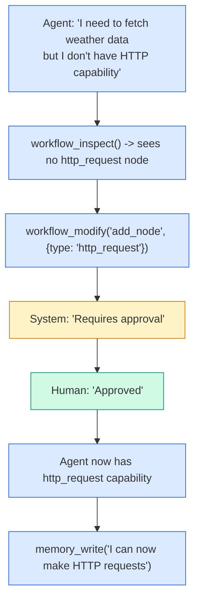
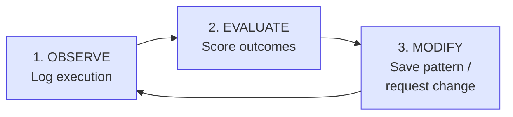

# Self-Improving Agents

Pipelit's long-term vision is a "Self-Evolving Lego" system where agents assemble workflows from nodes at runtime, learn from outcomes, modify themselves with guardrails, ask humans when uncertain, and crystallize successful patterns into reusable blocks.

This page describes the roadmap, architecture, and design principles for self-aware, self-evolving agent capabilities.

## Vision

```
Agent assembles workflows from nodes at runtime
Human watches construction on visual canvas
Agent learns from outcomes, remembers patterns
Agent can modify itself (with guardrails)
Agent asks human when uncertain
Successful patterns crystallize into reusable blocks
Complexity emerges organically over time
```

## Core Capabilities

| Capability | Description |
|------------|-------------|
| **Self-Awareness** | Agent knows its own config, structure, capabilities, and history |
| **Self-Evaluation** | Agent can assess what is working and what is not |
| **Self-Modification** | Agent can change its own workflows and configuration |
| **Guided Learning** | Agent asks human when uncertain, learns from answers |
| **Memory** | Agent remembers episodes, facts, and procedures |
| **Protection** | Guardrails prevent agent from breaking itself |

## Architecture Layers

```mermaid
graph TB
    subgraph Protection["Protection Layer"]
        Inv[Invariants]
        Perm[Permissions]
        CB[Circuit Breakers]
        Audit[Audit Log]
    end

    subgraph SelfModel["Agent Self-Model"]
        Config[Config<br/>model, temperature, limits]
        Structure[Structure<br/>nodes, edges, sub-agents]
        Caps[Capabilities<br/>tools available]
        Mem[Memory<br/>facts, procedures, episodes]
        Hist[History<br/>successes, failures, corrections]
    end

    subgraph Tools["Evolution Tools"]
        WI[workflow_inspect]
        WM[workflow_modify]
        MR[memory_read / write]
        CE[code_execute]
        RG[request_guidance]
        SE[self_evaluate]
    end

    subgraph Engine["Execution Engine"]
        Safe[Safe executor<br/>all checks applied]
        Stream[Live streaming<br/>to canvas]
        Approval[Approval workflows]
    end

    subgraph MemoryLayer["Memory Layer"]
        Episodes[Episodes<br/>raw logs]
        Facts[Facts<br/>knowledge]
        Procedures[Procedures<br/>skills]
    end

    Protection --> SelfModel
    SelfModel --> Tools
    Tools --> Engine
    Engine --> MemoryLayer

    classDef protect fill:#fee2e2,stroke:#dc2626
    classDef self fill:#dbeafe,stroke:#2563eb
    classDef tool fill:#d1fae5,stroke:#059669
    classDef engine fill:#fef3c7,stroke:#d97706
    classDef memory fill:#f3e8ff,stroke:#7c3aed

    class Inv,Perm,CB,Audit protect
    class Config,Structure,Caps,Mem,Hist self
    class WI,WM,MR,CE,RG,SE tool
    class Safe,Stream,Approval engine
    class Episodes,Facts,Procedures memory
```



## What Already Exists

The foundation for self-improving agents is largely in place:

| Capability | Status | Implementation |
|------------|--------|----------------|
| Trigger receiving (Telegram/Chat/Webhook) | Complete | `trigger_telegram`, `trigger_chat`, `trigger_webhook` |
| Agent with tool calling | Complete | `agent` node + 12+ tool sub-component types |
| Memory read/write | Complete | `memory_read`, `memory_write` tools |
| Workflow inspect / self-modify | Partial | `whoami` + `platform_api` tools |
| Human confirmation | Complete | `human_confirmation` node |
| Subworkflow execution | Complete | `workflow` node + `spawn_and_await` |
| Conditional routing | Complete | `switch` node + per-edge `condition_value` |
| Sequential and DAG execution | Complete | Topology-based ordering, RQ job queue |
| Loop iteration | Complete | `loop` node with body subgraph |
| State flow between nodes | Complete | `node_outputs` + Jinja2 expression resolution |
| Agent API credentials | Complete | `create_agent_user` tool |
| Platform API access | Complete | `platform_api` tool |
| Workflow CRUD via REST | Complete | Full API for workflows, nodes, edges |
| Visual canvas with live updates | Complete | React Flow + WebSocket |
| Cost tracking | Complete | `token_usage` service, budget enforcement via Epic budgets |

## Development Phases

### Phase 1: Foundation (Memory)

**Goal:** Agent can remember and persist knowledge across executions.

- Memory tables (Episodes, Facts, Procedures)
- `memory_read` and `memory_write` tool nodes
- Auto-logging of episodes after each execution

**Outcome:** Agent remembers things across conversations. **Status: Complete.**

### Phase 2: Self-Awareness

**Goal:** Agent can see itself -- its own structure, capabilities, and history.

- `workflow_inspect` tool (see own structure)
- `AgentSelfModel` (structured self-knowledge)
- Execution logging and success/failure tracking

**Outcome:** Agent can answer "What am I? What can I do? What is my history?" **Status: Partial -- `whoami` and `platform_api` tools provide base capability.**

### Phase 3: Protection

**Goal:** Agent cannot break itself.

| Component | Purpose | Status |
|-----------|---------|--------|
| Invariants | Hardcoded limits agent cannot see or change | Planned |
| Permission matrix | What agent can and cannot modify | Planned |
| Circuit breakers | Auto-stop on repeated failures | Planned |
| Rate limits | Prevent runaway execution | Planned |
| Cost tracking | Budget enforcement | **Complete** |
| Audit log | Immutable record of all actions | Planned |

**Outcome:** Agent operates safely within defined boundaries.

### Phase 4: Self-Modification

**Goal:** Agent can change itself, safely.

- `workflow_modify` tool (add/remove/rewire nodes)
- Approval system (human approves risky changes)
- Config adjustment (agent tunes own temperature, etc.)
- Pattern saving (save successful workflows as templates)

**Outcome:** Agent can propose and apply changes to itself.

### Phase 5: Guided Learning

**Goal:** Agent asks when stuck, learns from answers.

- Confidence scoring (know when uncertain)
- Human guidance request (ask questions with options)
- Learning persistence (save human teachings)
- Preference extraction (learn from corrections)

**Outcome:** Agent improves through human interaction.

### Phase 6: Live Visibility

**Goal:** Human sees everything in real-time.

- Execution streaming (watch nodes execute live) -- **Complete**
- Canvas status colors (see running/success/failed) -- **Complete**
- Pause/resume (intervene mid-execution) -- Planned
- Edit mid-flight (change nodes during execution) -- Planned
- Agent proposals UI (see what agent wants to change) -- Planned

**Outcome:** Full transparency into agent behavior.

### Phase 7: Emergence

**Goal:** Complexity grows organically.

- Self-reflection workflow (periodic self-evaluation)
- Pattern composition (combine patterns into larger ones)
- Habit formation (frequently-used patterns become automatic)
- Priority emergence (learn task importance from usage)
- Memory consolidation (extract facts from episodes)

**Outcome:** Agent evolves toward emergent executive function.

## The Bootstrap Moment

After Phase 4, the agent reaches **bootstrap capability** -- the point where it can request and grow its own capabilities:



From this point, the agent can request and grow its own capabilities. The human approves, or the agent writes code to compensate.

## Self-Iteration Loop

The minimum viable self-evolution loop:



1. **Observe** -- Automatically log every execution (episodes, inputs, outputs, success/failure)
2. **Evaluate** -- Score outcomes using a multi-signal formula:
    - Success rate (0.3 weight)
    - 1 - intervention rate (0.2 weight)
    - Human rating (0.3 weight)
    - Reuse count (0.2 weight)
3. **Modify** -- Save successful patterns as procedures, or request changes via the approval system

## Evaluation Signals

No single signal is sufficient. The platform combines multiple evaluation layers:

| Layer | Signal | When |
|-------|--------|------|
| Immediate | Success/failure, errors | During execution |
| Session | Human rating, corrections | End of interaction |
| Implicit | Reuse count, intervention rate | Over time |
| Outcome | External success signals | Days later |

## Memory-Driven Learning

The three memory types each serve a different role in the learning cycle:

| Memory Type | Purpose | Growth Rate | Example |
|-------------|---------|-------------|---------|
| **Episodes** | Raw execution logs | Fast (every run) | "Executed Moltbook join workflow, 3 tasks, 2340ms" |
| **Facts** | Extracted knowledge | Slow (consolidated) | "Moltbook requires webhook verification" |
| **Procedures** | Reusable patterns/skills | Slowest (learned) | "Webhook verification: create code node + webhook trigger" |

The learning progression:

1. Episodes accumulate from raw execution
2. Facts are extracted from episodes (e.g., "This API requires auth header")
3. Procedures crystallize from repeated successful patterns (e.g., "To verify webhooks, fork the moltbook-verify workflow")

## Integration with Multi-Agent Delegation

The self-improving architecture connects directly to the [multi-agent delegation system](multi-agent.md):

- **Epic/Task Registry** -- Provides the structured tracking layer for self-assessment ("What have I worked on? What succeeded?")
- **workflow_discover** -- Enables pattern reuse ("Has anyone solved this before?")
- **workflow_create** -- Enables self-modification ("I need a new workflow for this task")
- **spawn_and_await** -- Enables delegation ("This task needs its own workflow")
- **Cost tracking** -- Provides budget guardrails ("Am I within my resource limits?")

## Success Criteria

| Milestone | Criteria |
|-----------|---------|
| Memory works | Agent recalls facts from previous sessions |
| Self-aware | Agent accurately describes its own structure |
| Protected | Agent cannot delete its own protection layer |
| Self-modifying | Agent successfully adds a new node (with approval) |
| Learning | Agent asks question, human answers, agent remembers |
| Visible | Human watches execution in real-time on canvas |
| Evolving | Agent proposes improvement based on failure pattern |

## Roadmap Summary

| Week | Phase | Deliverable |
|------|-------|-------------|
| 1-3 | Foundation | Memory tables + read/write nodes + code execution |
| 4-5 | Self-Awareness | workflow_inspect + AgentSelfModel |
| 6-7 | Protection | Invariants + permissions + circuit breakers |
| 8-10 | Self-Modification | workflow_modify + approval flow + pattern saving |
| 11-13 | Guided Learning | Confidence scoring + human guidance + persistence |
| 14-16 | Live Visibility | Execution streaming + pause/resume + edit mid-flight |
| 17+ | Emergence | Self-reflection + pattern composition + habit formation |

The foundation (Phase 1) comes first because without memory there is no learning. Everything else builds on that base.
