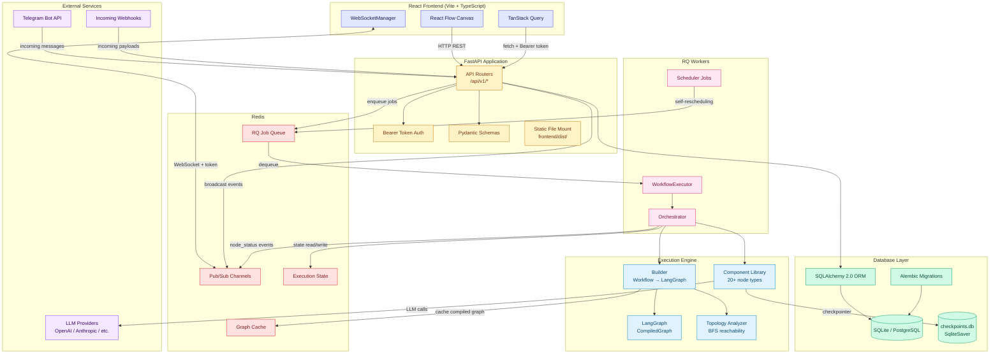
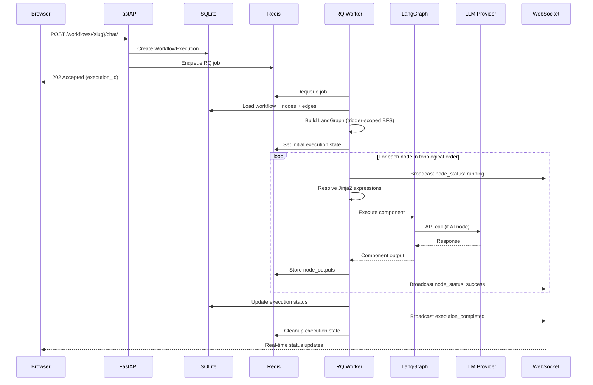

# System Overview

Pipelit is a visual workflow automation platform for building LLM-powered agents. This page describes how all major system components connect and interact.

## Architecture Diagram

## Component Descriptions

### React Frontend

The frontend is a React SPA built with Vite and TypeScript. It uses React Flow (v12) for the visual workflow canvas, TanStack Query for server state management, and Shadcn/ui for the component library.

- **React Flow Canvas** -- Users design workflows by placing nodes and connecting them with edges on a drag-and-drop canvas.
- **TanStack Query** -- All API calls use TanStack Query hooks. Mutations no longer invalidate queries on success; instead, updates arrive via WebSocket and are applied directly to the query cache.
- **WebSocketManager** -- A singleton that maintains a persistent WebSocket connection with exponential backoff reconnection and automatic resubscription after disconnect.

### FastAPI Application

The backend is a FastAPI application serving both the REST API and the built frontend.

- **API Routers** -- All endpoints live under `/api/v1/` and handle workflow CRUD, node/edge management, executions, credentials, chat, schedules, memory, and epics/tasks.
- **Bearer Token Auth** -- Every request is authenticated via `Authorization: Bearer <api_key>`. There is no session auth, OAuth, or basic auth.
- **Pydantic Schemas** -- Request/response validation uses Pydantic models with `Literal` types for component types, trigger types, and edge types.
- **Static File Mount** -- In production, the built frontend (`frontend/dist/`) is served directly by FastAPI.

### Database Layer

- **SQLAlchemy 2.0 ORM** -- All models use SQLAlchemy 2.0 with declarative mapping. The node system uses polymorphic inheritance for component configurations.
- **Alembic Migrations** -- Schema changes are managed via Alembic. SQLite `batch_alter_table` operations require extra care to avoid data loss.
- **SQLite / PostgreSQL** -- SQLite is the default for development; PostgreSQL is supported for production.
- **Checkpoints DB** -- A separate SQLite database (`checkpoints.db`) stores LangGraph conversation checkpoints for agent memory continuity.

### Redis

Redis serves four distinct roles in the platform:

- **Pub/Sub** -- The WebSocket broadcast system uses Redis pub/sub to fan out events across multiple API server instances and RQ workers.
- **Job Queue** -- RQ (Redis Queue) manages background job processing for workflow executions and scheduled jobs.
- **Graph Cache** -- Compiled LangGraph graphs are cached in Redis to avoid recompilation on repeated executions.
- **Execution State** -- Per-execution state (node outputs, node results, route values) is stored in Redis during execution and cleaned up after completion.

### RQ Workers

Background processing is handled by RQ workers that dequeue jobs from Redis.

- **WorkflowExecutor** -- The top-level wrapper that sets up the execution environment and delegates to the orchestrator.
- **Orchestrator** -- The core execution engine that walks through nodes in topological order, resolves expressions, executes components, and broadcasts status events.
- **Scheduler Jobs** -- Self-rescheduling jobs that implement recurring workflow execution without external cron. Each job dispatches its trigger, handles success/failure with exponential backoff, and enqueues its next run.

### Execution Engine

- **Builder** -- Compiles a `Workflow` database model into a LangGraph `CompiledGraph`. Only nodes reachable from the firing trigger are included (trigger-scoped execution via BFS).
- **LangGraph** -- The compiled graph is executed by LangGraph, which handles state transitions, message passing, and checkpointing.
- **Component Library** -- Over 20 component types implement the actual node logic: agents, tools, triggers, routing, code execution, memory, and more.
- **Topology Analyzer** -- BFS-based reachability analysis that determines which nodes are downstream from a given trigger.

### External Services

- **LLM Providers** -- Agent and AI nodes call external LLM APIs (OpenAI, Anthropic, and others) via LangChain. Credentials are stored encrypted with Fernet.
- **Telegram Bot API** -- The Telegram trigger handler receives incoming messages and dispatches them to workflows.
- **Incoming Webhooks** -- External services can trigger workflow execution via webhook endpoints.

## Request Flow

A typical user interaction flows through the system as follows:

## Technology Stack Summary

| Layer | Technology |
|-------|-----------|
| Frontend | React, TypeScript, Vite, React Flow v12, TanStack Query, Shadcn/ui |
| API | FastAPI, Pydantic, Uvicorn |
| ORM | SQLAlchemy 2.0 |
| Database | SQLite (dev) / PostgreSQL (prod) |
| Migrations | Alembic |
| Background Jobs | RQ (Redis Queue) |
| Execution Engine | LangGraph |
| LLM Integration | LangChain |
| Cache / Pub/Sub / State | Redis |
| Auth | Bearer token (API keys), Fernet encryption for secrets |
