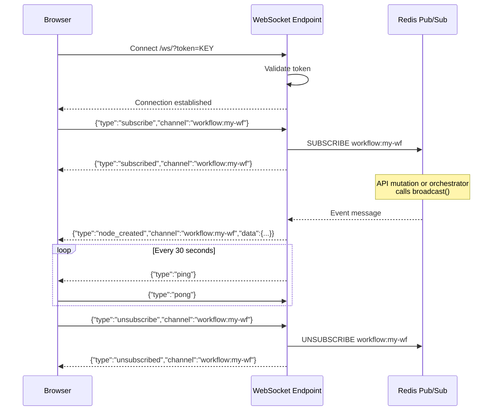

# WebSocket System

Pipelit uses a single global authenticated WebSocket connection to deliver real-time updates to the frontend. This replaces per-execution WebSocket connections and eliminates the need for polling.

## Architecture Overview

```mermaid
graph TB
    subgraph Clients["Frontend Clients"]
        C1[Browser 1]
        C2[Browser 2]
    end

    subgraph API["FastAPI Server"]
        WSEndpoint[WebSocket Endpoint<br/>/ws/?token=API_KEY]
        Router1[API Router<br/>node/edge mutations]
    end

    subgraph Redis["Redis"]
        PS[Pub/Sub Channels]
    end

    subgraph Workers["RQ Workers"]
        Orch[Orchestrator<br/>node_status events]
        Sched[Scheduler<br/>execution events]
    end

    C1 <-->|WebSocket| WSEndpoint
    C2 <-->|WebSocket| WSEndpoint
    WSEndpoint <-->|subscribe/publish| PS
    Router1 -->|broadcast()| PS
    Orch -->|broadcast()| PS
    Sched -->|broadcast()| PS

    classDef client fill:#e0e7ff,stroke:#4f46e5
    classDef api fill:#fef3c7,stroke:#d97706
    classDef redis fill:#fee2e2,stroke:#dc2626
    classDef worker fill:#fce7f3,stroke:#db2777

    class C1,C2 client
    class WSEndpoint,Router1 api
    class PS redis
    class Orch,Sched worker
```

## Backend Implementation

### WebSocket Endpoint (`ws/global_ws.py`)

A single persistent WebSocket at `GET /ws/?token=<api_key>`:

- **Authentication** -- Token is validated on connect. Invalid tokens get an immediate close.
- **Heartbeat** -- Server sends `{"type": "ping"}` every 30 seconds. Client must respond with `{"type": "pong"}`. Missing pongs trigger disconnect.
- **Redis pub/sub fan-out** -- Each WebSocket connection subscribes to Redis channels on behalf of the client. Messages from Redis are forwarded to the WebSocket.

### Broadcast Helper (`ws/broadcast.py`)

A synchronous function usable from both API endpoints and RQ workers:

```python
def broadcast(channel: str, event_type: str, data: dict):
    """Publish an event to all subscribers of a channel.

    Args:
        channel: "workflow:<slug>" or "execution:<id>"
        event_type: "node_status", "node_created", etc.
        data: Event payload
    """
```

This function publishes to Redis pub/sub. The WebSocket endpoint picks up the message and forwards it to all connected clients subscribed to that channel.

## Subscription Protocol

The client and server communicate via JSON messages over the WebSocket:

### Client to Server

```json
{"type": "subscribe", "channel": "workflow:my-workflow"}
```

```json
{"type": "unsubscribe", "channel": "workflow:my-workflow"}
```

```json
{"type": "pong"}
```

### Server to Client

```json
{"type": "subscribed", "channel": "workflow:my-workflow"}
```

```json
{"type": "unsubscribed", "channel": "workflow:my-workflow"}
```

```json
{"type": "ping"}
```

```json
{
    "type": "node_status",
    "channel": "workflow:my-workflow",
    "data": {
        "node_id": "agent_abc123",
        "status": "success",
        "output": {"output": "Hello!"}
    }
}
```

### Subscription Flow



## Event Types

### Canvas Mutation Events

Published by API routers when nodes or edges are created, updated, or deleted:

| Event Type | Channel | Payload |
|------------|---------|---------|
| `node_created` | `workflow:<slug>` | Full node data |
| `node_updated` | `workflow:<slug>` | Updated node fields |
| `node_deleted` | `workflow:<slug>` | `{node_id}` |
| `edge_created` | `workflow:<slug>` | Full edge data |
| `edge_updated` | `workflow:<slug>` | Updated edge fields |
| `edge_deleted` | `workflow:<slug>` | `{edge_id}` |
| `workflow_updated` | `workflow:<slug>` | Updated workflow fields |

### Execution Events

Published by the orchestrator during workflow execution:

| Event Type | Channel | Payload |
|------------|---------|---------|
| `node_status` | `workflow:<slug>` | `{node_id, status, output?, error?, error_code?}` |
| `execution_completed` | `workflow:<slug>` | `{execution_id, status, duration_ms}` |
| `execution_failed` | `workflow:<slug>` | `{execution_id, error}` |
| `execution_interrupted` | `workflow:<slug>` | `{execution_id, reason}` |

### Task Registry Events

Published when epics or tasks are modified:

| Event Type | Channel | Payload |
|------------|---------|---------|
| `task_created` | `epic:<epic_id>` | `{task_id, epic_id, title, status}` |
| `task_updated` | `epic:<epic_id>` | `{task_id, status, cost?}` |
| `epic_updated` | `epic:<epic_id>` | `{epic_id, status, progress}` |

### Node Status Values

The `node_status` event carries a `status` field with one of:

| Status | Meaning | Canvas Badge |
|--------|---------|-------------|
| `pending` | Queued for execution | -- |
| `running` | Currently executing | Spinning circle |
| `success` | Completed successfully | Green checkmark |
| `failed` | Encountered an error | Red X |
| `skipped` | Skipped (route mismatch or upstream failure) | Gray dash |

## Frontend Implementation

### WebSocketManager (`lib/wsManager.ts`)

A singleton that manages the WebSocket connection lifecycle:

```typescript
class WebSocketManager {
    connect(token: string): void;
    disconnect(): void;
    subscribe(channel: string): void;
    unsubscribe(channel: string): void;
    registerHandler(eventType: string, handler: Function): void;
    unregisterHandler(eventType: string, handler: Function): void;
}
```

Key behaviors:

- **Exponential backoff reconnection** -- On disconnect, the manager retries with increasing delays (1s, 2s, 4s, 8s, up to 30s)
- **Auto-resubscribe** -- After reconnecting, all previously active subscriptions are automatically restored
- **TanStack Query cache updates** -- The manager directly updates TanStack Query's cache when receiving mutation events:
    - `node_created/updated/deleted` -- `setQueryData` on the nodes query
    - `edge_created/updated/deleted` -- `setQueryData` on the edges query
    - `execution_completed/failed` -- `invalidateQueries` on the executions query
- **Handler registration** -- Components can register callbacks for specific event types (e.g., ChatPanel registers for `execution_completed`)

### React Hooks (`hooks/useWebSocket.ts`)

```typescript
function useWebSocket(): void;
// Connects on mount, disconnects on unmount

function useSubscription(channel: string): void;
// Subscribes on mount, unsubscribes on unmount
// Channel changes trigger resubscription
```

### No More Polling

The WebSocket system eliminates all polling patterns:

- Node/edge mutation hooks no longer use `onSuccess` query invalidation -- updates arrive via WebSocket
- `useExecution()` no longer uses `refetchInterval` polling -- status updates arrive via WebSocket
- ChatPanel uses `wsManager.registerHandler()` for execution completion instead of per-execution WebSocket connections

## Multi-Worker Broadcasting

The Redis pub/sub layer ensures events reach all connected clients regardless of which process generated them:

```mermaid
graph LR
    subgraph "Process 1: FastAPI"
        API[API Handler] -->|broadcast()| R1[Redis Publish]
        WS1[WS Connection 1] -->|subscribe| R2[Redis Subscribe]
        WS2[WS Connection 2] -->|subscribe| R2
    end

    subgraph "Process 2: RQ Worker"
        Orch[Orchestrator] -->|broadcast()| R3[Redis Publish]
    end

    R1 -->|pub/sub| Redis[(Redis)]
    R3 -->|pub/sub| Redis
    Redis -->|fan-out| R2
```

This means:

- An API mutation (node update) broadcasts from the FastAPI process
- An execution status event broadcasts from the RQ worker process
- Both reach the same connected clients via Redis pub/sub
- Scaling to multiple API server instances works automatically
