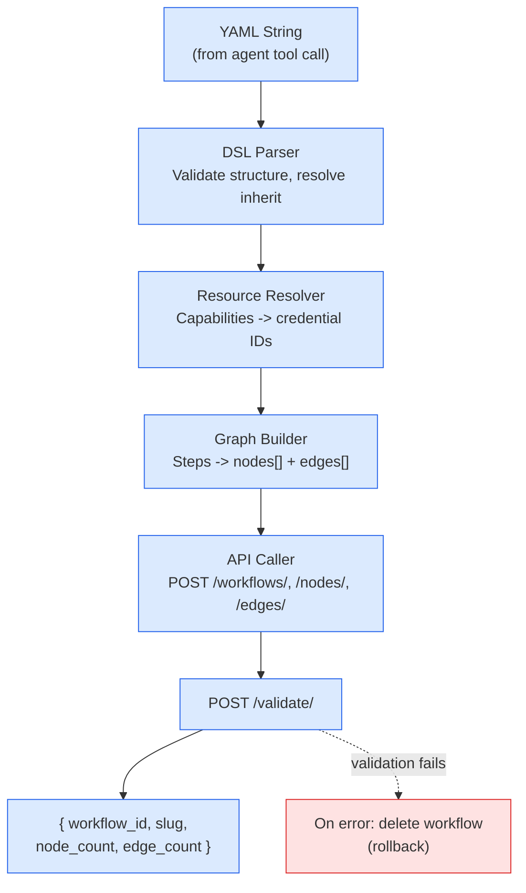
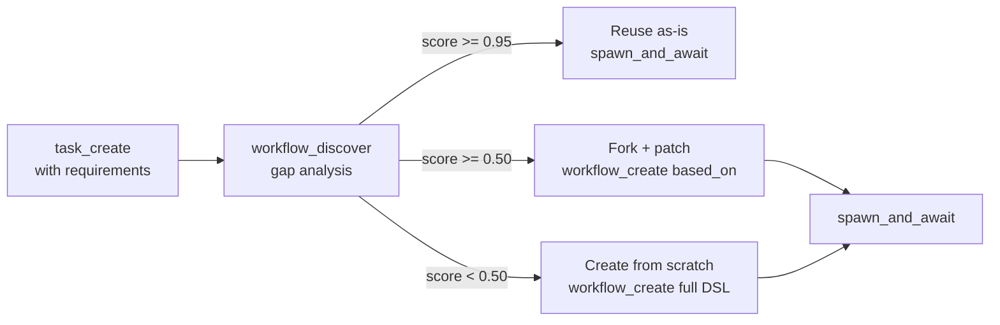

# Workflow DSL

Pipelit provides a YAML-based declarative workflow definition language that agents use to create workflows programmatically via the `workflow_create` tool. The DSL compiles to the standard node/edge representation at creation time -- it is not a persistent format.

## Overview

The DSL provides two modes:

1. **Create from scratch** -- Full workflow definition with steps, triggers, tools, and model declarations
2. **Fork and patch** (`based_on` + `patches`) -- Start from an existing workflow and apply incremental modifications

### Why YAML?

- More readable for LLMs generating workflow specs
- Multi-line strings (`|`) are natural for code snippets and prompts
- Comments are supported (agents can annotate their reasoning)
- JSON is a valid YAML subset -- agents can emit either

### Relationship to the Visual Canvas

The DSL is for **programmatic** workflow creation by agents. Human users continue using the visual canvas. Both produce the same underlying representation (nodes + edges in the database).

## Basic Structure

```yaml
name: "Moltbook Webhook Verification"
description: "Receives Moltbook verification ping and responds with token"
tags: ["webhook", "verification", "moltbook"]

trigger:
  type: webhook

model:
  capability: "gpt-4"       # Resolved to concrete credential at compile time

steps:
  - id: validate
    type: code
    snippet: |
      import json
      payload = json.loads(input_data)
      if payload.get("type") != "verification":
          raise ValueError("Not a verification request")
      return {"token": payload["verify_token"], "status": "ok"}

  - id: respond
    type: code
    snippet: |
      return {"verified": True, "token": trigger.payload.token}
```

## Step Types

Each step maps to a Pipelit component type:

| Step Type | Component Type | Required Fields | Optional Fields |
|-----------|---------------|-----------------|-----------------|
| `agent` | `agent` | `prompt` | `model`, `tools`, `memory` |
| `code` | `code` | `snippet` | -- |
| `http` | `http_request` | `url` | `method`, `headers`, `body`, `timeout` |
| `switch` | `switch` | `rules` | `default` |
| `loop` | `loop` | `over`, `body` | `max_iterations` |
| `workflow` | `workflow` | `slug` | `payload` |
| `transform` | `text_template` | `template` | -- |
| `human` | `human_confirmation` | `message` | `timeout` |

## Triggers

```yaml
# Webhook trigger
trigger:
  type: webhook

# Telegram trigger
trigger:
  type: telegram
  credential: inherit     # Use parent's telegram credential

# Chat trigger (for testing / manual invocation)
trigger:
  type: chat

# No trigger (subworkflow -- invoked by parent)
trigger: none
```

## Model Declaration

Models are declared by **capability**, not by credential ID. The compiler resolves capabilities to concrete credentials at creation time.

### Strategy 1: Capability Matching (Recommended)

```yaml
model:
  capability: "gpt-4"
  temperature: 0.7
```

The compiler queries `GET /credentials/?type=llm_provider` and finds a credential providing the requested model.

### Strategy 2: Inherit from Parent

```yaml
model:
  inherit: true
```

Copies the parent agent's `llm_credential_id` and `model_name` into the new workflow's agent nodes. This is the simplest and most common case for subworkflows.

### Strategy 3: Discovery

```yaml
model:
  discover: true
  preference: "cheapest"    # or "fastest", "most_capable"
```

Lists available credentials and models, applies the preference filter, and selects automatically.

### Strategy 4: Explicit (Escape Hatch)

```yaml
model:
  credential_id: 5
  model_name: "gpt-4o"
  temperature: 0.7
```

Direct reference -- fragile, avoid in agent-created workflows.

**Resolution order:** `inherit` > `capability` > `discover` > `credential_id`.

## Implicit vs. Explicit Flow

### Implicit Linear Flow

Steps execute in declaration order. No explicit edges needed:

```yaml
steps:
  - id: fetch
    type: http
    url: "https://api.example.com/data"

  - id: process
    type: code
    snippet: |
      data = json.loads(input_data)
      return {"count": len(data["items"])}

  - id: respond
    type: agent
    prompt: "Summarize the data"
```

Compiles to: `trigger -> fetch -> process -> respond` (3 direct edges).

### Explicit Branching

Use `switch` for conditional routing:

```yaml
steps:
  - id: classify
    type: switch
    rules:
      - field: "trigger.payload.type"
        operator: "equals"
        value: "verification"
        route: "verify"
      - field: "trigger.payload.type"
        operator: "equals"
        value: "message"
        route: "handle_msg"
    default: "log_unknown"

  - id: verify
    type: code
    snippet: "return {'verified': True}"

  - id: handle_msg
    type: agent
    prompt: "Process the incoming message"

  - id: log_unknown
    type: code
    snippet: "return {'error': 'unknown type'}"
```

Compiles to a `switch` node with conditional edges (`condition_value` on each edge).

## Tools for Agent Steps

Agent steps can declare inline tools:

```yaml
steps:
  - id: worker
    type: agent
    prompt: "You are a data analysis agent."
    model:
      capability: "gpt-4"
    tools:
      - type: code
      - type: http_request
      - type: calculator
      - type: web_search
        config:
          searxng_url: "http://localhost:8080"
    memory: true    # Enable memory_read + memory_write
```

Each tool entry creates a tool node and a `tool` edge connecting it to the agent. Tool configs support `inherit` to copy from the parent agent's matching tool.

## Loops

```yaml
steps:
  - id: process_items
    type: loop
    over: "{{ fetch.output }}"       # Jinja2 expression for the iterable
    max_iterations: 100
    body:
      - id: transform_item
        type: code
        snippet: |
          item = json.loads(input_data)
          return {"processed": item["name"].upper()}

      - id: store_item
        type: http
        url: "https://api.example.com/items"
        method: POST
        body: "{{ transform_item.output }}"
```

## Subworkflow Steps

Reference existing workflows:

```yaml
steps:
  - id: verify
    type: workflow
    slug: "moltbook-verify"
    payload:
      token: "{{ trigger.payload.verify_token }}"
```

## Fork and Patch Mode

For partial matches -- start from an existing workflow and apply modifications.

### Structure

```yaml
based_on: "moltbook-verify"
name: "ServiceX Webhook Verification"
description: "Adapted from moltbook-verify for ServiceX"
tags: ["webhook", "verification", "servicex"]

patches:
  - action: update_prompt
    step_id: "code_1"
    snippet: |
      return {"token": payload["sx_token"], "status": "ok"}

  - action: add_step
    after: "code_1"
    step:
      id: notify
      type: http
      url: "https://servicex.com/api/confirm"
      method: POST
      body: '{"verified": true}'

  - action: add_tool
    agent_id: "agent_1"
    tool:
      type: web_search
      config:
        searxng_url: "http://localhost:8080"

  - action: remove_step
    step_id: "old_logger"
```

### Patch Actions

| Action | Description | Parameters |
|--------|-------------|------------|
| `add_step` | Insert a new step | `after` (step_id), `step` (full spec) |
| `remove_step` | Remove a step, reconnect edges | `step_id` |
| `update_prompt` | Update code snippet or system prompt | `step_id`, `snippet` or `prompt` |
| `update_config` | Modify step configuration | `step_id`, `config` (merged) |
| `add_tool` | Connect a new tool to an agent | `agent_id`, `tool` (tool spec) |
| `remove_tool` | Disconnect a tool from an agent | `agent_id`, `tool_type` |
| `update_trigger` | Change trigger type or config | `trigger` (trigger spec) |
| `update_model` | Change model for an agent step | `step_id`, `model` (model spec) |

### Fork Semantics

When `based_on` is specified:

1. **Clone** -- Copy all nodes, edges, and configurations from the source workflow
2. **Rename** -- Apply `name`, `description`, `tags` from the DSL
3. **Patch** -- Apply each patch action in order
4. **Validate** -- Run the standard workflow validation pipeline
5. **Return** -- New workflow slug; the original is never modified

## DSL Compiler Pipeline



### Compilation Example

For a simple linear workflow:

```yaml
trigger:
  type: webhook
steps:
  - id: code_1
    type: code
    snippet: "return {'ok': True}"
  - id: agent_1
    type: agent
    prompt: "Summarize"
```

Compiles to:

```json
{
  "nodes": [
    {"node_id": "trigger_webhook_1", "component_type": "trigger_webhook"},
    {"node_id": "code_1", "component_type": "code",
     "config": {"extra_config": {"snippet": "return {'ok': True}"}}},
    {"node_id": "agent_1", "component_type": "agent",
     "config": {"system_prompt": "Summarize",
                "llm_credential_id": 5, "model_name": "gpt-4o"}}
  ],
  "edges": [
    {"source_node_id": "trigger_webhook_1", "target_node_id": "code_1"},
    {"source_node_id": "code_1", "target_node_id": "agent_1"}
  ]
}
```

### Error Handling

The compiler validates at each stage:

1. **Parse errors** -- Invalid YAML structure
2. **Unknown step types** -- Unrecognized step type in a step definition
3. **Resource resolution failures** -- No credential found providing the requested model
4. **API validation failures** -- Edge type mismatches or missing required connections; partially-created workflow is rolled back (deleted)

## Integration with Task Registry

Tasks in the registry declare **requirements** -- capabilities needed for the workflow that executes them. This connects task planning to workflow creation:

```python
create_task(
    epic_id="ep_01JKXYZ",
    title="Analyze coverage gaps",
    requirements='{"model": "gpt-4", "tools": ["code", "web_search"], "memory": true}',
)
```

The discovery-create-execute pipeline:



## Examples

### Simple Webhook Handler

```yaml
name: "Health Check Endpoint"
description: "Returns 200 OK for monitoring"
tags: ["health", "monitoring"]

trigger:
  type: webhook

steps:
  - id: respond
    type: code
    snippet: |
      return {"status": "healthy"}
```

### Agent with Tools (Subworkflow)

```yaml
name: "Research Assistant"
description: "Agent that can search the web and execute code"
tags: ["research", "agent"]

trigger: none    # Subworkflow -- invoked by parent

model:
  inherit: true

steps:
  - id: researcher
    type: agent
    prompt: |
      You are a research assistant. Use web search to find information
      and code execution to process data.
    tools:
      - type: web_search
        config:
          searxng_url: inherit
      - type: code
      - type: calculator
    memory: true
```

### Multi-Step Pipeline with Branching

```yaml
name: "Content Moderator"
tags: ["moderation", "content"]

trigger:
  type: webhook

model:
  capability: "gpt-4"

steps:
  - id: classify
    type: agent
    prompt: "Classify the content as 'safe', 'review', or 'block'."

  - id: route
    type: switch
    rules:
      - field: "classify.output"
        operator: equals
        value: "safe"
        route: approve
      - field: "classify.output"
        operator: equals
        value: "block"
        route: reject
    default: manual_review

  - id: approve
    type: code
    snippet: "return {'action': 'approve'}"

  - id: reject
    type: code
    snippet: "return {'action': 'reject'}"

  - id: manual_review
    type: human
    message: "Content needs manual review."
```

## Design Notes

### DSL Is Not Stored

The YAML DSL is ephemeral -- it is compiled to nodes and edges at creation time. The workflow stores the standard node/edge representation. To reconstruct the DSL from a workflow, a decompiler would be needed (future enhancement).

### Relationship to `platform_api` Tool

The `workflow_create` tool with DSL is a higher-level interface than the raw `platform_api` tool. Agents could still use `platform_api` directly for fine-grained control, but the DSL handles resource resolution, validation, and rollback automatically.
