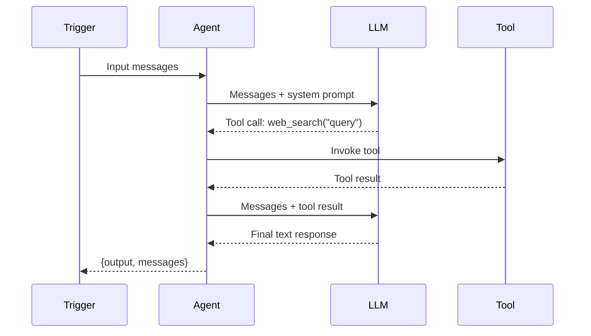
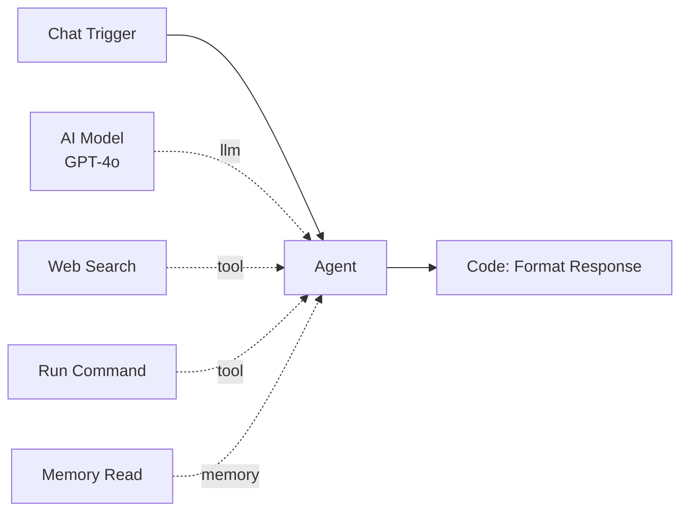

# Agent

The Agent node is a **LangGraph ReAct agent** -- an LLM that can reason about a task, decide which tools to call, observe the results, and iterate until it produces a final answer. It is the primary AI node in Pipelit.

**Component type:** `agent`

## Ports

### Inputs

| Port | Type | Required | Description |
|------|------|----------|-------------|
| `messages` | `MESSAGES` | Yes | Conversation messages from a trigger or upstream node |

### Outputs

| Port | Type | Description |
|------|------|-------------|
| `messages` | `MESSAGES` | Full conversation including tool calls and responses |
| `output` | `STRING` | Final text content from the last AI message |

## Sub-Components

The Agent supports three sub-component connections via the diamond handles at the bottom of the node:

| Sub-Component | Handle Color | Required | Edge Label | Purpose |
|---------------|-------------|----------|------------|---------|
| **Model** | Blue (`#3b82f6`) | Yes | `llm` | The LLM provider and model (e.g., GPT-4o, Claude) |
| **Tools** | Green (`#10b981`) | No | `tool` | LangChain tools the agent can invoke during reasoning |
| **Memory** | Amber (`#f59e0b`) | No | `memory` | Global memory read/write access (Memory Read, Memory Write) |

!!! warning "Model is required"
    Every Agent node must have an AI Model sub-component connected. Without it, the agent cannot resolve which LLM to use and will fail at build time.

## Configuration

| Setting | Type | Default | Description |
|---------|------|---------|-------------|
| System Prompt | `string` | `""` | Instructions and persona for the agent. Supports Jinja2 expressions. |
| Conversation Memory | `boolean` | `false` | When enabled, persists conversation history across executions using a SqliteSaver checkpointer. |

### System Prompt

The system prompt defines the agent's personality, instructions, and constraints. It is delivered to the LLM in two ways:

1. **SystemMessage** -- passed via LangGraph's `create_react_agent(prompt=SystemMessage(...))` for the standard system role.
2. **HumanMessage fallback** -- a `HumanMessage` with a stable ID is prepended to the conversation to support LLM providers that ignore the system role (e.g., Venice.ai).

The system prompt supports Jinja2 template expressions resolved against upstream node outputs and trigger data:

```
You are a helpful assistant for {{ trigger.payload.company_name }}.
Use the context from: {{ identify_user_abc123.user_context }}
```

### Conversation Memory

By default, agents are **stateless** -- each execution starts fresh. Enabling conversation memory changes this:

- A **SqliteSaver** checkpointer stores the full conversation state in `platform/checkpoints.db`.
- The **thread ID** is constructed from `{user_profile_id}:{telegram_chat_id}:{workflow_id}`, so the same user talking to the same workflow always resumes the same conversation.
- If there is no Telegram chat ID, the thread simplifies to `{user_profile_id}:{workflow_id}`.

!!! info "Ephemeral checkpoints for Spawn & Await"
    If an agent has a `spawn_and_await` tool connected but conversation memory is disabled, a **RedisSaver** checkpointer is used instead. This ephemeral checkpointer only persists state long enough for the child workflow to complete and the agent to resume.

## Usage

### Execution Loop

The Agent follows the ReAct (Reason + Act) pattern:

1. **Receive** -- the agent receives input messages from the trigger or upstream node.
2. **Reason** -- the LLM reads the conversation and system prompt, then decides what to do.
3. **Act** -- if the LLM needs more information, it calls one of its connected tools.
4. **Observe** -- the tool result is appended to the conversation as a `ToolMessage`.
5. **Repeat** -- the LLM reasons again with the new information. This loop continues until the LLM produces a text response without any tool calls.



### Tool Resolution

At build time, the agent queries all edges with `edge_label="tool"` or `edge_label="memory"` pointing to it. For each connected tool node, it loads the tool's factory and registers the resulting LangChain `@tool` function. When the LLM invokes a tool during reasoning:

1. A `node_status` WebSocket event with `status: "running"` is published for the tool node.
2. The tool function executes.
3. A `node_status` event with `status: "success"` or `status: "failed"` is published.
4. The result is returned to the LLM as a `ToolMessage`.

Tool nodes on the canvas show real-time status badges as the agent uses them.

### Output Convention

The Agent returns:

| Key | Type | Description |
|-----|------|-------------|
| `output` | `string` | The final text content extracted from the last AI message |
| `_messages` | `list` | All messages from the agent's execution (appended to workflow state) |
| `_token_usage` | `dict` | Token counts, cost in USD, and tool invocation count |

Downstream nodes access the agent's text via `{{ agent_abc123.output }}`.

!!! tip "Tool message cleanup"
    If an agent has no tools connected, it automatically strips `ToolMessage` and tool-call AI messages from upstream agents. This prevents the LLM from being confused by foreign tool calls it cannot handle.

## Example

A simple chat agent with web search and command execution:



**System prompt:**
```
You are a helpful research assistant. When the user asks a question:
1. Search the web for current information.
2. Verify facts by running commands if needed.
3. Check memory for any relevant prior context.
4. Provide a comprehensive, well-sourced answer.
```

**Configuration:**

- Conversation Memory: `true` (remembers prior interactions)
- AI Model: GPT-4o via OpenAI credential
- Tools: Web Search (SearXNG), Run Command
- Memory: Memory Read
