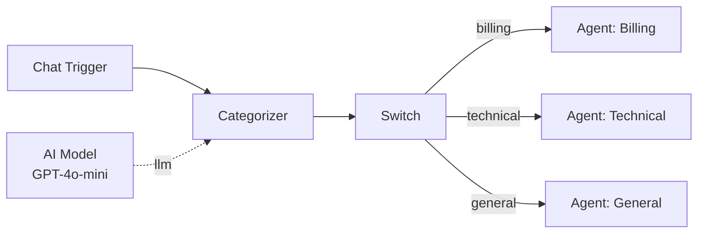

# Categorizer

The Categorizer node classifies input messages into one of a set of predefined categories using an LLM. It outputs the matched category label and the raw LLM response, and sets the `_route` state for downstream conditional routing.

**Component type:** `categorizer`

## Ports

### Inputs

| Port | Type | Required | Description |
|------|------|----------|-------------|
| `messages` | `MESSAGES` | Yes | Conversation messages to classify |

### Outputs

| Port | Type | Description |
|------|------|-------------|
| `category` | `STRING` | The matched category name |
| `raw` | `STRING` | The raw LLM response text before parsing |

## Sub-Components

| Sub-Component | Handle Color | Required | Edge Label | Purpose |
|---------------|-------------|----------|------------|---------|
| **Model** | Blue (`#3b82f6`) | Yes | `llm` | The LLM provider and model to use for classification |
| **Memory** | Amber (`#f59e0b`) | No | `memory` | Global memory access for context-aware classification |
| **Output Parser** | Slate (`#94a3b8`) | No | `output_parser` | Custom parsing logic for the LLM response |

!!! warning "Model is required"
    Every Categorizer node must have an AI Model sub-component connected. Without it, the node cannot resolve which LLM to use and will fail at build time.

## Configuration

| Setting | Type | Default | Description |
|---------|------|---------|-------------|
| System Prompt | `string` | `""` | Optional custom instructions prepended to the classification prompt |
| Categories | `array` | `[]` | List of category objects, each with a `name` and optional `description` |

### Categories

Categories are defined in the `extra_config` field as a list of objects:

```json
{
  "categories": [
    {"name": "billing", "description": "Questions about invoices, payments, or pricing"},
    {"name": "technical", "description": "Bug reports, feature requests, or technical help"},
    {"name": "general", "description": "General inquiries and small talk"}
  ]
}
```

The Categorizer automatically constructs a classification prompt that lists all category names and descriptions, then instructs the LLM to respond with a JSON object containing the matched category.

### System Prompt

An optional custom system prompt is prepended to the auto-generated classification instructions. This lets you add domain-specific context without replacing the core classification logic:

```
You are classifying messages for Acme Corp's support team.
Consider the customer's account tier when classifying.
```

The system prompt supports Jinja2 template expressions (e.g., `{{ trigger.text }}`).

## Usage

### Classification Flow

1. The Categorizer receives input messages (typically the last user message).
2. It constructs a prompt listing all defined categories with their descriptions.
3. The LLM is invoked with the classification prompt and the user's message.
4. The response is parsed to extract the category name.
5. The matched category is returned as `category` and also set as `_route` for conditional edge routing.

### Response Parsing

The Categorizer uses a multi-strategy parser to extract the category from the LLM response:

1. **JSON parse** -- attempts to parse the full response as `{"category": "name"}`.
2. **Regex extraction** -- looks for `"category": "name"` patterns in the text.
3. **Fuzzy match** -- checks if any category name appears in the response text (case-insensitive).
4. **Fallback** -- if nothing matches, returns the first category in the list.

### Route Output

The Categorizer sets `_route` to the matched category name. This integrates with downstream Switch nodes or any conditional routing logic that reads the workflow route state. You can connect a Switch node downstream and create conditional edges matching each category value.

### Token Usage

The Categorizer tracks token usage from the LLM call and returns it as `_token_usage` with input tokens, output tokens, total tokens, and estimated cost in USD.

## Example

A customer support message classifier that routes to specialized agents:



**Categories configuration:**
```json
{
  "categories": [
    {"name": "billing", "description": "Invoices, payments, refunds, pricing"},
    {"name": "technical", "description": "Bug reports, errors, feature requests"},
    {"name": "general", "description": "Greetings, general questions, feedback"}
  ]
}
```

**System prompt:**
```
You are classifying customer support messages for a SaaS platform.
Be precise -- billing questions about feature limits should go to "technical",
not "billing".
```

When a user sends "I can't log into my account", the Categorizer outputs:

- `category`: `"technical"`
- `raw`: `'{"category": "technical"}'`
- `_route`: `"technical"`

The Switch node then follows the conditional edge labeled `technical` to the Technical Support Agent.
