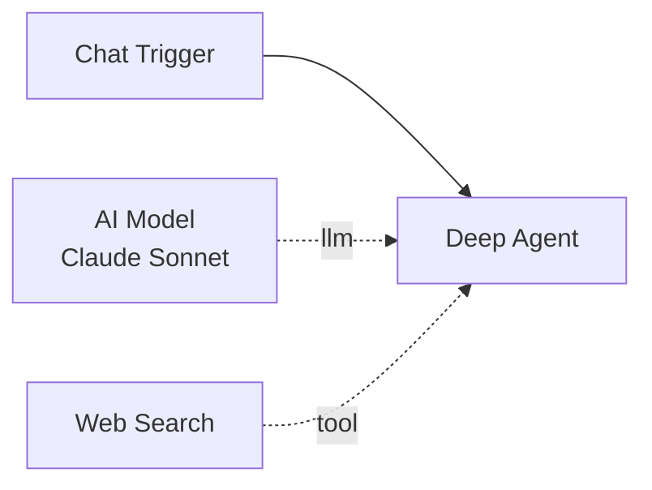

# Deep Agent

The Deep Agent node is an advanced AI agent powered by the [`deepagents`](https://github.com/deepagents/deepagents) library. It extends the standard [Agent](agent.md) with built-in task planning (todos), filesystem tools, and inline subagent delegation -- features that would otherwise require multiple canvas tool connections.

**Component type:** `deep_agent`

## Ports

### Inputs

| Port | Type | Required | Description |
|------|------|----------|-------------|
| `messages` | `MESSAGES` | Yes | Conversation messages from a trigger or upstream node |

### Outputs

| Port | Type | Description |
|------|------|-------------|
| `messages` | `MESSAGES` | Full conversation including tool calls and responses |
| `output` | `STRING` | Final text content from the last AI message |

## Sub-Components

The Deep Agent supports two sub-component connections via the diamond handles at the bottom of the node:

| Sub-Component | Handle Color | Required | Edge Label | Purpose |
|---------------|-------------|----------|------------|---------|
| **Model** | Blue (`#3b82f6`) | Yes | `llm` | The LLM provider and model (e.g., GPT-4o, Claude) |
| **Tools** | Green (`#10b981`) | No | `tool` | LangChain tools the agent can invoke during reasoning |

!!! warning "Model is required"
    Every Deep Agent node must have an AI Model sub-component connected. Without it, the agent cannot resolve which LLM to use and will fail at build time.

!!! note "No memory or output parser handles"
    Unlike the standard Agent, Deep Agent does not have memory or output parser sub-component handles. Memory-like capabilities are provided by the built-in filesystem tools and todo system instead.

## Canvas Appearance

- **Border color:** Purple (`#7c3aed`)
- **Icon:** Brain (Font Awesome)
- **Width:** Fixed 250px with separator line and bottom sub-component pills
- **Bottom handles:** Model (blue diamond), Tools (green diamond)

## Configuration

| Setting | Type | Default | Description |
|---------|------|---------|-------------|
| System Prompt | `string` | `""` | Instructions and persona for the agent. Supports Jinja2 expressions. |
| Conversation Memory | `boolean` | `false` | When enabled, persists conversation history across executions using a SqliteSaver checkpointer. |
| Task Planning (Todos) | `boolean` | `false` | Enables built-in task planning tools for the agent to create and manage a todo list during execution. |
| Filesystem Tools | `boolean` | `false` | Enables built-in filesystem tools for reading and writing files. |
| Filesystem Backend | `enum` | `"state"` | Backend type for filesystem tools (only shown when Filesystem Tools is enabled). |
| Filesystem Root Dir | `string` | `""` | Root directory for the filesystem backend (only used with `filesystem` backend). |
| Subagents | `array` | `[]` | Inline subagent definitions for delegation. |

### System Prompt

The system prompt works identically to the standard [Agent](agent.md#system-prompt) -- it defines the agent's personality and instructions, supports Jinja2 template expressions, and is delivered via both a `SystemMessage` and a `HumanMessage` fallback for provider compatibility.

### Task Planning (Todos)

When enabled, the agent gains built-in tools for managing a task list during its reasoning loop. This lets the agent break down complex requests into steps, track progress, and work through tasks systematically -- all without requiring any canvas tool connections.

### Filesystem Tools

When enabled, the agent gains built-in tools for reading and writing files. The backend determines where files are stored:

| Backend | Description |
|---------|-------------|
| `state` | In-memory storage within the LangGraph state. Files exist only for the duration of the execution. |
| `filesystem` | Disk-based storage. Files are read from and written to the actual filesystem, scoped to `filesystem_root_dir`. |
| `store` | LangGraph Store-backed storage. Files are persisted via the LangGraph store mechanism. |

!!! tip "Use `state` for ephemeral scratch space"
    The `state` backend is useful when the agent needs temporary file storage during reasoning (e.g., drafting a document iteratively) but you don't need the files to persist after execution.

### Subagents

Subagents allow the Deep Agent to delegate subtasks to specialized inline agents. Each subagent is defined with:

| Field | Type | Required | Description |
|-------|------|----------|-------------|
| `name` | `string` | Yes | A unique identifier for the subagent |
| `description` | `string` | Yes | Describes when/why to delegate to this subagent |
| `system_prompt` | `string` | Yes | Instructions for the subagent |
| `model` | `string` | No | Optional model override (uses the parent's model if omitted) |

The parent agent can invoke subagents as tools during its reasoning loop. Each subagent runs with its own system prompt and optionally its own model, then returns results back to the parent agent.

## Differences from Agent

| Feature | Agent | Deep Agent |
|---------|-------|------------|
| Implementation | `create_agent()` (LangGraph) | `create_deep_agent()` (deepagents library) |
| Task planning | Requires canvas tool connections | Built-in todos toggle |
| Filesystem | Requires canvas tool connections | Built-in with backend selection |
| Subagents | Must use Spawn & Await or separate workflows | Inline subagent definitions |
| Memory handle | Yes (amber diamond) | No |
| Output parser handle | No | No |
| Canvas tools | Yes (green diamond) | Yes (green diamond) |

## Conversation Memory

Conversation memory works the same as the standard Agent. When enabled:

- A **SqliteSaver** checkpointer stores conversation state in `platform/checkpoints.db`.
- The **thread ID** is constructed from `{user_profile_id}:{telegram_chat_id}:{workflow_id}`.
- Without a Telegram chat ID, the thread simplifies to `{user_profile_id}:{workflow_id}`.

When disabled, a **RedisSaver** checkpointer provides ephemeral state for interrupt/resume capability (e.g., subagent delegation).

## Output Convention

The Deep Agent returns:

| Key | Type | Description |
|-----|------|-------------|
| `output` | `string` | The final text content extracted from the last AI message |
| `_messages` | `list` | All messages from the agent's execution (appended to workflow state) |
| `_token_usage` | `dict` | Token counts, cost in USD, and tool invocation count |

Downstream nodes access the agent's text via `{{ deep_agent_abc123.output }}`.

## Example

A Deep Agent with task planning and filesystem tools for code generation:



**System prompt:**
```
You are a code generation assistant. When given a request:
1. Break the task into steps using your todo list.
2. Research any unfamiliar APIs using web search.
3. Write the code to your filesystem.
4. Review and refine each file.
5. Present the final solution.
```

**Configuration:**

- Task Planning (Todos): `true`
- Filesystem Tools: `true` (backend: `state`)
- AI Model: Claude Sonnet via Anthropic credential
- Canvas Tools: Web Search (SearXNG)
- Subagents:
    - `reviewer` -- name: `reviewer`, description: `Reviews generated code for bugs and style issues`, system_prompt: `You are a code reviewer. Analyze the provided code for bugs, style issues, and best practices. Provide specific, actionable feedback.`
