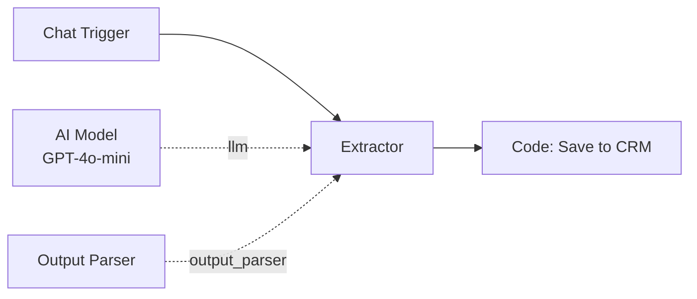
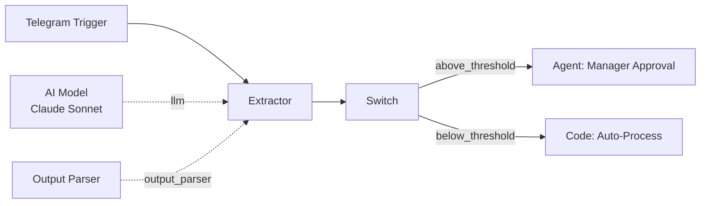

# Extractor

The Extractor node uses an LLM to extract structured data from unstructured text input. It parses the LLM response into a JSON object according to a schema defined by the connected Output Parser.

**Component type:** `extractor`

## Ports

### Inputs

| Port | Type | Required | Description |
|------|------|----------|-------------|
| `messages` | `MESSAGES` | Yes | Conversation messages containing the text to extract from |

### Outputs

| Port | Type | Description |
|------|------|-------------|
| `extracted` | `OBJECT` | A JSON object containing the extracted structured data |

## Sub-Components

| Sub-Component | Handle Color | Required | Edge Label | Purpose |
|---------------|-------------|----------|------------|---------|
| **Model** | Blue (`#3b82f6`) | Yes | `llm` | The LLM provider and model to use for extraction |
| **Memory** | Amber (`#f59e0b`) | No | `memory` | Global memory access for context-aware extraction |
| **Output Parser** | Slate (`#94a3b8`) | Yes | `output_parser` | Defines the extraction schema and parses the LLM response into structured data |

!!! warning "Model and Output Parser are required"
    The Extractor needs both an AI Model (to generate the extraction) and an Output Parser (to define the target schema and parse the result). Without either, the node will fail at build time.

## Configuration

| Setting | Type | Default | Description |
|---------|------|---------|-------------|
| System Prompt | `string` | `""` | Instructions for the LLM on how to extract data. Supports Jinja2 expressions. |

### System Prompt

The system prompt should instruct the LLM on what information to extract and in what format. The Output Parser defines the target schema, but the system prompt provides the LLM with context about the extraction task:

```
Extract the following information from the user's message:
- Full name
- Email address
- Phone number (if mentioned)
- Company name (if mentioned)

Return the data as a JSON object. Use null for fields not found in the text.
```

The system prompt supports Jinja2 template expressions for dynamic context:

```
Extract order details from the message.
Customer tier: {{ identify_user_abc123.user_context.tier }}
```

### Output Parser

The Output Parser sub-component defines the schema for the extracted data. It controls how the raw LLM response is parsed into the structured `extracted` output. Connect an Output Parser node to the Extractor via the slate-colored diamond handle.

The parser's configuration specifies the expected fields, their types, and any validation rules. The Extractor sends the LLM response through the parser, which returns a validated JSON object.

## Usage

### Extraction Flow

1. The Extractor receives input messages containing unstructured text.
2. The system prompt and Output Parser schema are combined into instructions for the LLM.
3. The LLM analyzes the text and produces a response conforming to the schema.
4. The Output Parser validates and structures the LLM response into a JSON object.
5. The structured object is returned as the `extracted` output port.

### Accessing Extracted Data

Downstream nodes can access individual fields from the extracted object using Jinja2 expressions:

```
{{ extractor_abc123.extracted.name }}
{{ extractor_abc123.extracted.email }}
{{ extractor_abc123.extracted.order_total }}
```

Or access the entire extracted object:

```
{{ extractor_abc123.extracted }}
```

## Example

### Contact information extraction

Extract contact details from a free-text customer message:



**System prompt:**
```
Extract contact information from the user's message.
Be precise with email addresses and phone numbers.
If a field is not mentioned, set it to null.
```

**Output Parser schema:**
```json
{
  "name": "string",
  "email": "string",
  "phone": "string | null",
  "company": "string | null",
  "role": "string | null"
}
```

**Input message:**
```
Hi, I'm Jane Smith from Acme Corp. You can reach me at jane@acme.com
or call 555-0123. I'm the VP of Engineering.
```

**Extracted output:**
```json
{
  "name": "Jane Smith",
  "email": "jane@acme.com",
  "phone": "555-0123",
  "company": "Acme Corp",
  "role": "VP of Engineering"
}
```

### Order detail extraction

Extract structured order data from conversational input for downstream processing:



**System prompt:**
```
Extract order information from the customer's message.
Amounts should be numeric (no currency symbols).
Dates should be in ISO 8601 format (YYYY-MM-DD).
```

**Extracted output:**
```json
{
  "product": "Enterprise License",
  "quantity": 50,
  "unit_price": 99.00,
  "total": 4950.00,
  "requested_delivery": "2026-03-15"
}
```

The extracted `total` field can then be evaluated by a downstream Switch node to route high-value orders through a manager approval flow.
