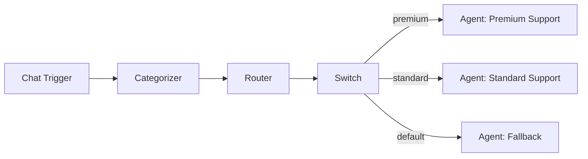

# Router

The Router node evaluates state fields or expressions and directs execution to different downstream branches. Unlike the Categorizer (which uses an LLM to classify messages), the Router operates on **rule-based logic** against the current workflow state.

**Component type:** `router`

## Ports

### Inputs

| Port | Type | Required | Description |
|------|------|----------|-------------|
| `messages` | `MESSAGES` | Yes | Conversation messages (provides state context) |

### Outputs

| Port | Type | Description |
|------|------|-------------|
| `route` | `STRING` | The resolved route value used for conditional edge matching |

## Sub-Components

| Sub-Component | Handle Color | Required | Edge Label | Purpose |
|---------------|-------------|----------|------------|---------|
| **Model** | Blue (`#3b82f6`) | Yes | `llm` | The LLM provider and model (required by the type registry, though routing itself is rule-based) |
| **Memory** | Amber (`#f59e0b`) | No | `memory` | Global memory access for context-aware routing decisions |
| **Output Parser** | Slate (`#94a3b8`) | No | `output_parser` | Custom parsing logic for route resolution |

## Configuration

| Setting | Type | Default | Description |
|---------|------|---------|-------------|
| `condition_field` | `string` | `"route"` | The state field to read the route value from |
| `condition_expression` | `string` | `null` | A condition expression to evaluate against state (overrides `condition_field` if set) |

### Condition Field

The simplest routing mode. The Router reads the value of a state field and emits it as the route. The default field is `"route"`, which is set by upstream nodes that produce `_route` output (like the Categorizer).

### Condition Expression

For more control, you can provide an expression that evaluates against the workflow state. Supported syntax:

**Field access** -- dotted paths into the state dictionary:
```
state.route
state.node_outputs.categorizer_abc123.category
state.user_context.tier
```

**Equality checks** -- returns the matched value or an empty string:
```
state.route == 'premium'
state.node_outputs.categorizer_abc123.category == 'billing'
```

When a condition expression is provided, it takes precedence over `condition_field`.

## Usage

### Routing Flow

1. The Router receives the current workflow state.
2. If a `condition_expression` is configured, it evaluates the expression against the state.
3. Otherwise, it reads the value of `condition_field` from the state.
4. The resolved value is returned as both `route` (output port) and `_route` (sets the workflow route state for conditional edge matching).

### Conditional Edge Integration

The Router's `_route` output integrates with Switch nodes and conditional edges downstream. You can connect a Switch node after the Router and create conditional edges that match specific route values:



### Difference from Categorizer

The Router and Categorizer both produce route values, but they work differently:

| Aspect | Router | Categorizer |
|--------|--------|-------------|
| **Decision method** | Rule-based state evaluation | LLM classification |
| **LLM cost** | None (reads existing state) | One LLM call per execution |
| **Speed** | Instant | Depends on LLM latency |
| **Use case** | Route on values already in state | Classify raw text input |

Use the Router when an upstream node has already determined the route value (e.g., a Categorizer or Code node). Use the Categorizer when you need the LLM to interpret and classify the input.

## Example

### Route on upstream categorizer output

A Router that reads the category set by a previous Categorizer and forwards it for conditional branching:

**Configuration:**
```json
{
  "condition_field": "route"
}
```

Since the Categorizer sets `_route` to the category name, the Router simply reads the `route` field from state and re-emits it. This is useful when you need a routing decision point after additional processing between the Categorizer and the branching Switch.

### Route on user tier with expression

A Router that checks a user's account tier from state context:

**Configuration:**
```json
{
  "condition_expression": "state.user_context.tier"
}
```

If `state["user_context"]["tier"]` is `"premium"`, the Router emits `route: "premium"`. A downstream Switch with conditional edges for `"premium"`, `"standard"`, and `"default"` then directs execution accordingly.

### Equality check

A Router that only matches a specific value:

**Configuration:**
```json
{
  "condition_expression": "state.node_outputs.categorizer_abc123.category == 'urgent'"
}
```

If the categorizer's output category equals `"urgent"`, the route value is `"urgent"`. Otherwise, it is an empty string, which a downstream Switch can match as the `"default"` route.
