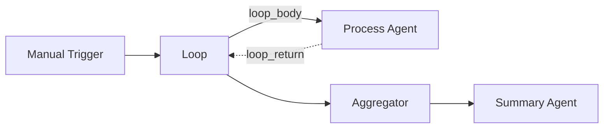

# Aggregator

The **Aggregator** component collects items from an array input and combines them into a single aggregated output. It is useful for gathering results from parallel branches, loop iterations, or multi-step processing pipelines.

| Property | Value |
|----------|-------|
| **Component Type** | `aggregator` |
| **Category** | Flow |
| **Display Name** | Aggregator |

## Ports

### Inputs

| Port | Data Type | Required | Description |
|------|-----------|----------|-------------|
| `items` | ARRAY | No | Array of items to aggregate |

### Outputs

| Port | Data Type | Description |
|------|-----------|-------------|
| `aggregated` | ANY | Combined result |

## Configuration

The Aggregator component uses `extra_config` for any aggregation-specific settings. Configuration depends on the aggregation strategy being applied.

## Usage

1. Add an **Aggregator** node from the Node Palette (Logic category)
2. Connect upstream nodes that produce array outputs
3. Connect the Aggregator's output to downstream nodes

The Aggregator takes an array of items and produces a single aggregated value. This is particularly useful as the final step after a Loop or after multiple parallel branches have produced individual results.

## Example

A loop processes multiple documents, and the aggregator combines all results:

The Loop iterates over a list of documents, the Process Agent analyzes each one, and the Aggregator combines all analysis results into a single structure that the Summary Agent can use to produce a final report.

!!! tip "Aggregator vs. Merge"
    The **Aggregator** collects items from a single array input (typically the output of a Loop). The **Merge** component combines outputs from multiple parallel branches. Use Aggregator when working with array data; use Merge when combining separate node outputs.
