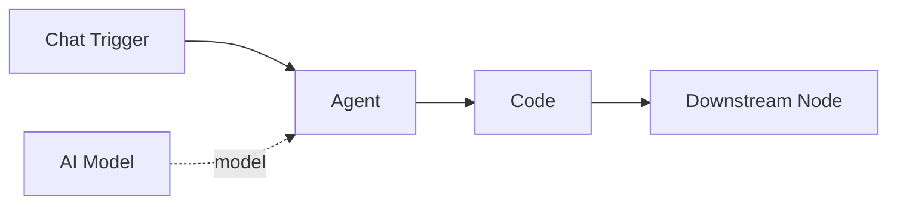

# Code

The **Code** component executes custom Python code as a step in the workflow graph. It provides direct access to the workflow state and upstream node outputs, making it suitable for data transformation, computation, and custom logic that does not require an LLM.

| Property | Value |
|----------|-------|
| **Component Type** | `code` |
| **Category** | Logic |
| **Display Name** | Code |

## Ports

### Inputs

| Port | Data Type | Required | Description |
|------|-----------|----------|-------------|
| `input` | ANY | No | Data from upstream nodes |

### Outputs

| Port | Data Type | Description |
|------|-----------|-------------|
| `output` | ANY | Result of the code execution |

## Configuration

The Code component accepts the following configuration in `extra_config`:

| Field | Type | Default | Description |
|-------|------|---------|-------------|
| `code` | string | -- | Python code snippet to execute (required) |
| `language` | string | `python` | Programming language (currently only Python is supported) |

## Usage

1. Add a **Code** node from the Node Palette (Logic category)
2. Connect upstream nodes to provide input data
3. Write your Python code in the **Code Snippet** field in the node details panel
4. Connect the Code node's output to downstream nodes

### Available variables

Your code has access to the following local variables:

| Variable | Description |
|----------|-------------|
| `state` | The full workflow state dict (read-only by convention) |
| `node_outputs` | Shortcut for `state["node_outputs"]` -- dict of all upstream node outputs keyed by node ID |
| `result` | Set this variable to produce the component's output |

### Output resolution

The Code component determines its output using this priority:

1. If you set the `result` variable, its string value becomes the output
2. If `result` is not set, anything written to stdout via `print()` becomes the output
3. If neither produces content, the output is empty

### Using `return`

If your code contains a `return` statement, it is automatically wrapped in a function. The return value is assigned to `result`:

```python
data = node_outputs.get("agent_abc123", {})
text = data.get("output", "")
return text.upper()
```

### Jinja2 in code

The Code Snippet field supports Jinja2 syntax highlighting. You can use `{{ }}` template expressions that are resolved before execution:

```python
name = "{{ trigger.text }}"
result = f"Hello, {name}!"
```

## Example

A code node that transforms an agent's output into a structured summary:

```python
import json

agent_output = node_outputs.get("agent_abc123", {})
text = agent_output.get("output", "")

lines = text.strip().split("\n")
result = json.dumps({
    "line_count": len(lines),
    "first_line": lines[0] if lines else "",
    "last_line": lines[-1] if lines else "",
    "total_chars": len(text),
})
```



!!! warning "No sandboxing"
    The Code component executes Python code directly in the Pipelit process using `exec()`. It has access to all built-in Python functions. Unlike the [Code Execute](../sub-components/code-execute.md) sub-component tool, it does not run in a subprocess and does not enforce security restrictions. Use the Code Execute tool for agent-invoked code execution with sandboxing.

!!! note "Error handling"
    If the code raises an exception, the node fails with a `RuntimeError` containing the error message. The error is visible in the execution logs and on the canvas as a failed node status.
