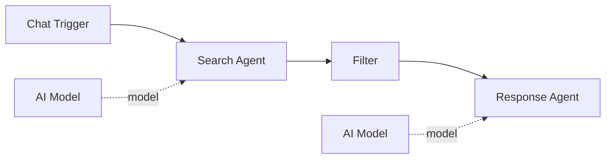

# Filter

The **Filter** component removes items from an array that do not match specified rules. It uses the same operator set as the Switch component, applied to each item in the input array.

| Property | Value |
|----------|-------|
| **Component Type** | `filter` |
| **Category** | Logic |
| **Display Name** | Filter |

## Ports

### Inputs

| Port | Data Type | Required | Description |
|------|-----------|----------|-------------|
| `input` | ARRAY | Yes | Array of items to filter |

### Outputs

| Port | Data Type | Description |
|------|-----------|-------------|
| `filtered` | ARRAY | Items that matched all rules |

## Configuration

The Filter component accepts the following configuration in `extra_config`:

| Field | Type | Default | Description |
|-------|------|---------|-------------|
| `rules` | array | `[]` | List of filter rule objects |
| `source_node` | string | -- | Node ID to read input from (optional) |
| `field` | string | -- | Field name to extract from the source node's output (optional) |

### Rule structure

Each rule has the same structure as Switch rules:

| Field | Description |
|-------|-------------|
| `field` | Key to read from each item (for dict items) |
| `operator` | Comparison operator (same set as Switch -- see [Switch operators](switch.md#available-operators)) |
| `value` | Value to compare against |

### Matching behavior

An item passes the filter only if **all** rules match (AND logic). If no rules are configured, all items pass through unchanged.

## Usage

1. Add a **Filter** node from the Node Palette (Logic category)
2. Connect an upstream node that produces an array output
3. Configure filter rules in Extra Config
4. Connect the Filter node's output to downstream nodes

### Source data resolution

The Filter component resolves its input data in this order:

1. If `source_node` is set, reads that node's output from `state.node_outputs`
2. If `field` is also set, extracts that specific field from the source node's dict output
3. If neither is set, reads from the generic `state.output`

## Example

An agent produces a list of search results, and the filter keeps only high-relevance items:



Filter Extra Config:

```json
{
  "source_node": "agent_search",
  "field": "results",
  "rules": [
    {"field": "relevance", "operator": "gte", "value": "0.7"},
    {"field": "status", "operator": "equals", "value": "active"}
  ]
}
```

Input array:

```json
[
  {"title": "Result A", "relevance": 0.9, "status": "active"},
  {"title": "Result B", "relevance": 0.4, "status": "active"},
  {"title": "Result C", "relevance": 0.8, "status": "archived"}
]
```

Filtered output:

```json
[
  {"title": "Result A", "relevance": 0.9, "status": "active"}
]
```

Only Result A passes both rules (relevance >= 0.7 AND status equals "active").

!!! tip "Combining with Loop"
    Filter pairs well with Loop -- filter an array down to relevant items, then iterate over them with a Loop node for individual processing.
