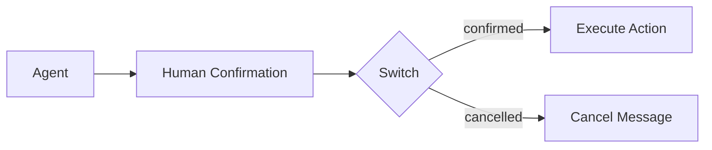
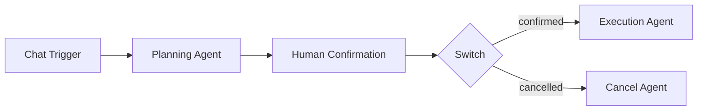

# Human Confirmation

The **Human Confirmation** component pauses workflow execution and waits for a user to approve or reject before continuing. It enables human-in-the-loop workflows where sensitive or irreversible actions require explicit consent.

| Property | Value |
|----------|-------|
| **Component Type** | `human_confirmation` |
| **Category** | Flow |
| **Display Name** | Human Confirmation |

## Ports

### Inputs

| Port | Data Type | Required | Description |
|------|-----------|----------|-------------|
| `prompt` | STRING | No | Context or question shown to the user |

### Outputs

| Port | Data Type | Description |
|------|-----------|-------------|
| `confirmed` | BOOLEAN | Whether the user confirmed (`true`) or rejected (`false`) |
| `user_response` | STRING | The raw text response from the user |

## Configuration

The Human Confirmation component accepts the following configuration in `extra_config`:

| Field | Type | Default | Description |
|-------|------|---------|-------------|
| `prompt` | string | `Please confirm to proceed.` | Message displayed to the user when the workflow pauses |

## Usage

1. Add a **Human Confirmation** node from the Node Palette (Logic category)
2. Configure the prompt message in Extra Config
3. Place it before any nodes that perform sensitive operations
4. Optionally connect a Switch node downstream to branch on the confirmation result

### Interrupt/resume flow

The Human Confirmation component works with the orchestrator's interrupt mechanism:

1. **First invocation** -- the orchestrator interrupts execution before or after this node. The workflow enters an interrupted state and waits for user input.
2. **Resume** -- when the user provides a response, the orchestrator resumes execution with `_resume_input` set in the state.
3. **Second invocation** -- the component reads `_resume_input` and determines whether the user confirmed.

### Confirmation parsing

The following responses are treated as confirmation (case-insensitive):

- `yes`, `confirm`, `true`, `y`, `1`

Any other response is treated as rejection.

### Routing

The component also emits a `_route` value (`confirmed` or `cancelled`), which can be used with a downstream Switch node for conditional branching:



## Example

A workflow that asks for approval before executing a shell command:



Human Confirmation Extra Config:

```json
{
  "prompt": "The agent wants to run: rm -rf /tmp/old_builds. Approve? (yes/no)"
}
```

When the Planning Agent finishes and the workflow reaches the Human Confirmation node, execution pauses. The user sees the prompt and responds. If the user replies "yes", the Execution Agent runs. If the user replies "no" or anything else, the Cancel Agent handles the rejection.

!!! note "Execution state"
    While waiting for user input, the execution remains in an interrupted state. The execution detail page shows the current status and the pending confirmation prompt.

!!! tip "Dynamic prompts"
    The prompt field supports Jinja2 expressions. You can include upstream node outputs in the prompt to give the user context about what they are approving:

    ```
    The agent wants to execute: {{ agent_abc123.output }}
    Approve this action? (yes/no)
    ```
