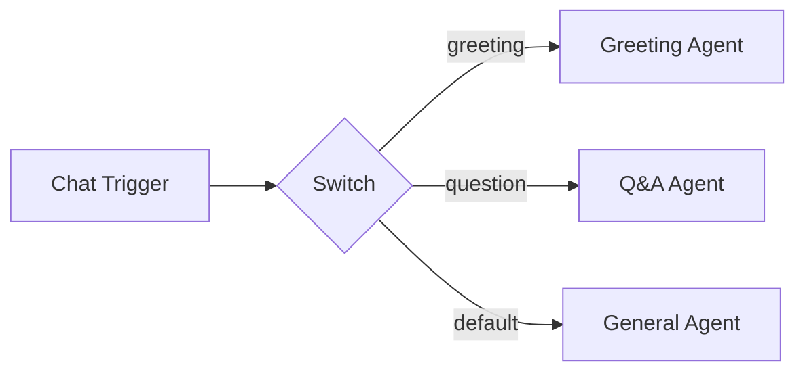

# Logic

Logic components control how data flows through a workflow. They handle branching, iteration, filtering, merging, delays, and orchestration -- everything between receiving input and producing output that is not LLM reasoning.

## Overview

There are nine logic component types:

| Component | Purpose | Key Feature |
|-----------|---------|-------------|
| [Switch](switch.md) | Route to branches based on rules | Conditional edges with `condition_value` |
| [Code](code.md) | Execute custom Python code | Access to workflow state and node outputs |
| [Merge](merge.md) | Combine outputs from multiple branches | Append or combine modes |
| [Filter](filter.md) | Filter array items using rules | Same operator set as Switch |
| [Loop](loop.md) | Iterate over arrays | Special `loop_body` / `loop_return` edges |
| [Wait](wait.md) | Delay execution | Configurable duration and unit |
| [Human Confirmation](human-confirmation.md) | Pause for user approval | Interrupt/resume execution flow |
| [Aggregator](aggregator.md) | Collect and combine array items | Flexible aggregation |
| [Subworkflow](subworkflow.md) | Execute another workflow as a child | Implicit or explicit trigger mode |

## How logic components work

Logic components are **executable nodes** -- they run during workflow execution and produce outputs that downstream nodes can consume. Unlike AI nodes, they do not require an LLM connection. Unlike tools, they are not invoked by an agent's reasoning loop. They simply process data according to their configuration.

## Flow control patterns

### Branching

Use **Switch** to route execution to different branches based on rules. Each branch is connected via a conditional edge with a `condition_value` that matches the switch's output route.

### Parallel branches and merging

Multiple nodes can receive the same input (fan-out). Use **Merge** to bring parallel branches back together (fan-in), combining their outputs into a single value.

### Iteration

Use **Loop** to process each item in an array individually. The loop body runs once per item, and results are collected into an output array.

### Filtering

Use **Filter** to remove items from an array that do not match specified rules, reducing the dataset before further processing.

### Human-in-the-loop

Use **Human Confirmation** to pause execution and wait for user approval before proceeding with sensitive or irreversible operations.

### Composition

Use **Subworkflow** to delegate work to another workflow, keeping complex logic modular and reusable.
