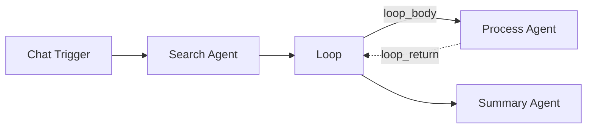

# Loop

The **Loop** component iterates over an array, executing a body of nodes once for each item. Results from each iteration are collected into an output array.

| Property | Value |
|----------|-------|
| **Component Type** | `loop` |
| **Category** | Logic |
| **Display Name** | Loop |

## Ports

### Inputs

| Port | Data Type | Required | Description |
|------|-----------|----------|-------------|
| `items` | ARRAY | Yes | Array of items to iterate over |

### Outputs

| Port | Data Type | Description |
|------|-----------|-------------|
| `results` | ARRAY | Collected results from each iteration |

## Configuration

The Loop component accepts the following configuration in `extra_config`:

| Field | Type | Default | Description |
|-------|------|---------|-------------|
| `source_node` | string | -- | Node ID to read the items array from |
| `field` | string | -- | Field name to extract from the source node's output |

## Usage

1. Add a **Loop** node from the Node Palette (Logic category)
2. Connect an upstream node that produces an array
3. Add body nodes that should execute for each item
4. Connect the Loop to the first body node via a `loop_body` edge
5. Connect the last body node back to the Loop via a `loop_return` edge
6. Connect the Loop's output to downstream nodes

### Special edge labels

Loop nodes use two special edge labels that bypass standard type-compatibility validation:

| Edge Label | Direction | Purpose |
|------------|-----------|---------|
| `loop_body` | Loop to body node | Sends the current item to the body for processing |
| `loop_return` | Body node to Loop | Returns the processed result back to the loop |

### Canvas rendering

On the canvas, `loop_return` edges render with a distinctive visual style:

- **Path**: Routes below the nodes (right from source, down, left, up to target) with rounded 90-degree corners
- **Stroke**: Dashed line
- **Label**: "return"

This visual treatment makes loop structures easy to identify at a glance.

### Data flow

For each item in the input array:

1. The Loop emits the current item to the body node via the `loop_body` edge
2. The body node(s) process the item
3. The last body node returns its result via the `loop_return` edge
4. The result is appended to the Loop's `results` array

The Loop also sets a `_loop` key in the state containing `{"items": [...]}` for internal orchestrator use.

## Example

Process each search result individually with an agent:



Loop Extra Config:

```json
{
  "source_node": "agent_search",
  "field": "results"
}
```

If the search agent returns `{"results": ["item1", "item2", "item3"]}`, the Process Agent runs three times -- once for each item. The Loop collects all three results into its `results` array, which the Summary Agent then receives.

!!! warning "Body complexity"
    The loop body can contain multiple nodes connected in sequence, but keep loop bodies simple. Each iteration runs the full body chain, so complex bodies with many nodes or LLM calls can significantly increase execution time.

!!! note "Non-array input"
    If the input data is not a list, the Loop wraps it in a single-element array. If the input is `None`, the Loop runs with an empty array and produces an empty results array.
