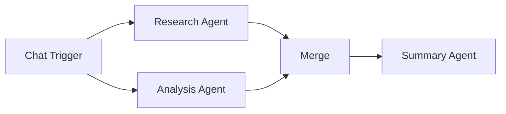

# Merge

The **Merge** component combines outputs from multiple upstream branches into a single value. It is the fan-in counterpart to branching patterns -- use it after parallel paths to bring results back together.

| Property | Value |
|----------|-------|
| **Component Type** | `merge` |
| **Category** | Logic |
| **Display Name** | Merge |

## Ports

### Inputs

| Port | Data Type | Required | Description |
|------|-----------|----------|-------------|
| `branches` | ARRAY | Yes | Outputs from multiple upstream nodes |

### Outputs

| Port | Data Type | Description |
|------|-----------|-------------|
| `merged` | ANY | Combined result from all branches |

## Configuration

The Merge component accepts the following configuration in `extra_config`:

| Field | Type | Default | Description |
|-------|------|---------|-------------|
| `mode` | string | `append` | Merge strategy: `append` or `combine` |
| `source_nodes` | array | -- | Explicit list of node IDs to merge (optional) |

### Merge modes

| Mode | Behavior | Output Type |
|------|----------|-------------|
| `append` | Collects all source outputs into a flat array. Lists are flattened, scalar values are appended as individual items. | Array |
| `combine` | Merges all source outputs into a single object. Each dict source is merged via `update()`. Non-dict sources are keyed by an auto-generated ID. | Object |

## Usage

1. Add a **Merge** node from the Node Palette (Logic category)
2. Connect multiple upstream nodes to the Merge node's input
3. Optionally set the `mode` and `source_nodes` in Extra Config
4. Connect the Merge node's output to downstream nodes

### Source resolution

If `source_nodes` is specified, only outputs from those node IDs are merged. If not specified, all available node outputs in the workflow state are included.

## Example

Two agents process input in parallel, and their outputs are merged before being sent to a final summarizer:



Merge Extra Config (append mode):

```json
{
  "mode": "append",
  "source_nodes": ["agent_research", "agent_analysis"]
}
```

Output:

```json
{
  "merged": [
    "Research findings: The market grew 15% in Q4...",
    "Analysis conclusion: Growth is driven by..."
  ]
}
```

Merge Extra Config (combine mode):

```json
{
  "mode": "combine",
  "source_nodes": ["agent_research", "agent_analysis"]
}
```

Output:

```json
{
  "merged": {
    "output": "Analysis conclusion: Growth is driven by...",
    "research_data": "..."
  }
}
```

!!! note "Combine mode key collisions"
    In `combine` mode, if multiple source nodes produce dicts with the same keys, later sources overwrite earlier ones. Use `append` mode if you need to preserve all values, or ensure source nodes use distinct output keys.
