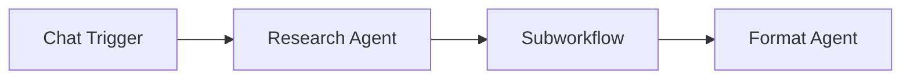

# Subworkflow

The **Subworkflow** component executes another workflow as a child and returns its output. It enables composition -- breaking complex automation into modular, reusable workflows that can be invoked from a parent workflow.

| Property | Value |
|----------|-------|
| **Component Type** | `workflow` |
| **Category** | Logic |
| **Display Name** | Subworkflow |

## Ports

### Inputs

| Port | Data Type | Required | Description |
|------|-----------|----------|-------------|
| `payload` | ANY | No | Data passed to the child workflow's trigger |

### Outputs

| Port | Data Type | Description |
|------|-----------|-------------|
| `output` | ANY | Final output from the child workflow |

## Configuration

The Subworkflow component accepts the following configuration in `extra_config`:

| Field | Type | Default | Required | Description |
|-------|------|---------|----------|-------------|
| `target_workflow` | string | -- | Yes | Slug of the workflow to invoke |
| `trigger_mode` | string | `implicit` | No | How to invoke the child: `implicit` or `explicit` |
| `input_mapping` | object | `{}` | No | Map parent state fields to child trigger payload |

### Trigger modes

| Mode | Description |
|------|-------------|
| `implicit` | Looks up the target workflow by slug and creates a child execution directly. Does not go through trigger resolution. This is the default and recommended mode. |
| `explicit` | Dispatches a `workflow` event through the trigger resolver, which matches the event to a `trigger_workflow` node in the target workflow. Use this when the target workflow has specific trigger-based preprocessing. |

### Input mapping

By default (when `input_mapping` is empty), the child workflow receives:

```json
{
  "text": "<trigger text from parent>",
  "payload": {
    "trigger": "<parent trigger data>",
    "node_outputs": "<all parent node outputs>"
  }
}
```

When `input_mapping` is specified, each key-value pair maps a target payload field to a dotted path in the parent state:

```json
{
  "query": "node_outputs.agent_abc.output",
  "context": "trigger.payload"
}
```

This produces a child trigger payload of:

```json
{
  "query": "<resolved value from parent>",
  "context": "<resolved value from parent>"
}
```

## Usage

1. Add a **Subworkflow** node from the Node Palette (Logic category)
2. Set the `target_workflow` slug in Extra Config (required)
3. Optionally configure `trigger_mode` and `input_mapping`
4. Connect upstream nodes to provide input data
5. Connect the Subworkflow's output to downstream nodes

### Execution flow

The Subworkflow component uses a two-phase execution model:

1. **First invocation** -- creates a child `WorkflowExecution` record, enqueues it on the RQ `workflows` queue, and returns a `_subworkflow` signal to the orchestrator with the child execution ID. The parent execution waits.
2. **Second invocation** -- when the child execution completes, its result is injected into the parent state under `_subworkflow_results[node_id]`. The Subworkflow component reads this result and returns it as its `output`.

### Parent-child linkage

The child execution records its `parent_execution_id` and `parent_node_id`, creating a traceable lineage. This is visible in the execution detail page.

## Example

A research workflow delegates summarization to a dedicated summary workflow:



Subworkflow Extra Config:

```json
{
  "target_workflow": "summarizer-v2",
  "trigger_mode": "implicit",
  "input_mapping": {
    "text": "node_outputs.agent_research.output"
  }
}
```

The Research Agent gathers information, the Subworkflow sends the research output to the `summarizer-v2` workflow for processing, and the Format Agent receives the summary as the Subworkflow's output.

!!! warning "Circular references"
    Avoid creating circular subworkflow references (workflow A invokes workflow B which invokes workflow A). This will cause infinite execution loops. Pipelit does not currently detect circular subworkflow references at build time.

!!! note "Child workflow errors"
    If the child workflow fails, the Subworkflow node in the parent workflow also fails. The error from the child execution is propagated to the parent's execution logs.

!!! tip "Reusable building blocks"
    Design child workflows as self-contained units with clear trigger inputs and outputs. This makes them reusable across multiple parent workflows, similar to functions in programming.
