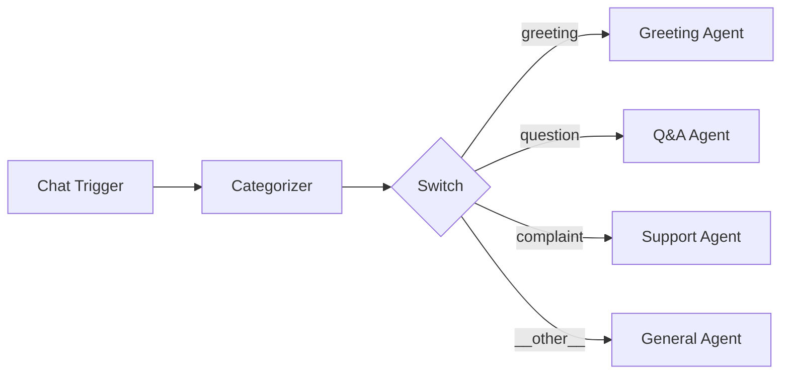

# Switch

The **Switch** component routes execution to different downstream branches based on configurable rules. It evaluates the current workflow state against a list of rules and emits a `_route` value that determines which conditional edge to follow.

| Property | Value |
|----------|-------|
| **Component Type** | `switch` |
| **Category** | Logic |
| **Display Name** | Switch |

## Ports

### Inputs

| Port | Data Type | Required | Description |
|------|-----------|----------|-------------|
| `input` | ANY | Yes | Data to evaluate against rules |

### Outputs

| Port | Data Type | Description |
|------|-----------|-------------|
| `route` | STRING | The matched route identifier |

## Configuration

Switch rules are configured in the `extra_config` field:

| Field | Type | Default | Description |
|-------|------|---------|-------------|
| `rules` | array | -- | List of rule objects (see below) |
| `enable_fallback` | boolean | `false` | Emit `__other__` route when no rules match |

### Rule structure

Each rule in the `rules` array has the following fields:

| Field | Description |
|-------|-------------|
| `id` | Route identifier emitted when this rule matches (used as `condition_value` on edges) |
| `field` | Dotted path to the state field to evaluate (e.g., `node_outputs.categorizer.category`) |
| `operator` | Comparison operator (see table below) |
| `value` | Value to compare against |

### Available operators

The Switch component supports the full set of shared operators:

| Category | Operators |
|----------|-----------|
| **Universal** | `exists`, `does_not_exist`, `is_empty`, `is_not_empty` |
| **String / Equality** | `equals`, `not_equals`, `contains`, `not_contains`, `starts_with`, `not_starts_with`, `ends_with`, `not_ends_with`, `matches_regex`, `not_matches_regex` |
| **Number** | `gt`, `lt`, `gte`, `lte` |
| **Datetime** | `after`, `before`, `after_or_equal`, `before_or_equal` |
| **Boolean** | `is_true`, `is_false` |
| **Array Length** | `length_eq`, `length_neq`, `length_gt`, `length_lt`, `length_gte`, `length_lte` |

## Usage

1. Add a **Switch** node from the Node Palette (Logic category)
2. Connect the upstream node to the Switch's input
3. Configure rules in the node's Extra Config field
4. Draw edges from the Switch to each target branch node
5. Set each edge's `condition_value` to match the corresponding rule's `id`

### Rule evaluation

Rules are evaluated **in order** -- the first matching rule wins. If no rules match and `enable_fallback` is enabled, the route is set to `__other__`. If no rules match and fallback is disabled, the route is an empty string.

### Conditional edges

Only Switch nodes can originate conditional edges. Each downstream edge carries a `condition_value` string that the orchestrator matches against the emitted `_route`. This is a per-edge model -- each edge has its own `condition_value` rather than a single mapping dict.

### Legacy mode

The Switch component also supports a legacy configuration using `condition_field` or `condition_expression` in `extra_config`. This mode reads a field directly from state or evaluates a simple expression. The rule-based mode is recommended for new workflows.

## Example

A categorizer classifies user input, then a switch routes to the appropriate handler:



Switch Extra Config:

```json
{
  "rules": [
    {"id": "greeting", "field": "node_outputs.categorizer_abc.category", "operator": "equals", "value": "greeting"},
    {"id": "question", "field": "node_outputs.categorizer_abc.category", "operator": "equals", "value": "question"},
    {"id": "complaint", "field": "node_outputs.categorizer_abc.category", "operator": "equals", "value": "complaint"}
  ],
  "enable_fallback": true
}
```

Each edge from the Switch to a downstream agent has its `condition_value` set to the corresponding route ID (`greeting`, `question`, `complaint`, or `__other__`).

!!! note "Switch vs. Router"
    The **Switch** node evaluates rules against state data -- it does not use an LLM. The **Router** (AI category) uses an LLM to determine which branch to take based on natural language understanding. Use Switch for deterministic, rule-based routing; use Router when the decision requires language comprehension.
