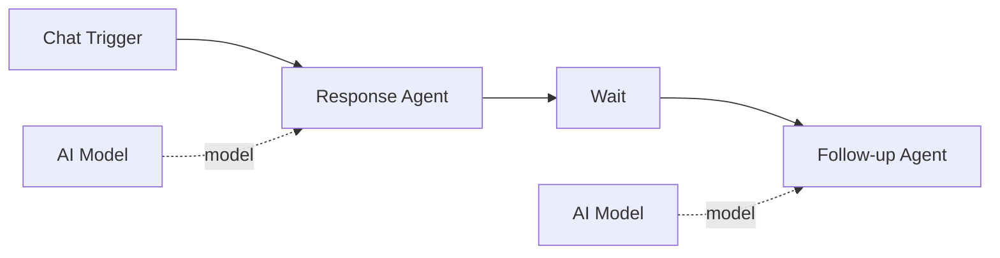

# Wait

The **Wait** component delays downstream execution by a specified duration. It passes through data unchanged after the delay period, useful for rate limiting, scheduling gaps, or creating timed workflows.

| Property | Value |
|----------|-------|
| **Component Type** | `wait` |
| **Category** | Logic |
| **Display Name** | Wait |

## Ports

### Inputs

| Port | Data Type | Required | Description |
|------|-----------|----------|-------------|
| `input` | ANY | No | Data to pass through after the delay |

### Outputs

| Port | Data Type | Description |
|------|-----------|-------------|
| `output` | STRING | Confirmation message (e.g., "Waited 30 seconds") |

## Configuration

The Wait component accepts the following configuration in `extra_config`:

| Field | Type | Default | Description |
|-------|------|---------|-------------|
| `duration` | number | `0` | Length of the delay |
| `unit` | string | `seconds` | Time unit: `seconds`, `minutes`, or `hours` |

The actual delay is calculated as `duration * multiplier`, where the multiplier is:

| Unit | Multiplier |
|------|------------|
| `seconds` | 1 |
| `minutes` | 60 |
| `hours` | 3600 |

## Usage

1. Add a **Wait** node from the Node Palette (Logic category)
2. Configure the duration and unit in Extra Config
3. Place the Wait node between the steps where you need a delay

The Wait component emits a `_delay_seconds` key in its output, which the orchestrator uses to pause execution for the specified duration before continuing to downstream nodes.

## Example

A workflow that sends a follow-up message 5 minutes after the initial response:



Wait Extra Config:

```json
{
  "duration": 5,
  "unit": "minutes"
}
```

The Response Agent answers immediately. After a 5-minute delay, the Follow-up Agent runs and can send additional information or ask for feedback.

!!! tip "Rate limiting"
    Place a Wait node before API calls or tool-heavy agents to avoid hitting rate limits on external services. A short delay (e.g., 1-2 seconds) between iterations in a loop can prevent throttling.

!!! note "Execution time"
    The wait duration counts toward the total execution time. Long delays keep the execution in a running state. For delays longer than a few minutes, consider using the [Scheduler](../../concepts/scheduler.md) system instead.
