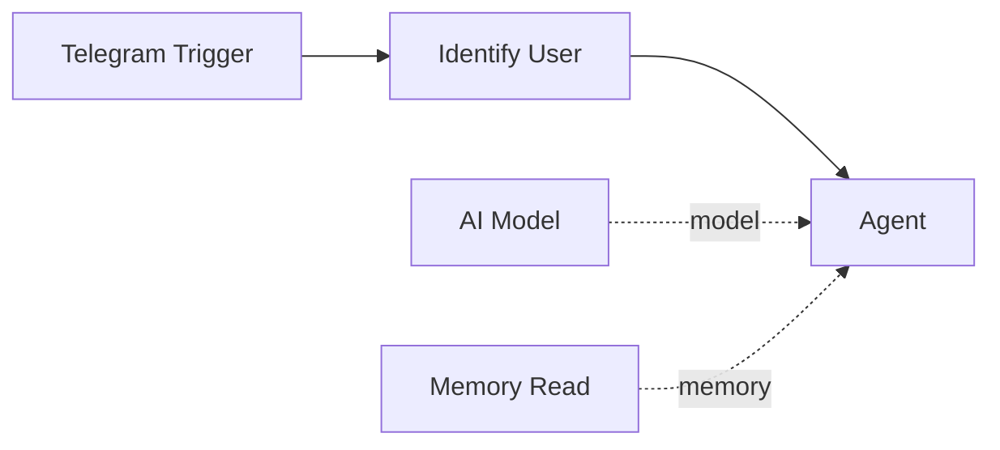

# Identify User

The **Identify User** component identifies who is interacting with the workflow and loads their stored context. Unlike Memory Read and Memory Write, this is a direct workflow node -- it runs as a step in the graph rather than as an agent tool.

| Property | Value |
|----------|-------|
| **Component Type** | `identify_user` |
| **Category** | Memory |
| **Display Name** | Identify User |

## Ports

### Inputs

| Port | Data Type | Required | Description |
|------|-----------|----------|-------------|
| `trigger_input` | OBJECT | Yes | Raw trigger payload containing user-identifying information |
| `channel` | STRING | Yes | Channel type (telegram, webhook, chat, manual) |

### Outputs

| Port | Data Type | Description |
|------|-----------|-------------|
| `user_id` | STRING | Canonical user ID (unique across channels) |
| `user_context` | OBJECT | User facts, preferences, and conversation history |
| `is_new_user` | BOOLEAN | Whether this is a first-time user |

## Configuration

The Identify User component has no additional configuration. It infers the channel and extracts user identity from the trigger payload automatically.

## Usage

1. Add an **Identify User** node from the Node Palette (Memory category)
2. Place it between the trigger node and the agent node
3. Connect the trigger's output to Identify User's input
4. Connect Identify User's output to the agent's input

The component examines the trigger payload and automatically detects the channel type. It then extracts channel-specific identifiers:

| Channel | Identifier Source | Display Name Source |
|---------|-------------------|---------------------|
| `telegram` | `message.from.id` | `message.from.first_name` + `last_name` |
| `webhook` | `user_id` or `email` field | `user_name` or `name` field |
| `chat` | `user_id` field | `user_name` field |
| `manual` | `user_id` field | `user_name` field |

### Channel auto-detection

If the `channel` input is not explicitly provided, the component infers it from the trigger payload structure:

- Contains `message.from` -- detected as `telegram`
- Contains `webhook_id` -- detected as `webhook`
- Contains `source: "manual"` -- detected as `manual`
- Contains `source: "chat"` -- detected as `chat`

### State patch

In addition to its output ports, the Identify User component writes a `_state_patch` that merges user context into the global workflow state under the `user_context` key. This makes user information available to all downstream nodes via Jinja2 expressions without needing explicit edges.

## Example

A workflow that personalizes responses based on user identity:



On first interaction from a Telegram user:

```
Identify User output:
{
  "user_id": "tg_12345678",
  "user_context": {"is_new": true, "facts": [], "history": []},
  "is_new_user": true
}
```

On subsequent interactions:

```
Identify User output:
{
  "user_id": "tg_12345678",
  "user_context": {
    "is_new": false,
    "facts": [
      {"key": "user_name", "value": "Alice"},
      {"key": "preferred_language", "value": "English"}
    ],
    "history": [...]
  },
  "is_new_user": false
}
```

The agent can then reference user context in its system prompt:

```

Welcome! This is your first time here.

Welcome back, {{ user_context.facts | selectattr("key", "equalto", "user_name") | map(attribute="value") | first }}!

```

!!! tip "Combine with Memory Write"
    Identify User loads existing context, but it does not store new facts. Pair it with a Memory Write tool on the agent so the agent can learn and remember new information about the user over time.

!!! note "Conversation counting"
    Each time Identify User runs for a known user, it increments their `total_conversations` counter. This can be used to distinguish between first-time and returning users via the `is_new_user` output.
