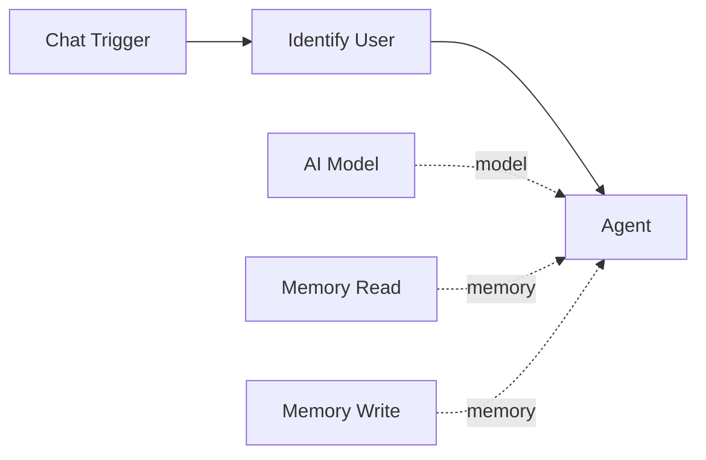

# Memory

Memory components give agents persistent knowledge that survives across executions. They connect to agents as sub-component tools via the amber diamond **memory** handle, allowing an agent to read from, write to, and personalize interactions using a global memory system.

## Overview

There are three memory component types:

| Component | Purpose | Connection |
|-----------|---------|------------|
| [Memory Read](memory-read.md) | Recall stored facts, episodes, and procedures | Sub-component tool (memory handle) |
| [Memory Write](memory-write.md) | Store new facts and knowledge | Sub-component tool (memory handle) |
| [Identify User](identify-user.md) | Identify who is talking and load their context | Direct node (standard edges) |

## How memory components work

Memory Read and Memory Write are **sub-component tools** -- they connect to agent nodes via the amber diamond memory handle and become available as LangChain tools inside the agent's reasoning loop. The agent decides when to recall or remember information based on the conversation.

Identify User is different -- it is a **direct node** in the workflow graph that runs before the agent, extracting user identity from trigger payloads and loading personalized context into the workflow state.

## Memory types

The global memory system stores three types of knowledge:

| Type | Description | Example |
|------|-------------|---------|
| **Facts** | Key-value pairs with confidence scores | `user_name = Alice (0.95)` |
| **Episodes** | Time-stamped event summaries | `User asked about pricing on 2024-03-15` |
| **Procedures** | Named workflows with steps and context | `deploy_app: Build, test, push to production` |

Memory Read can search across one type or all types simultaneously. Memory Write stores facts with configurable type classification.

## Memory scope

All memory operations use a **global** scope by default. Facts written by one workflow are readable by any other workflow on the same platform instance. This enables shared knowledge across agents -- for example, one agent can learn a user's preferences while another agent uses that knowledge to personalize responses.

## Connecting memory to agents

1. Add a **Memory Read** and/or **Memory Write** node from the Node Palette
2. Connect them to an agent node via the amber diamond **memory** handle at the bottom
3. Optionally add an **Identify User** node before the agent to load user-specific context

The agent's LLM will then have `recall` and `remember` tools available for reading and writing memory during its reasoning loop.

!!! tip "Memory is optional"
    An agent does not require any memory components. Without memory, the agent has no persistent knowledge between executions (though it can still use conversation memory via the `conversation_memory` toggle for within-session continuity).
