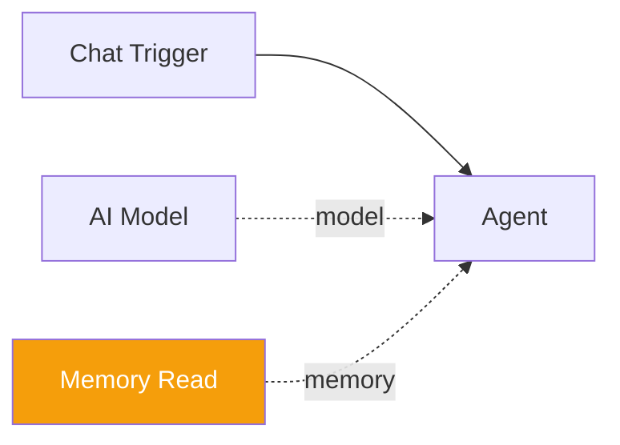

# Memory Read

The **Memory Read** component provides a `recall` tool that retrieves information from the global memory system. When connected to an agent, the agent can look up facts by key, search by query, or list all stored memories.

| Property | Value |
|----------|-------|
| **Component Type** | `memory_read` |
| **Category** | Sub-component (Memory) |
| **Display Name** | Memory Read |

## Ports

### Inputs

This component has no wired inputs. It operates as a LangChain tool that the agent invokes with arguments during its reasoning loop.

### Outputs

| Port | Data Type | Description |
|------|-----------|-------------|
| `result` | STRING | Retrieved memory content (JSON or plain text) |

## Configuration

The Memory Read component accepts the following configuration in `extra_config`:

| Field | Type | Default | Options | Description |
|-------|------|---------|---------|-------------|
| `memory_type` | string | `facts` | `facts`, `episodes`, `procedures`, `all` | Type of memory to search |
| `limit` | integer | `10` | 1--100 | Maximum number of results to return |
| `min_confidence` | number | `0.5` | 0--1 | Minimum confidence threshold for fact results |

## Usage

1. Add a **Memory Read** node from the Node Palette (Memory category)
2. Connect it to an agent node via the amber diamond **memory** handle
3. Optionally configure the memory type, result limit, and confidence threshold in the node's Extra Config

The agent's LLM will then have a `recall` tool available. The tool accepts two optional parameters:

| Parameter | Description |
|-----------|-------------|
| `key` | Exact key lookup. Falls back to search if no exact match is found. |
| `query` | Search query for fuzzy matching across memory. |

If called with no arguments, the tool lists all stored memories up to the configured limit.

### Search behavior

The `recall` tool follows this resolution order:

1. **No arguments** -- lists all facts from global memory
2. **Key provided** -- attempts exact key lookup first, then falls back to fuzzy search using the key as a query
3. **Query provided** -- searches across the configured memory type(s):
    - **Facts** -- fuzzy search with confidence filtering
    - **Procedures** -- finds procedures matching the goal
    - **Episodes** -- searches recent episode summaries
    - **All** -- searches across all three types

### Return format

Results are returned as JSON arrays with the following structure:

```json
[
  {"key": "user_name", "value": "Alice", "confidence": 0.95},
  {"key": "favorite_color", "value": "blue", "confidence": 0.8}
]
```

For exact key lookups, the format is a simple string: `user_name = Alice`.

If no results are found, a descriptive message is returned (e.g., `No memory found for key: unknown_key`).

## Example

An agent with Memory Read connected can answer questions about previously stored knowledge:

```
User: What do you know about me?
Agent: [calls recall(query="user")]
       → [{"key": "user_name", "value": "Alice", "confidence": 0.95},
          {"key": "user_role", "value": "developer", "confidence": 0.8}]
Agent: I know your name is Alice and you're a developer.
```



!!! note "Global scope"
    Memory Read always searches the global memory scope. Facts stored by any workflow on the platform are accessible. Use the `min_confidence` setting to filter out low-confidence facts.
