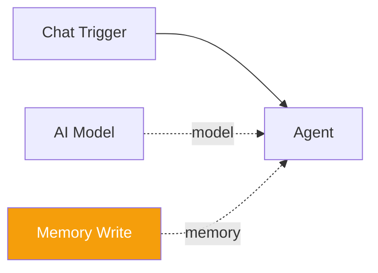

# Memory Write

The **Memory Write** component provides a `remember` tool that stores facts in the global memory system. When connected to an agent, the agent can persist key-value pairs that survive across executions and are accessible to any workflow on the platform.

| Property | Value |
|----------|-------|
| **Component Type** | `memory_write` |
| **Category** | Sub-component (Memory) |
| **Display Name** | Memory Write |

## Ports

### Inputs

This component has no wired inputs. It operates as a LangChain tool that the agent invokes with arguments during its reasoning loop.

### Outputs

| Port | Data Type | Description |
|------|-----------|-------------|
| `result` | STRING | Confirmation of what was stored |

## Configuration

The Memory Write component accepts the following configuration in `extra_config`:

| Field | Type | Default | Options | Description |
|-------|------|---------|---------|-------------|
| `fact_type` | string | `world_knowledge` | `user_preference`, `world_knowledge`, `self_knowledge`, `correction`, `relationship` | Type classification for the stored fact |
| `overwrite` | boolean | `true` | -- | Whether to overwrite an existing fact with the same key |

### Fact types

| Fact Type | Description | Example |
|-----------|-------------|---------|
| `user_preference` | User-specific preferences and settings | Preferred language, notification settings |
| `world_knowledge` | General facts about the world | API endpoints, project names |
| `self_knowledge` | Facts the agent knows about itself | Its own capabilities, assigned roles |
| `correction` | Corrections to previously stored facts | Updated values after user feedback |
| `relationship` | Relationships between entities | "Alice manages the backend team" |

## Usage

1. Add a **Memory Write** node from the Node Palette (Memory category)
2. Connect it to an agent node via the amber diamond **memory** handle
3. Optionally configure the default fact type and overwrite behavior in the node's Extra Config

The agent's LLM will then have a `remember` tool available. The tool accepts three parameters:

| Parameter | Required | Description |
|-----------|----------|-------------|
| `key` | Yes | The identifier for the fact |
| `value` | Yes | The content to store |
| `fact_type` | No | Override the configured default fact type |

### Write behavior

When the `remember` tool is called:

1. If a fact with the same key already exists and `overwrite` is `true`, the value is updated and the confirmation count is incremented
2. If a fact with the same key exists and `overwrite` is `false`, the write is skipped
3. If no fact with that key exists, a new fact is created

### Return format

The tool returns a confirmation string:

```
Remembered: user_name = Alice (created)
Remembered: user_name = Alice Smith (updated)
Remembered: user_name = Alice (skipped)
```

## Example

An agent with Memory Write connected can store information for later retrieval:

```
User: My name is Alice and I prefer dark mode.
Agent: [calls remember(key="user_name", value="Alice", fact_type="user_preference")]
       → Remembered: user_name = Alice (created)
       [calls remember(key="ui_preference", value="dark mode", fact_type="user_preference")]
       → Remembered: ui_preference = dark mode (created)
Agent: Got it! I've noted your name and preference.
```



!!! tip "Pair with Memory Read"
    Memory Write is most useful when paired with Memory Read on the same agent. The agent can then both store and recall information, building persistent knowledge over time.

!!! note "Global scope"
    All facts are stored in the global memory scope. Any workflow on the platform can read facts written by this component. Be mindful of key naming to avoid unintended collisions across workflows.
