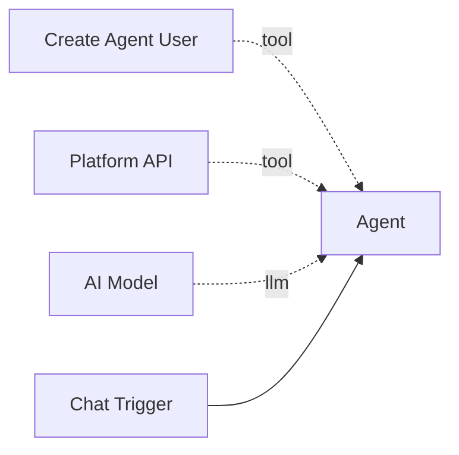

# Create Agent User

The **Create Agent User** tool provisions API credentials that an agent can use to authenticate against the Pipelit platform. This is the first step in enabling self-modification -- without credentials, an agent cannot call the platform API.

**Component type:** `create_agent_user`

## How It Works

When invoked, the tool creates (or retrieves existing) API credentials scoped to the agent. The username is deterministic, constructed from the workflow slug and the parent agent's node ID:

```
agent_{workflow_slug}_{agent_node_id}
```

This means calling the tool multiple times is safe -- it returns the same credentials if they already exist. Agent users are created **without passwords** and with MFA enabled (a TOTP secret is generated automatically).

## Ports

### Outputs

| Port | Type | Description |
|------|------|-------------|
| `credentials` | `STRING` | JSON object with `username`, `api_key`, `api_base_url`, `purpose`, and `already_existed` |

### Output Format

```json
{
  "success": true,
  "username": "agent_my-workflow_agent_abc123",
  "api_key": "xxxxxxxx-xxxx-xxxx-xxxx-xxxxxxxxxxxx",
  "api_base_url": "http://localhost:8000",
  "purpose": "Self-modification agent",
  "already_existed": false
}
```

## Configuration

| Setting | Type | Default | Description |
|---------|------|---------|-------------|
| `api_base_url` | string | `http://localhost:8000` | Base URL for the platform API. Set this to your production URL if deploying remotely. |

Set `api_base_url` in the node's **Extra Config** panel.

## Usage

Connect this tool to an agent via the green diamond **tool** handle. The agent calls it when it needs API access:



The agent typically calls `create_agent_user` first to obtain credentials, then passes the `api_key` to subsequent `platform_api` calls.

### Tool Signature

```python
create_agent_user(purpose: str = "") -> str
```

**Parameters:**

| Parameter | Type | Default | Description |
|-----------|------|---------|-------------|
| `purpose` | string | `""` | Optional description of what the credentials are for. Stored in the user's `first_name` field. |

## Example

An agent with a system prompt like:

```
You are a self-improving agent. When asked to improve yourself:
1. Call create_agent_user to get your API credentials.
2. Call whoami to learn your identity and current configuration.
3. Use platform_api to update your system prompt via PATCH.
```

When the user says "improve your greeting," the agent:

1. Calls `create_agent_user(purpose="Self-improvement")` and receives credentials.
2. Uses the `api_key` in subsequent `platform_api` calls to modify its own configuration.

!!! info "Idempotent"
    Calling `create_agent_user` multiple times is safe. If credentials already exist for this agent, the tool returns them without creating duplicates. The `already_existed` field in the response indicates whether credentials were freshly created or retrieved.

!!! warning "Agent Users Are Not Human Users"
    Agent users are created without passwords and cannot log in through the web UI. They exist solely for API access via Bearer token authentication. Each agent user also has a TOTP secret for identity verification -- see [Get TOTP Code](get-totp-code.md).
