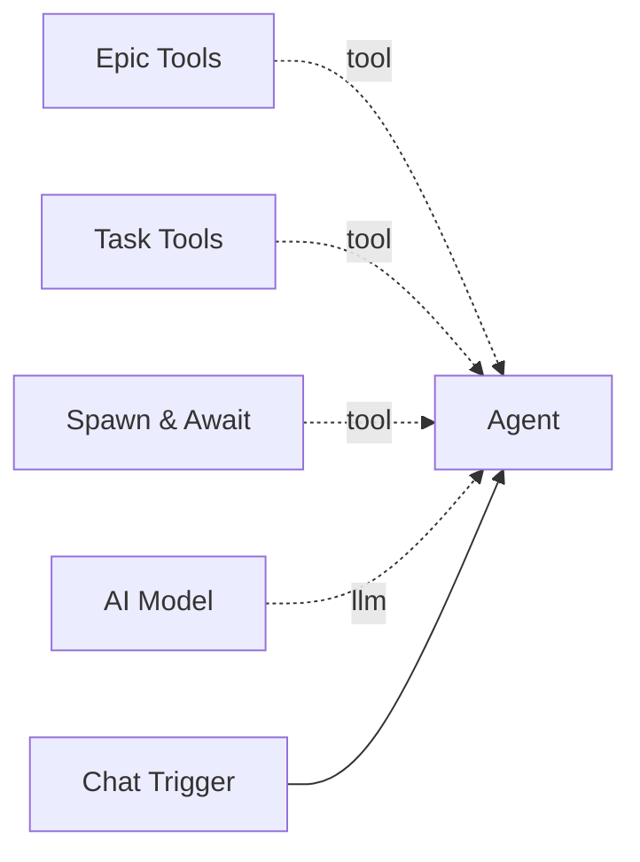

# Epic Tools

The **Epic Tools** component provides a set of LangChain tools for creating, querying, updating, and searching epics. Epics are high-level work packages that organize multiple tasks for multi-agent delegation and tracking.

**Component type:** `epic_tools`

## How It Works

This component registers four tools with the parent agent. Epics serve as containers for tasks -- each epic has a title, description, priority, optional budget limits, and a status that tracks progress from planning through completion.

All epics are scoped to the workflow owner. The component resolves the owner from the workflow at build time.

## Ports

### Outputs

| Port | Type | Description |
|------|------|-------------|
| `result` | `STRING` | JSON result from epic operations |

## Configuration

This tool has no configurable settings.

## Usage

Connect this tool to an agent via the green diamond **tool** handle. It is typically paired with [Task Tools](task-tools.md) for full work decomposition:



## Tools Provided

This component registers **four tools** with the agent:

### `create_epic`

Create a new epic for organizing tasks.

```python
create_epic(
    title: str,
    description: str = "",
    tags: str = "",
    priority: int = 2,
    budget_tokens: int | None = None,
    budget_usd: float | None = None,
) -> str
```

| Parameter | Type | Default | Description |
|-----------|------|---------|-------------|
| `title` | string | (required) | Epic title |
| `description` | string | `""` | Detailed description |
| `tags` | string | `""` | Comma-separated tags (e.g., `"backend,urgent"`) |
| `priority` | int | `2` | Priority level 1-5 (1 = highest) |
| `budget_tokens` | int | `None` | Optional token budget limit |
| `budget_usd` | float | `None` | Optional USD budget limit |

**Returns:** `{"success": true, "epic_id": "ep-abc123", "title": "...", "status": "planning"}`

### `epic_status`

Get detailed status of an epic including its task breakdown.

```python
epic_status(epic_id: str) -> str
```

| Parameter | Type | Description |
|-----------|------|-------------|
| `epic_id` | string | The epic ID (e.g., `"ep-abc123"`) |

**Returns:** JSON with epic details, task counts, budget usage, and full task list.

### `update_epic`

Update an epic's fields. Only provided fields are changed.

```python
update_epic(
    epic_id: str,
    status: str | None = None,
    title: str | None = None,
    description: str | None = None,
    priority: int | None = None,
    budget_tokens: int | None = None,
    budget_usd: float | None = None,
    result_summary: str | None = None,
) -> str
```

| Parameter | Type | Description |
|-----------|------|-------------|
| `epic_id` | string | The epic ID |
| `status` | string | New status: `planning`, `active`, `paused`, `completed`, `cancelled`, `failed` |
| `title` | string | New title |
| `description` | string | New description |
| `priority` | int | New priority 1-5 |
| `budget_tokens` | int | New token budget |
| `budget_usd` | float | New USD budget |
| `result_summary` | string | Summary of results when completing |

**Returns:** `{"success": true, "epic_id": "ep-abc123", "status": "completed"}`

!!! note "Cancellation Cascades"
    Setting an epic's status to `cancelled` automatically cancels all its pending, blocked, and running tasks.

### `search_epics`

Search epics by text, tags, or status.

```python
search_epics(
    query: str = "",
    tags: str = "",
    status: str | None = None,
    limit: int = 10,
) -> str
```

| Parameter | Type | Default | Description |
|-----------|------|---------|-------------|
| `query` | string | `""` | Search text (matches title and description, case-insensitive) |
| `tags` | string | `""` | Comma-separated tags to filter by (OR semantics) |
| `status` | string | `None` | Filter by status |
| `limit` | int | `10` | Max results (1-100) |

**Returns:** JSON with `results` list, `success_rate` (ratio of completed to finished epics), and `avg_cost`.

## Example

An orchestrator agent decomposing a complex request:

```
User: Build me a data pipeline that fetches weather data hourly.

Agent thinking: I need to create an epic and break this into tasks.

Tool call: create_epic(
    title="Weather Data Pipeline",
    description="Build an hourly weather data fetching pipeline",
    tags="data,automation",
    priority=2
)
Result: {"success": true, "epic_id": "ep-w3ath3r", "status": "planning"}

Tool call: update_epic(epic_id="ep-w3ath3r", status="active")
Result: {"success": true, "epic_id": "ep-w3ath3r", "status": "active"}
```

The agent then uses [Task Tools](task-tools.md) to create individual tasks within the epic, and [Spawn & Await](spawn-and-await.md) to delegate each task to a worker workflow.

!!! tip "WebSocket Events"
    Epic creation and updates broadcast WebSocket events (`epic_created`, `epic_updated`) on the `epic:{epic_id}` channel, enabling real-time UI updates.
