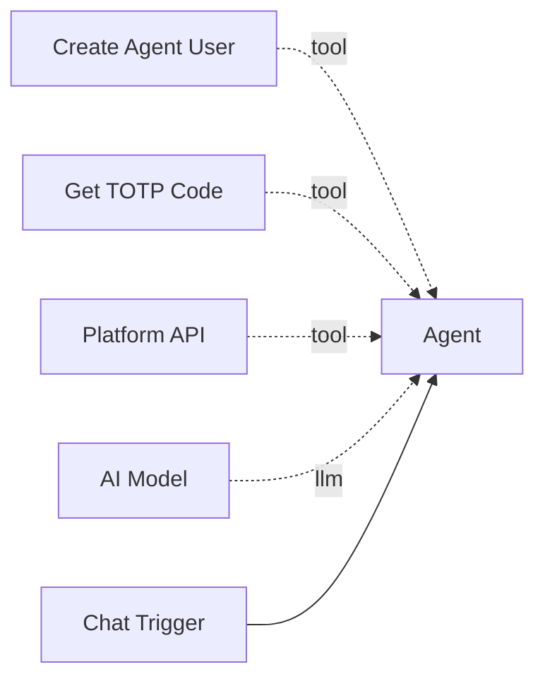

# Get TOTP Code

The **Get TOTP Code** tool retrieves the current time-based one-time password (TOTP) for an agent user. This enables agent identity verification when interacting with systems that require MFA.

**Component type:** `get_totp_code`

## How It Works

Every agent user created by [Create Agent User](create-agent-user.md) is provisioned with a TOTP secret and MFA enabled. This tool reads the secret from the database and generates the current 6-digit TOTP code using the standard RFC 6238 algorithm (via `pyotp`).

If no username is provided, the tool automatically resolves the agent user associated with the current workflow and node by following the `tool` edge to the parent agent and constructing the deterministic username (`agent_{workflow_slug}_{agent_node_id}`).

## Ports

### Outputs

| Port | Type | Description |
|------|------|-------------|
| `totp_code` | `STRING` | JSON object with `username` and current `totp_code` |

### Output Format

```json
{
  "success": true,
  "username": "agent_my-workflow_agent_abc123",
  "totp_code": "483291"
}
```

## Configuration

This tool has no configurable settings.

## Usage

Connect this tool to an agent via the green diamond **tool** handle. It pairs with `create_agent_user` for scenarios where the agent needs to prove its identity:



### Tool Signature

```python
get_totp_code(username: str = "") -> str
```

**Parameters:**

| Parameter | Type | Default | Description |
|-----------|------|---------|-------------|
| `username` | string | `""` | The agent username to get the TOTP code for. If omitted, the tool automatically resolves the agent user for the current workflow/node. |

## Example

An agent that needs to authenticate with an external system requiring MFA:

1. Calls `create_agent_user()` to ensure credentials exist.
2. Calls `get_totp_code()` to retrieve the current TOTP code.
3. Submits both the API key and TOTP code to the external system.

```
Agent: I need to verify my identity with the external service.
       Let me get my credentials and TOTP code.

Tool call: create_agent_user(purpose="External auth")
Result: {"success": true, "username": "agent_my-workflow_agent_abc123", ...}

Tool call: get_totp_code()
Result: {"success": true, "username": "agent_my-workflow_agent_abc123", "totp_code": "483291"}
```

!!! info "Code Rotation"
    TOTP codes rotate every 30 seconds. The tool returns the code that is valid at the moment of the call. If the agent needs to use the code in a subsequent API call, it should do so promptly.

!!! warning "Agent User Must Exist"
    The tool returns an error if the agent user has not been created yet or if the user has no TOTP secret configured. Always call `create_agent_user` first to ensure the agent user exists.
