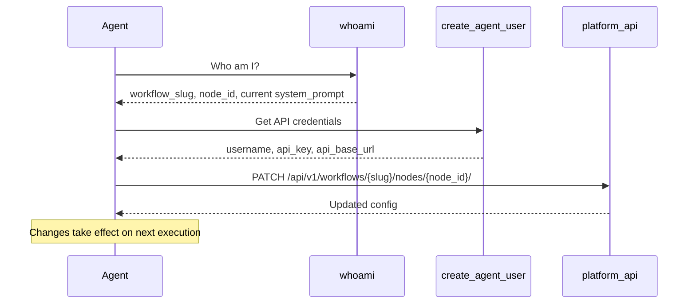
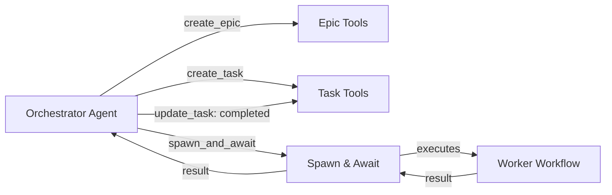

# Self-Awareness

Self-awareness tools give agents the ability to interact with the Pipelit platform itself -- creating users, making API calls, managing workflows, scheduling jobs, and understanding their own identity. This is what enables **self-improving agents**: agents that can inspect their own configuration, modify their system prompts, create new workflows, delegate tasks, and monitor the health of the infrastructure they run on.

All self-awareness components are **tool nodes**. They connect to agent nodes via the green diamond "tool" handle and are invoked by the LLM during its reasoning loop, just like any other tool.

## Available Components

| Component | Type | Description |
|-----------|------|-------------|
| [Create Agent User](create-agent-user.md) | `create_agent_user` | Provision API credentials so the agent can authenticate against the platform |
| [Platform API](platform-api.md) | `platform_api` | Make authenticated HTTP requests to any platform REST endpoint |
| [WhoAmI](whoami.md) | `whoami` | Retrieve the agent's own identity: workflow slug, node ID, current config, and self-modification instructions |
| [Get TOTP Code](get-totp-code.md) | `get_totp_code` | Retrieve the current TOTP code for agent identity verification |
| [Epic Tools](epic-tools.md) | `epic_tools` | Create, query, update, and search epics for organizing multi-step work |
| [Task Tools](task-tools.md) | `task_tools` | Create, list, update, and cancel tasks within epics |
| [Spawn & Await](spawn-and-await.md) | `spawn_and_await` | Spawn a child workflow and wait for its result inside the agent's reasoning loop |
| [Workflow Create](workflow-create.md) | `workflow_create` | Create workflows programmatically from a YAML DSL specification |
| [Workflow Discover](workflow-discover.md) | `workflow_discover` | Search existing workflows by requirements and get scored reuse recommendations |
| [Scheduler Tools](scheduler-tools.md) | `scheduler_tools` | Create, pause, resume, stop, and list scheduled recurring jobs |
| [System Health](system-health.md) | `system_health` | Check platform infrastructure health: Redis, RQ workers, queues, and executions |

## Self-Improvement Pattern

The typical self-improvement cycle uses three tools together:

1. **WhoAmI** tells the agent its workflow slug, node ID, and current system prompt.
2. **Create Agent User** provisions API credentials (or returns existing ones).
3. **Platform API** sends a `PATCH` request to update the agent's own configuration.

## Multi-Agent Delegation Pattern

For complex tasks, agents can decompose work into epics and tasks, then spawn child workflows to execute them:

## Connection

All self-awareness tools connect to agent nodes via the green diamond **tool** handle, the same way standard tools (Run Command, HTTP Request, etc.) connect. An agent can have any number of self-awareness tools attached simultaneously.

## What's Next?

- Learn how agents work: [Agents](../../concepts/agents.md)
- Build a self-improving agent: [Self-Improving Agent Tutorial](../../tutorials/self-improving-agent.md)
- Understand the YAML DSL: [YAML DSL Tutorial](../../tutorials/yaml-dsl.md)
- See the multi-agent architecture: [Multi-Agent Architecture](../../architecture/multi-agent.md)
