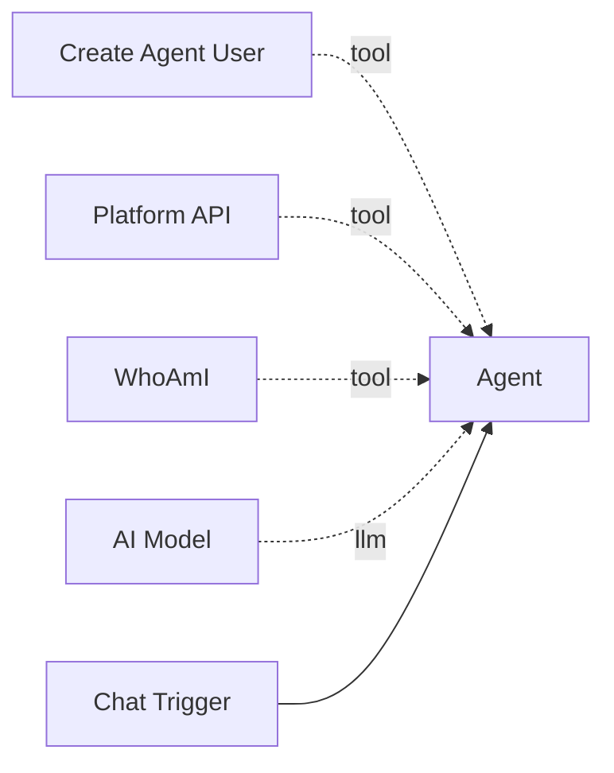

# Platform API

The **Platform API** tool allows agents to make authenticated HTTP requests to any endpoint on the Pipelit REST API. Combined with [Create Agent User](create-agent-user.md), this gives agents full programmatic access to the platform -- reading workflows, modifying node configurations, managing credentials, and more.

**Component type:** `platform_api`

## How It Works

The tool wraps an HTTP client (`httpx`) that sends requests to the platform API with Bearer token authentication. The agent provides the HTTP method, path, optional JSON body, and the API key obtained from `create_agent_user`.

A recommended first call is `path="/openapi.json"` to retrieve the full OpenAPI schema, which the agent can then use to discover all available endpoints and their expected request/response formats.

## Ports

### Outputs

| Port | Type | Description |
|------|------|-------------|
| `response` | `STRING` | JSON object with `status_code`, `success`, `data`, and optionally `error` |

### Output Format

```json
{
  "status_code": 200,
  "success": true,
  "data": { ... }
}
```

On error (HTTP 4xx/5xx):

```json
{
  "status_code": 404,
  "success": false,
  "data": { "detail": "Not found" },
  "error": "HTTP 404"
}
```

## Configuration

| Setting | Type | Default | Description |
|---------|------|---------|-------------|
| `api_base_url` | string | `http://localhost:8000` | Base URL for the platform API. Override for remote deployments. |

Set `api_base_url` in the node's **Extra Config** panel.

## Usage

Connect this tool to an agent via the green diamond **tool** handle, alongside `create_agent_user` for credential provisioning:



### Tool Signature

```python
platform_api(
    method: str = "GET",
    path: str = "/openapi.json",
    body: str = "",
    api_key: str = "",
    base_url: str = "",
) -> str
```

**Parameters:**

| Parameter | Type | Default | Description |
|-----------|------|---------|-------------|
| `method` | string | `"GET"` | HTTP method: `GET`, `POST`, `PATCH`, `DELETE` |
| `path` | string | `"/openapi.json"` | API path (e.g., `/api/v1/workflows/`, `/api/v1/auth/me/`) |
| `body` | string | `""` | JSON body for `POST`/`PATCH` requests (as a string) |
| `api_key` | string | `""` | Bearer token from `create_agent_user` |
| `base_url` | string | `""` | Override base URL (defaults to node config `api_base_url`) |

## Example

A typical self-modification workflow:

1. **Discover the API:**
    ```
    platform_api(path="/openapi.json", api_key="...")
    ```

2. **List workflows:**
    ```
    platform_api(method="GET", path="/api/v1/workflows/", api_key="...")
    ```

3. **Read current node config:**
    ```
    platform_api(method="GET", path="/api/v1/workflows/my-workflow/nodes/", api_key="...")
    ```

4. **Update the agent's system prompt:**
    ```
    platform_api(
        method="PATCH",
        path="/api/v1/workflows/my-workflow/nodes/agent_abc123/",
        body='{"config": {"system_prompt": "You are an improved agent..."}}',
        api_key="..."
    )
    ```

!!! tip "Discover Endpoints First"
    The default path (`/openapi.json`) returns the full OpenAPI specification. Encourage your agent to call this first so it understands what endpoints are available before making targeted requests. This is especially useful when the agent needs to interact with APIs it has not been explicitly told about.

!!! warning "Timeout"
    Requests have a 30-second timeout. Long-running operations (like triggering a workflow execution) should be handled through other mechanisms such as [Spawn & Await](spawn-and-await.md).
