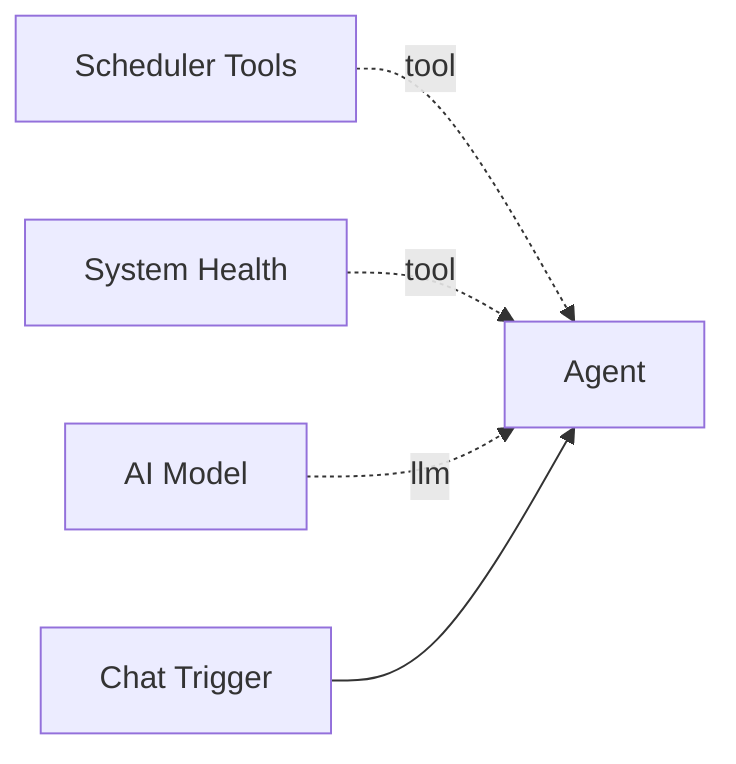

# Scheduler Tools

The **Scheduler Tools** component provides LangChain tools for creating, pausing, resuming, stopping, and listing scheduled recurring jobs. This allows agents to set up automated workflow executions on intervals without human intervention.

**Component type:** `scheduler_tools`

## How It Works

This component registers five tools with the parent agent. Scheduled jobs use Pipelit's self-rescheduling architecture -- each job runs as an RQ task that, on completion, enqueues itself for the next run via `Queue.enqueue_in()`. This approach avoids external cron dependencies and supports exponential backoff on failure.

Each scheduled job tracks:

- **Run count** -- how many times it has executed.
- **Error count** -- how many failures have occurred.
- **Status** -- `active`, `paused`, `done`, `dead`.
- **Interval** -- seconds between successful runs.

## Ports

### Outputs

| Port | Type | Description |
|------|------|-------------|
| `result` | `STRING` | JSON result from schedule operations |

## Configuration

This tool has no configurable settings.

## Usage

Connect this tool to an agent via the green diamond **tool** handle:



## Tools Provided

This component registers **five tools** with the agent:

### `create_schedule`

Create a scheduled job that runs a workflow on a recurring interval.

```python
create_schedule(
    name: str,
    workflow_id: int,
    interval_seconds: int,
    description: str = "",
    trigger_node_id: str | None = None,
    total_repeats: int = 0,
    max_retries: int = 3,
    timeout_seconds: int = 600,
) -> str
```

| Parameter | Type | Default | Description |
|-----------|------|---------|-------------|
| `name` | string | (required) | Human-readable schedule name |
| `workflow_id` | int | (required) | ID of the workflow to execute |
| `interval_seconds` | int | (required) | Seconds between successful runs (must be >= 1) |
| `description` | string | `""` | Optional description |
| `trigger_node_id` | string | `None` | Specific trigger node to target (uses first trigger if omitted) |
| `total_repeats` | int | `0` | Total runs before stopping (0 = infinite) |
| `max_retries` | int | `3` | Max retries per run on failure |
| `timeout_seconds` | int | `600` | Per-execution timeout in seconds |

**Returns:** `{"success": true, "schedule_id": "...", "name": "...", "status": "active"}`

### `pause_schedule`

Pause a running scheduled job. It stops rescheduling until resumed.

```python
pause_schedule(schedule_id: str) -> str
```

| Parameter | Type | Description |
|-----------|------|-------------|
| `schedule_id` | string | The schedule UUID |

**Returns:** `{"success": true, "schedule_id": "...", "status": "paused"}`

### `resume_schedule`

Resume a paused scheduled job.

```python
resume_schedule(schedule_id: str) -> str
```

| Parameter | Type | Description |
|-----------|------|-------------|
| `schedule_id` | string | The schedule UUID |

**Returns:** `{"success": true, "schedule_id": "...", "status": "active"}`

### `stop_schedule`

Permanently delete a scheduled job.

```python
stop_schedule(schedule_id: str) -> str
```

| Parameter | Type | Description |
|-----------|------|-------------|
| `schedule_id` | string | The schedule UUID |

**Returns:** `{"success": true, "schedule_id": "...", "deleted": true}`

!!! warning "Permanent Deletion"
    `stop_schedule` permanently deletes the scheduled job from the database. This action cannot be undone. Use `pause_schedule` if you want to temporarily suspend a job.

### `list_schedules`

List scheduled jobs with optional filters.

```python
list_schedules(
    status: str | None = None,
    workflow_id: int | None = None,
    limit: int = 10,
) -> str
```

| Parameter | Type | Default | Description |
|-----------|------|---------|-------------|
| `status` | string | `None` | Filter by status: `active`, `paused`, `stopped`, `dead`, `done` |
| `workflow_id` | int | `None` | Filter by workflow ID |
| `limit` | int | `10` | Max results (1-100) |

**Returns:** JSON with `results` list, each containing `schedule_id`, `name`, `status`, `workflow_id`, `interval_seconds`, `run_count`, and `error_count`.

## Example

An agent setting up hourly monitoring:

```
User: Run the site-monitor workflow every hour.

Agent thinking: I need to find the workflow ID and create a schedule.

Tool call: list_schedules(workflow_id=12)
Result: {"success": true, "results": []}

Tool call: create_schedule(
    name="Hourly Site Monitor",
    workflow_id=12,
    interval_seconds=3600,
    description="Check site health every hour",
    max_retries=3
)
Result: {"success": true, "schedule_id": "sched-abc123", "name": "Hourly Site Monitor", "status": "active"}

Agent: Done! The site-monitor workflow will run every hour.
       Schedule ID: sched-abc123
```

Later, pausing the schedule:

```
User: Pause the monitoring, we're doing maintenance.

Tool call: pause_schedule(schedule_id="sched-abc123")
Result: {"success": true, "schedule_id": "sched-abc123", "status": "paused"}
```

!!! info "Failure Backoff"
    When a scheduled execution fails, the scheduler uses exponential backoff (capped at 10x the interval) before retrying. After exhausting `max_retries`, the job transitions to `dead` status. Use [System Health](system-health.md) to monitor for dead scheduled jobs.

!!! tip "Finite Schedules"
    Set `total_repeats` to a non-zero value for jobs that should run a fixed number of times. For example, `total_repeats=24` with `interval_seconds=3600` runs once per hour for exactly one day, then transitions to `done` status.
