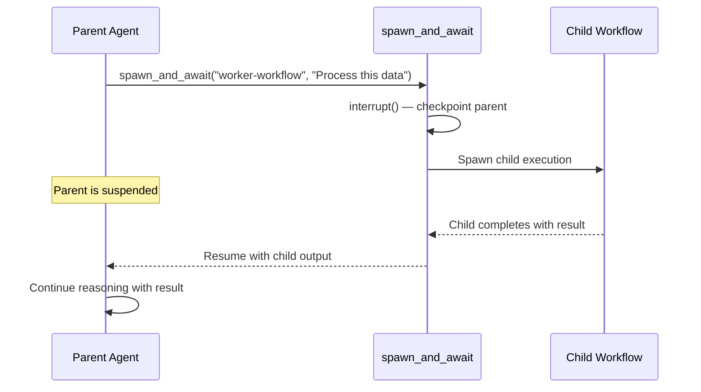
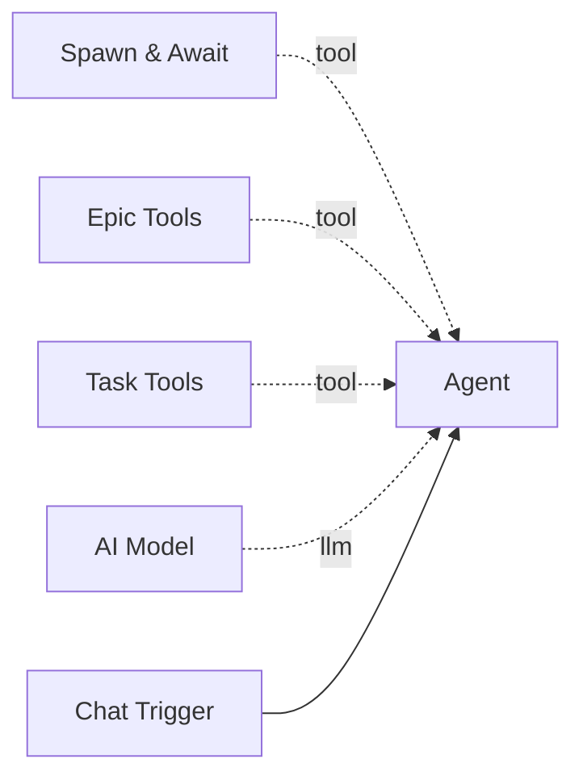

# Spawn & Await

The **Spawn & Await** tool is the key mechanism for multi-agent delegation. It allows an agent to spawn a child workflow, pause its own execution, and resume when the child completes -- all within the agent's reasoning loop.

**Component type:** `spawn_and_await`

## How It Works

When an agent calls this tool, it triggers LangGraph's `interrupt()` mechanism to checkpoint the agent mid-tool-call. The orchestrator then:

1. Spawns a new execution of the specified child workflow.
2. Passes the `input_text` and `input_data` as the child's trigger payload.
3. Optionally links the child execution to a task (via `task_id`).
4. Waits for the child to complete.
5. Resumes the parent agent with the child's output as the tool return value.

This means the parent agent's full reasoning state -- including prior tool calls, messages, and context -- is preserved across the interrupt.



## Ports

### Outputs

| Port | Type | Description |
|------|------|-------------|
| `result` | `STRING` | JSON result from the child workflow's execution |

## Configuration

This tool has no configurable settings.

## Usage

Connect this tool to an agent via the green diamond **tool** handle. It is the primary tool for orchestrator agents that delegate work:



### Tool Signature

```python
spawn_and_await(
    workflow_slug: str,
    input_text: str = "",
    task_id: str | None = None,
    input_data: dict | None = None,
) -> str
```

**Parameters:**

| Parameter | Type | Default | Description |
|-----------|------|---------|-------------|
| `workflow_slug` | string | (required) | Slug of the child workflow to spawn |
| `input_text` | string | `""` | Text input passed as the child's trigger text |
| `task_id` | string | `None` | Optional task ID to link the child execution to |
| `input_data` | dict | `None` | Optional dict of additional data for the child trigger payload |

## Example

An orchestrator agent delegating a code review task:

```
User: Review the authentication module for security issues.

Agent thinking: I'll delegate this to the security-review workflow.

Tool call: spawn_and_await(
    workflow_slug="security-review",
    input_text="Review the authentication module for security vulnerabilities",
    task_id="tsk-review01",
    input_data={"module": "auth", "priority": "high"}
)

[Parent agent suspends while child executes]

Result: {"findings": ["SQL injection risk in login handler", ...], "severity": "high"}

Agent: The security review found the following issues:
1. SQL injection risk in the login handler...
```

### Task Integration

When `task_id` is provided, the child execution is linked to the task record. This enables the orchestrator to track which execution handled which task, and allows [Task Tools](task-tools.md) to cancel the execution if the task is cancelled.

### Error Handling

If the child workflow fails, the tool raises a `ToolException` with the error message. This triggers the agent's error handling rather than having the LLM retry the tool call:

```json
{"_error": "Child workflow failed: Connection timeout"}
```

The parent agent can then decide how to proceed -- retry with different parameters, try a different workflow, or report the failure.

!!! info "Checkpointing"
    If the parent agent does not have conversation memory enabled, Pipelit uses a **RedisSaver** ephemeral checkpointer (instead of SqliteSaver) to persist state only long enough for the child to complete. The thread ID format is `exec:{execution_id}:{node_id}`.

!!! warning "Child Must Complete"
    The parent agent remains suspended until the child workflow finishes (successfully or with an error). Ensure child workflows are designed to complete in a reasonable time. Use the `timeout_seconds` setting on scheduled jobs if you need to bound execution time.
