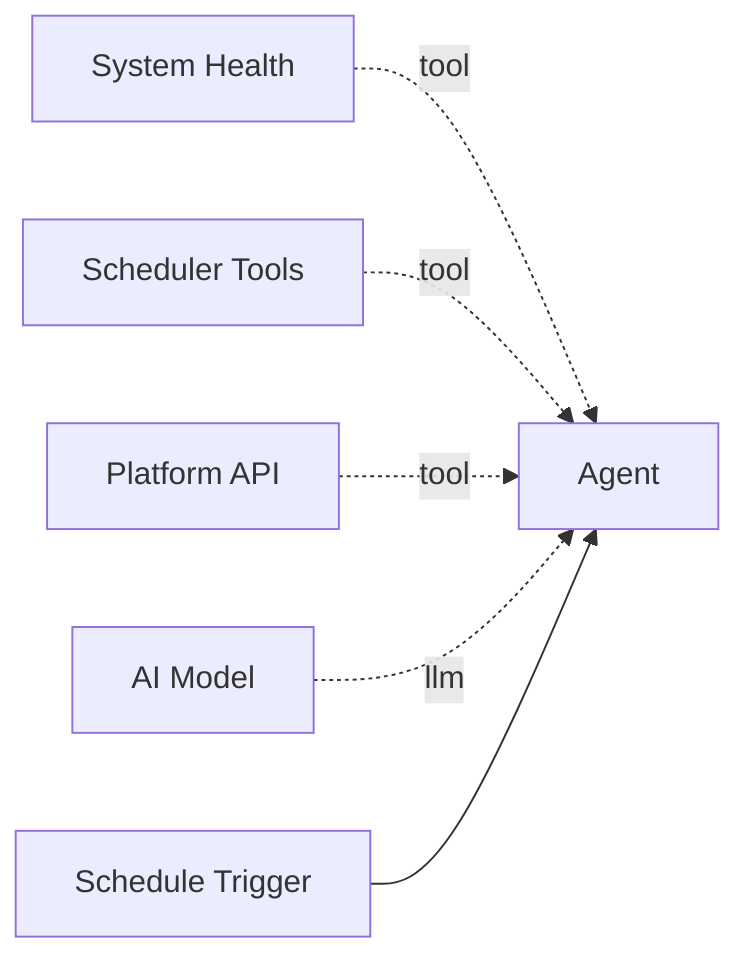
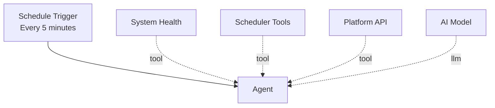

# System Health

The **System Health** tool checks the health of the Pipelit platform infrastructure. It inspects Redis connectivity, RQ worker status, queue depths, stuck executions, recent failures, and problematic scheduled jobs -- returning a comprehensive health report with a summary status and actionable issues.

**Component type:** `system_health`

## How It Works

When invoked, the tool runs six health checks in sequence:

1. **Redis** -- Pings Redis and reports memory usage and connected clients.
2. **RQ Workers** -- Lists all active workers, their state, and queues.
3. **Queue Depths** -- Reports the number of pending jobs in the `workflows` and `default` queues.
4. **Stuck Executions** -- Finds executions that have been `running` for more than 15 minutes.
5. **Failed Executions** -- Counts failures in the last 24 hours, grouped by error message.
6. **Scheduled Jobs** -- Identifies dead or erroring scheduled jobs.

The results are combined into a summary status:

| Summary | Condition |
|---------|-----------|
| `healthy` | All checks pass, no critical issues |
| `degraded` | More than 5 failed executions in 24h, or dead scheduled jobs |
| `critical` | Redis unreachable, no RQ workers, or stuck executions |

## Ports

### Outputs

| Port | Type | Description |
|------|------|-------------|
| `result` | `STRING` | JSON health report with `timestamp`, `summary`, `checks`, and `issues` |

### Output Format

```json
{
  "timestamp": "2026-02-16T10:30:00+00:00",
  "summary": "healthy",
  "checks": {
    "redis": {
      "status": "ok",
      "used_memory_human": "2.50M",
      "used_memory_peak_human": "4.12M",
      "connected_clients": 5
    },
    "workers": {
      "status": "ok",
      "count": 2,
      "workers": [
        {"name": "worker-1", "state": "idle", "queues": ["workflows", "default"]},
        {"name": "worker-2", "state": "busy", "queues": ["workflows"]}
      ]
    },
    "queues": {
      "status": "ok",
      "workflows": 3,
      "default": 0
    },
    "stuck_executions": {
      "status": "ok",
      "count": 0,
      "executions": []
    },
    "failed_executions": {
      "status": "ok",
      "total_24h": 2,
      "by_error": [
        {"error": "LLM timeout", "count": 2}
      ]
    },
    "scheduled_jobs": {
      "status": "ok",
      "dead_count": 0,
      "erroring_count": 0,
      "jobs": []
    }
  },
  "issues": []
}
```

### Issues Format

When problems are found, the `issues` array contains actionable items:

```json
{
  "issues": [
    {
      "severity": "critical",
      "check": "workers",
      "detail": "No RQ workers running"
    },
    {
      "severity": "warn",
      "check": "failed_executions",
      "detail": "12 failed execution(s) in the last 24 hours"
    }
  ]
}
```

Issue severity levels:

| Severity | Meaning |
|----------|---------|
| `critical` | System cannot function properly -- immediate action required |
| `warn` | Degraded performance or accumulating problems -- should be investigated |

## Configuration

This tool has no configurable settings.

## Usage

Connect this tool to an agent via the green diamond **tool** handle. It is useful for operational monitoring and self-healing agents:



### Tool Signature

```python
check_system_health() -> str
```

This tool takes no parameters.

## Example

A monitoring agent that runs on a schedule and reports issues:

```
Agent: Let me check the system health.

Tool call: check_system_health()

Result: {
    "summary": "degraded",
    "checks": { ... },
    "issues": [
        {
            "severity": "warn",
            "check": "scheduled_jobs",
            "detail": "2 dead scheduled job(s)"
        },
        {
            "severity": "warn",
            "check": "failed_executions",
            "detail": "8 failed execution(s) in the last 24 hours"
        }
    ]
}

Agent: System status is DEGRADED. Two issues found:
1. 2 dead scheduled jobs need attention -- they have exceeded retry limits.
2. 8 failed executions in the last 24 hours, indicating a recurring problem.

Recommended actions:
- Review the dead scheduled jobs and either restart or delete them.
- Check the error messages on failed executions to identify the root cause.
```

### Self-Healing Pattern

Combine System Health with [Scheduler Tools](scheduler-tools.md) and [Platform API](platform-api.md) for a self-healing agent:



The agent:

1. Runs `check_system_health()` on a schedule.
2. If it finds dead scheduled jobs, uses `scheduler_tools` to restart or delete them.
3. If it finds stuck executions, uses `platform_api` to cancel them.
4. Reports its actions via a delivery channel (Telegram, webhook, etc.).

!!! info "Check Thresholds"
    - **Stuck executions:** Running longer than 15 minutes.
    - **Failed executions warning:** More than 5 failures in 24 hours.
    - **Scheduled jobs:** Any job with `dead` status or non-zero `error_count`.

!!! tip "Combine with Scheduling"
    For continuous monitoring, create a scheduled job that runs the health-check workflow every few minutes using [Scheduler Tools](scheduler-tools.md). The agent can then escalate issues by sending alerts via Telegram or webhook delivery.
