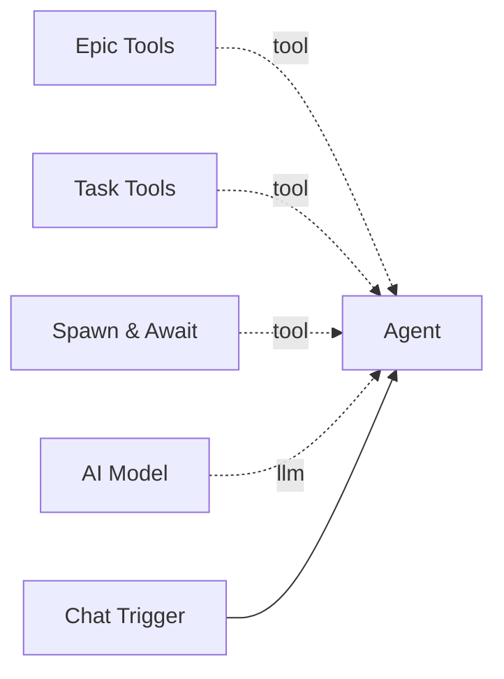

# Task Tools

The **Task Tools** component provides LangChain tools for creating, listing, updating, and cancelling tasks within epics. Tasks are the individual units of work that agents execute, each trackable with status, dependencies, and budget.

**Component type:** `task_tools`

## How It Works

This component registers four tools with the parent agent. Tasks belong to epics and support dependency chains -- a task can depend on other tasks within the same epic, and will be automatically set to `blocked` status until its dependencies complete. When a task is marked `completed`, any downstream tasks that depended on it are automatically unblocked.

## Ports

### Outputs

| Port | Type | Description |
|------|------|-------------|
| `result` | `STRING` | JSON result from task operations |

## Configuration

This tool has no configurable settings.

## Usage

Connect this tool to an agent via the green diamond **tool** handle. It is typically paired with [Epic Tools](epic-tools.md) and [Spawn & Await](spawn-and-await.md):



## Tools Provided

This component registers **four tools** with the agent:

### `create_task`

Create a new task within an epic.

```python
create_task(
    epic_id: str,
    title: str,
    description: str = "",
    tags: str = "",
    depends_on: str = "",
    priority: int = 2,
    estimated_tokens: int | None = None,
    max_retries: int = 2,
) -> str
```

| Parameter | Type | Default | Description |
|-----------|------|---------|-------------|
| `epic_id` | string | (required) | Parent epic ID |
| `title` | string | (required) | Task title |
| `description` | string | `""` | Detailed description |
| `tags` | string | `""` | Comma-separated tags |
| `depends_on` | string | `""` | Comma-separated task IDs this task depends on |
| `priority` | int | `2` | Priority 1-5 (1 = highest) |
| `estimated_tokens` | int | `None` | Estimated token cost |
| `max_retries` | int | `2` | Max retry attempts on failure |

**Returns:** `{"success": true, "task_id": "tsk-abc123", "status": "pending"}`

!!! note "Automatic Blocking"
    If `depends_on` is specified and not all dependencies are completed, the task is created with status `blocked` instead of `pending`. It will be automatically unblocked when all dependencies complete.

### `list_tasks`

List tasks within an epic, optionally filtered by status or tags.

```python
list_tasks(
    epic_id: str,
    status: str | None = None,
    tags: str | None = None,
    limit: int = 20,
) -> str
```

| Parameter | Type | Default | Description |
|-----------|------|---------|-------------|
| `epic_id` | string | (required) | The epic ID |
| `status` | string | `None` | Filter: `pending`, `blocked`, `running`, `completed`, `failed`, `cancelled` |
| `tags` | string | `None` | Comma-separated tags to filter by |
| `limit` | int | `20` | Max results (1-100) |

**Returns:** JSON with `tasks` list (each with `id`, `title`, `status`, `priority`, `depends_on`, `execution_id`) and `total` count.

### `update_task`

Update a task's fields. Only provided fields are changed.

```python
update_task(
    task_id: str,
    status: str | None = None,
    title: str | None = None,
    description: str | None = None,
    priority: int | None = None,
    result_summary: str | None = None,
    error_message: str | None = None,
    notes: str | None = None,
) -> str
```

| Parameter | Type | Description |
|-----------|------|-------------|
| `task_id` | string | The task ID |
| `status` | string | New status: `pending`, `blocked`, `running`, `completed`, `failed`, `cancelled` |
| `title` | string | New title |
| `description` | string | New description |
| `priority` | int | New priority 1-5 |
| `result_summary` | string | Summary of results when completing |
| `error_message` | string | Error message if failed |
| `notes` | string | A note to append to the task's notes list |

**Returns:** `{"success": true, "task_id": "tsk-abc123", "status": "completed"}`

!!! note "Dependency Resolution"
    When a task is marked `completed`, the tool automatically checks for downstream tasks that depend on it and unblocks them if all their dependencies are now satisfied.

### `cancel_task`

Cancel a task and optionally its linked execution.

```python
cancel_task(task_id: str, reason: str = "") -> str
```

| Parameter | Type | Default | Description |
|-----------|------|---------|-------------|
| `task_id` | string | (required) | The task ID to cancel |
| `reason` | string | `""` | Optional cancellation reason (appended to notes) |

**Returns:** `{"success": true, "task_id": "tsk-abc123", "execution_cancelled": true}`

If the task has a linked workflow execution that is still `pending` or `running`, it is cancelled as well.

## Example

An orchestrator agent managing a multi-step project:

```
Tool call: create_task(
    epic_id="ep-w3ath3r",
    title="Create weather API integration workflow",
    description="Build a workflow that calls the OpenWeatherMap API",
    tags="api,integration",
    priority=1
)
Result: {"success": true, "task_id": "tsk-api001", "status": "pending"}

Tool call: create_task(
    epic_id="ep-w3ath3r",
    title="Create data storage workflow",
    description="Build a workflow that stores weather data",
    depends_on="tsk-api001",
    priority=2
)
Result: {"success": true, "task_id": "tsk-store01", "status": "blocked"}
```

The second task is automatically `blocked` because it depends on the first. When the agent marks `tsk-api001` as `completed`, `tsk-store01` is automatically unblocked and moves to `pending`.

!!! tip "WebSocket Events"
    Task creation and updates broadcast WebSocket events (`task_created`, `task_updated`) on the `epic:{epic_id}` channel. The epic's progress counters (`total_tasks`, `completed_tasks`, `failed_tasks`) are automatically synced after each task mutation.
