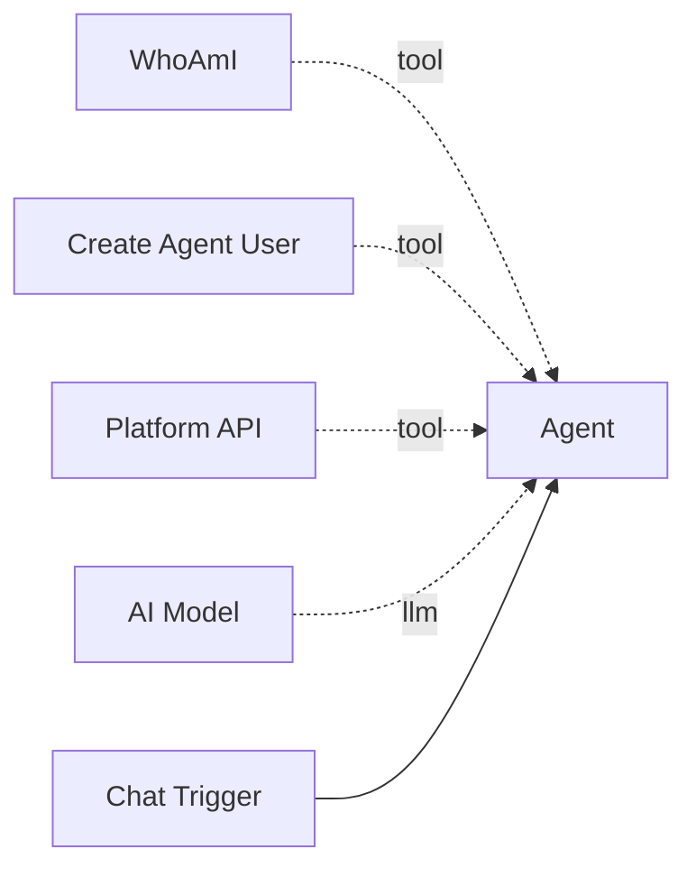

# WhoAmI

The **WhoAmI** tool gives an agent self-awareness about its own identity within the platform. It returns the agent's workflow slug, node ID, current system prompt, extra configuration, and step-by-step instructions for self-modification.

**Component type:** `whoami`

## How It Works

When invoked, the tool follows the `tool` edge from itself back to the parent agent node, then queries the database for the agent's current configuration and the workflow it belongs to. The response includes everything the agent needs to modify itself via the [Platform API](platform-api.md).

## Ports

### Outputs

| Port | Type | Description |
|------|------|-------------|
| `identity` | `STRING` | JSON object with `identity`, `current_config`, and `self_modification` sections |

### Output Format

```json
{
  "identity": {
    "workflow_slug": "my-workflow",
    "workflow_id": 42,
    "node_id": "agent_abc123",
    "component_type": "agent"
  },
  "current_config": {
    "system_prompt": "You are a helpful assistant...",
    "system_prompt_length": 45,
    "extra_config": {
      "conversation_memory": true
    }
  },
  "self_modification": {
    "endpoint": "/api/v1/workflows/my-workflow/nodes/agent_abc123/",
    "method": "PATCH",
    "example_body": {
      "config": {
        "system_prompt": "Your new system prompt here",
        "extra_config": { "conversation_memory": true }
      }
    },
    "instructions": [
      "1. Use create_agent_user to get API credentials if you don't have them",
      "2. Use platform_api with method='PATCH' to update your configuration",
      "3. Changes take effect on the next execution/conversation"
    ]
  }
}
```

## Configuration

This tool has no configurable settings. It automatically resolves its parent agent from the tool edge connection.

## Usage

Connect this tool to an agent via the green diamond **tool** handle. It is most useful alongside `create_agent_user` and `platform_api`:



### Tool Signature

```python
whoami() -> str
```

This tool takes no parameters. It automatically discovers the parent agent node through the edge graph.

## Example

A self-improving agent's system prompt might include:

```
You are a self-improving assistant. When asked to change your behavior:
1. Call whoami() to learn your current configuration.
2. Call create_agent_user() to get API credentials.
3. Use platform_api() to PATCH your system prompt at the endpoint from whoami.
4. Confirm to the user that the change will take effect on the next conversation.
```

When a user says "Be more concise in your responses," the agent:

1. Calls `whoami()` to get its current system prompt and the PATCH endpoint.
2. Calls `create_agent_user()` to get an API key.
3. Calls `platform_api(method="PATCH", path="/api/v1/workflows/my-workflow/nodes/agent_abc123/", body='{"config": {"system_prompt": "You are a concise assistant..."}}', api_key="...")`.

!!! note "System Prompt Truncation"
    If the current system prompt exceeds 1,000 characters, it is truncated in the `whoami` response with a `"..."` suffix. The full length is always available in the `system_prompt_length` field.

!!! warning "Connection Required"
    The WhoAmI tool must be connected to an agent node via a `tool` edge. If the tool is not connected, it returns an error with a hint to connect it.
