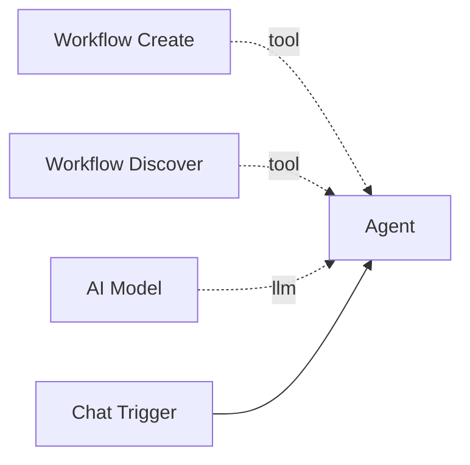

# Workflow Create

The **Workflow Create** tool allows agents to create entire workflows programmatically from a YAML DSL specification. This is a core capability for self-improving agents -- they can design and deploy new workflows without human intervention.

**Component type:** `workflow_create`

## How It Works

The tool accepts a YAML string defining a workflow and compiles it into persisted database objects (workflow, nodes, edges, configurations) in a single transaction. It supports two modes:

- **Create mode** -- define `name`, `trigger`, and `steps` for a new workflow from scratch.
- **Fork mode** -- specify `based_on: <slug>` to clone an existing workflow and apply `patches` (add/remove steps, update prompts, add/remove tools, update config).

### Model Resolution

The DSL compiler supports several strategies for resolving which LLM model to use for agent steps:

| Strategy | DSL Syntax | Description |
|----------|-----------|-------------|
| `inherit` | `model: inherit` | Copy the model from the parent agent that owns this tool |
| `capability` | `model: "gpt-4"` | Find the first LLM credential matching a substring |
| `credential_id` | `model: { credential_id: 5 }` | Direct credential ID pass-through |
| `discover` | `model: discover` | Auto-discover the best model from available credentials |

## Ports

### Outputs

| Port | Type | Description |
|------|------|-------------|
| `result` | `STRING` | JSON with `workflow_id`, `slug`, `node_count`, `edge_count`, or `error` |

### Output Format

```json
{
  "success": true,
  "workflow_id": 15,
  "slug": "weather-pipeline",
  "node_count": 4,
  "edge_count": 3
}
```

## Configuration

This tool has no configurable settings. Model resolution is handled through the DSL syntax.

## Usage

Connect this tool to an agent via the green diamond **tool** handle:



### Tool Signature

```python
workflow_create(dsl: str, tags: str = "") -> str
```

**Parameters:**

| Parameter | Type | Default | Description |
|-----------|------|---------|-------------|
| `dsl` | string | (required) | YAML string defining the workflow |
| `tags` | string | `""` | Optional comma-separated tags to add to the created workflow |

## Example

### Create Mode

An agent creating a simple chat workflow:

```yaml
name: "Customer Support Bot"
trigger: chat
steps:
  - name: support_agent
    type: agent
    prompt: |
      You are a customer support agent. Be helpful and professional.
      Answer questions about our products and services.
    model: inherit
    tools:
      - web_search
      - http
```

The agent invokes:

```
Tool call: workflow_create(
    dsl="name: 'Customer Support Bot'\ntrigger: chat\nsteps:\n  - name: support_agent\n    type: agent\n    prompt: 'You are a customer support agent...'\n    model: inherit\n    tools:\n      - web_search",
    tags="support,customer"
)
Result: {"success": true, "workflow_id": 15, "slug": "customer-support-bot", "node_count": 4, "edge_count": 3}
```

### Fork Mode

Cloning and modifying an existing workflow:

```yaml
based_on: "customer-support-bot"
patches:
  - type: update_prompt
    step: support_agent
    prompt: |
      You are a technical support agent specializing in API issues.
  - type: add_tool
    step: support_agent
    tool: run_command
```

### DSL Step Types

| DSL Type | Component Type | Description |
|----------|---------------|-------------|
| `agent` | `agent` | LLM agent with tools |
| `code` | `code` | Python/Jinja2 code execution |
| `http` | `http_request` | HTTP request |
| `switch` | `switch` | Conditional routing |
| `loop` | `loop` | Array iteration |
| `workflow` | `workflow` | Subworkflow invocation |
| `human` | `human_confirmation` | Human confirmation gate |
| `transform` | `code` | Data transformation (alias for code) |

### DSL Trigger Types

| DSL Trigger | Component Type |
|-------------|---------------|
| `chat` | `trigger_chat` |
| `telegram` | `trigger_telegram` |
| `manual` | `trigger_manual` |
| `none` | `trigger_workflow` |

!!! tip "Discover Before Creating"
    Use [Workflow Discover](workflow-discover.md) first to check if a similar workflow already exists. If a close match is found (score >= 0.50), fork mode is more efficient than creating from scratch.

!!! info "Model Inheritance"
    When using `model: inherit`, the created workflow's agent steps automatically inherit the LLM model and credential from the parent agent that owns the `workflow_create` tool. This is the simplest approach and avoids hardcoding credential IDs.
