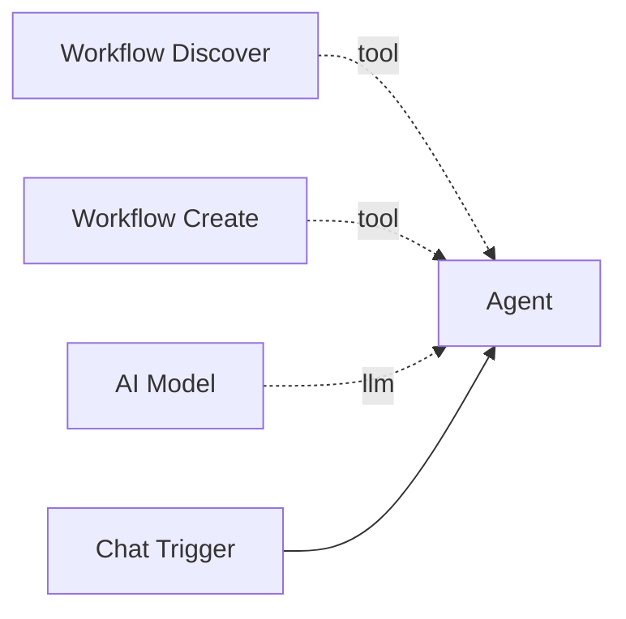

# Workflow Discover

The **Workflow Discover** tool searches existing workflows by requirements and returns scored matches with gap analysis and reuse recommendations. This helps agents avoid creating duplicate workflows and instead reuse or fork existing ones.

**Component type:** `workflow_discover`

## How It Works

The tool queries all active, non-deleted workflows on the platform (excluding the caller's own workflow), scores each one against the provided requirements, and returns the top matches sorted by score. The scoring considers trigger types, node types, tools, tags, and description similarity.

Each match includes a **recommendation** based on its score:

| Score | Recommendation | Meaning |
|-------|---------------|---------|
| >= 0.95 | `reuse` | The workflow already meets your requirements -- use it as-is |
| >= 0.50 | `fork_and_patch` | Close enough to fork and modify via [Workflow Create](workflow-create.md) fork mode |
| < 0.50 | `create_new` | No good match -- create a new workflow from scratch |

Each match also includes a **gap analysis** listing what the existing workflow is missing compared to your requirements (missing triggers, node types, or tools).

## Ports

### Outputs

| Port | Type | Description |
|------|------|-------------|
| `result` | `STRING` | JSON with `matches` (scored results), and `total_searched` |

### Output Format

```json
{
  "success": true,
  "matches": [
    {
      "workflow_id": 12,
      "slug": "data-pipeline",
      "name": "Data Pipeline",
      "description": "Fetches and processes data hourly",
      "score": 0.82,
      "recommendation": "fork_and_patch",
      "capabilities": {
        "triggers": ["trigger_schedule"],
        "node_types": ["agent", "code"],
        "tools": ["http_request", "run_command"]
      },
      "gaps": {
        "triggers": [],
        "node_types": ["switch"],
        "tools": ["web_search"]
      },
      "success_rate": 0.95,
      "execution_count": 47
    }
  ],
  "total_searched": 15
}
```

## Configuration

This tool has no configurable settings.

## Usage

Connect this tool to an agent via the green diamond **tool** handle. It pairs naturally with [Workflow Create](workflow-create.md):



### Tool Signature

```python
workflow_discover(requirements: str, limit: int = 5) -> str
```

**Parameters:**

| Parameter | Type | Default | Description |
|-----------|------|---------|-------------|
| `requirements` | string | (required) | JSON string with search criteria |
| `limit` | int | `5` | Maximum number of results |

### Requirements Format

The `requirements` parameter is a JSON string with optional keys:

```json
{
  "triggers": ["trigger_chat", "trigger_telegram"],
  "node_types": ["agent", "code", "switch"],
  "tools": ["web_search", "run_command"],
  "tags": ["support", "automation"],
  "description": "A workflow that handles customer support queries",
  "model_capability": "gpt-4"
}
```

| Key | Type | Description |
|-----|------|-------------|
| `triggers` | array | Required trigger types |
| `node_types` | array | Required node component types |
| `tools` | array | Required tool component types |
| `tags` | array | Tags to match against |
| `description` | string | Natural language description for similarity matching |
| `model_capability` | string | Required model capability substring |

All keys are optional. Omitted keys are not factored into the score.

## Example

An agent tasked with building a new workflow first checks for existing ones:

```
User: Build me a workflow that monitors a website and sends Telegram alerts.

Agent thinking: Let me check if something similar already exists.

Tool call: workflow_discover(
    requirements='{"triggers": ["trigger_schedule"], "node_types": ["agent"], "tools": ["http_request"], "tags": ["monitoring"], "description": "Monitor a website and send alerts via Telegram"}'
)

Result: {
    "success": true,
    "matches": [
        {
            "slug": "site-monitor",
            "score": 0.72,
            "recommendation": "fork_and_patch",
            "gaps": {"tools": [], "node_types": [], "triggers": []}
        }
    ],
    "total_searched": 8
}

Agent: I found an existing workflow "site-monitor" with a 72% match.
       I'll fork it and add Telegram delivery.
```

The agent then uses `workflow_create` with `based_on: "site-monitor"` and patches to add Telegram notification.

!!! tip "Discover-Then-Create Pattern"
    The recommended pattern is: discover first, then either reuse (score >= 0.95), fork and patch (score >= 0.50), or create new (score < 0.50). This prevents workflow sprawl and promotes reuse of tested, proven workflows.

!!! info "Scoring Includes Execution History"
    The scoring algorithm considers each workflow's historical success rate and execution count. Workflows with a high success rate and many successful executions score higher, as they are more likely to work reliably.
