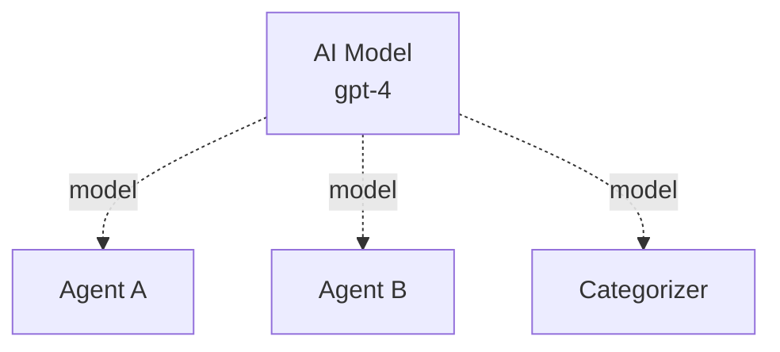
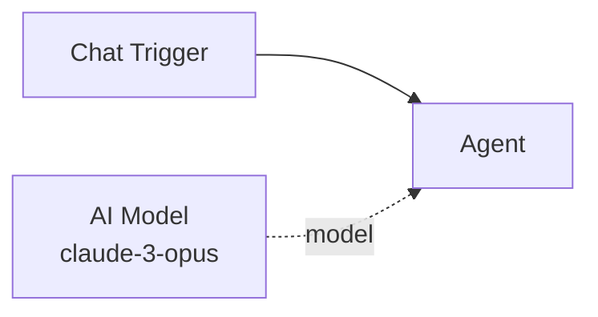

# AI Model

The **AI Model** sub-component provides LLM configuration to AI nodes. It holds the credential (API key) and model name that determine which language model an agent, categorizer, router, or extractor uses.

| Property | Value |
|----------|-------|
| **Component Type** | `ai_model` |
| **Category** | Sub-component |
| **Display Name** | AI Model |
| **Executable** | No (configuration only) |

## Ports

### Inputs

This component has no inputs. It is a source-only node.

### Outputs

| Port | Data Type | Description |
|------|-----------|-------------|
| `model` | OBJECT | LLM configuration object (credential + model name) |

## Configuration

The AI Model node stores its configuration on the `ComponentConfig` record:

| Field | Description |
|-------|-------------|
| `llm_credential` | ID of the LLM provider credential (from the Credentials page) |
| `llm_model` | Model name string (e.g., `gpt-4`, `claude-3-opus`, `llama-3.1-70b`) |

Both fields are **required**. An AI Model node without both values set will cause a build error when any connected AI node attempts to resolve its LLM.

## Usage

1. Add an **AI Model** node from the Node Palette (Sub-components category)
2. Select an LLM credential from the dropdown in the node details panel
3. Select a model name from the available models (populated from the credential's provider)
4. Connect the AI Model to an AI node via the blue diamond **model** handle

### Canvas layout

The AI Model node has a unique handle configuration:

- **Top diamond handle** (source) -- connects upward to AI nodes
- No bottom handles, no left/right circle handles

This means the AI Model always sits below or beside the AI node it serves, with the connection going upward.

### One model per AI node

Each AI node requires exactly one AI Model connection. If multiple AI Model nodes are connected, the behavior depends on which edge the builder encounters first. Best practice is to connect exactly one AI Model per AI node.

### Sharing models

A single AI Model node can be connected to multiple AI nodes on the same canvas. This is useful when you want several agents to use the same LLM:

### LLM resolution

At build time, the `resolve_llm_for_node()` function in `services/llm.py` follows this path:

1. Find the AI Model node connected via an `edge_label="llm"` edge
2. Read the `llm_credential` and `llm_model` from its `ComponentConfig`
3. Load the credential from the database and decrypt the API key
4. Instantiate the appropriate LangChain LLM class (ChatOpenAI, ChatAnthropic, etc.)

## Example

A basic chat workflow with an agent and its model:

The AI Model is configured with:

- **Credential**: `anthropic-prod` (an Anthropic API key from the Credentials page)
- **Model**: `claude-3-opus-20240229`

The Agent automatically uses this model for all LLM calls during execution.

!!! warning "Missing model connection"
    If an AI node does not have an AI Model connected, the workflow will fail at build time with an error indicating that the LLM could not be resolved. Always verify the blue model connection is present before executing.

!!! note "Available models"
    The model name dropdown in the node details panel is populated by calling the credential's provider API (e.g., OpenAI's models endpoint). The available models depend on the provider and your API key's access level.
