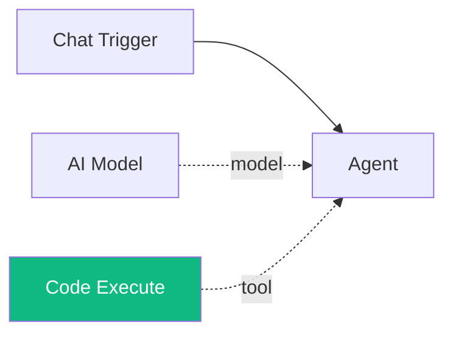

# Code Execute

The **Code Execute** sub-component provides a sandboxed code execution tool to agents. When connected to an agent, the agent's LLM can write and run Python or Bash code in an isolated subprocess with security restrictions and timeout enforcement.

| Property | Value |
|----------|-------|
| **Component Type** | `code_execute` |
| **Category** | Sub-component |
| **Display Name** | Code Execute |
| **Executable** | Yes (runs when invoked by an agent) |

## Ports

### Inputs

This component has no wired inputs. It operates as a LangChain tool that the agent invokes with arguments during its reasoning loop.

### Outputs

| Port | Data Type | Description |
|------|-----------|-------------|
| `result` | STRING | Execution output (stdout, stderr, exit code, and parsed result) |

## Configuration

The Code Execute component accepts the following configuration in `extra_config`:

| Field | Type | Default | Range | Description |
|-------|------|---------|-------|-------------|
| `language` | string | `python` | `python`, `bash` | Default programming language |
| `timeout_seconds` | integer | `30` | 1--300 | Maximum execution time in seconds |
| `sandbox` | boolean | `true` | -- | Enable security restrictions |

## Usage

1. Add a **Code Execute** node from the Node Palette (Sub-components category)
2. Connect it to an agent node via the green diamond **tools** handle
3. Optionally configure the default language, timeout, and sandbox settings in Extra Config

The agent's LLM will then have a `code_execute` tool available. The tool accepts two parameters:

| Parameter | Required | Description |
|-----------|----------|-------------|
| `code` | Yes | Code to execute |
| `language` | No | Override the configured default language (`python` or `bash`) |

### Execution environment

Code runs in a subprocess (not in the Pipelit process):

- **Python** -- written to a temp file in `/tmp` and executed with `python3`
- **Bash** -- written to a temp file in `/tmp` with `#!/bin/bash` and `set -e`, then executed with `/bin/bash`

Both languages run with a working directory of `/tmp`.

### Sandbox mode

When `sandbox` is enabled (the default), two protections are applied:

1. **Security pattern checking** -- code is scanned for forbidden patterns before execution
2. **Environment restriction** -- the subprocess runs with a restricted `PATH` (`/usr/bin:/bin:/usr/local/bin`) and without `HOME` or `USER` environment variables

### Forbidden patterns

The security scanner blocks code containing these patterns:

**Python:**

- `import os`, `from os import`, `import subprocess`, `from subprocess import`
- `import shutil`, `from shutil import`
- `__import__()`, `eval()`, `exec()`, `compile()`
- `open()` targeting `/etc`, `/proc`, `/sys`, `/dev`

**Bash:**

- `rm -rf /`, `rm -rf ~`, `rm -rf $HOME`
- `dd if=... of=/dev/...`, `mkfs.`
- Writes to `/etc/` or `/dev/`
- Piped remote execution (`curl ... | sh`, `wget ... | sh`)
- `chmod 777`, `chmod -R 777`

### Return format

The tool returns a multi-line string with:

```
stdout:
<captured stdout>
stderr:
<captured stderr>
exit_code: 0
result: <JSON-parsed last line, if applicable>
```

If the code times out, the output is: `Execution timed out after N seconds`.

If a security violation is detected, the output is: `Security violation: <details>`.

## Example

An agent with Code Execute can perform computations, data processing, and system queries:

```
User: Calculate the first 20 Fibonacci numbers.
Agent: [calls code_execute(code="a,b=0,1\nfor _ in range(20):\n    print(a)\n    a,b=b,a+b")]
       → stdout:
         0
         1
         1
         2
         3
         5
         8
         13
         ...
         exit_code: 0
Agent: The first 20 Fibonacci numbers are: 0, 1, 1, 2, 3, 5, 8, 13, ...
```



!!! warning "Sandbox limitations"
    The sandbox security patterns are a blocklist, not an allowlist. Determined users may find ways around them. For production deployments, consider running Pipelit in a container or VM to provide OS-level isolation. See [Security](../../concepts/security.md) for recommendations.

!!! note "Code Execute vs. Code node"
    **Code Execute** is a sub-component tool -- it runs in a sandboxed subprocess when an agent decides to use it. The **[Code](../logic/code.md)** node (Logic category) is a direct workflow step that runs inline via `exec()` with full access to the workflow state. Use Code Execute when agents need to run arbitrary code safely; use the Code node for predetermined data transformations in the workflow graph.
