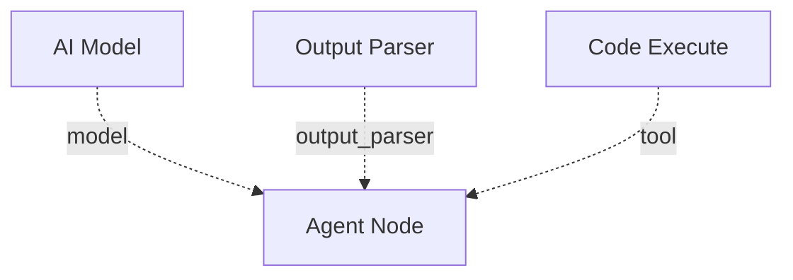

# Sub-Components

Sub-components are configuration and utility nodes that attach to AI nodes via special diamond-shaped handles. They do not appear as standalone steps in the execution flow -- instead, they provide capabilities that AI nodes consume at build time or during their reasoning loop.

## Overview

There are three sub-component types:

| Component | Purpose | Connects Via |
|-----------|---------|--------------|
| [AI Model](ai-model.md) | Provides LLM credential and model selection | Blue diamond handle (`llm`) |
| [Output Parser](output-parser.md) | Parses raw LLM output into structured data | Slate diamond handle (`output_parser`) |
| [Code Execute](code-execute.md) | Executes Python or Bash in a sandboxed subprocess | Green diamond handle (`tool`) |

## How sub-components work

Sub-components connect to AI nodes via the colored diamond handles at the bottom of the node. The connection type determines how the sub-component integrates:

| Handle | Color | Edge Label | Description |
|--------|-------|------------|-------------|
| model | Blue (`#3b82f6`) | `llm` | AI Model provides the LLM configuration |
| output_parser | Slate (`#94a3b8`) | `output_parser` | Output Parser processes raw LLM text |
| tools | Green (`#10b981`) | `tool` | Code Execute provides a tool function |

### AI Model

The **AI Model** node is unique among sub-components:

- It has only a **top** diamond handle (source) -- it connects upward to nodes that need a model
- It is **non-executable** -- it does not run during execution
- It is **required** for all AI nodes (agent, categorizer, router, extractor)

Without an AI Model connected, an AI node cannot resolve which LLM to use and will fail at build time.

### Output Parser

The **Output Parser** takes the raw text output from an AI node and transforms it into structured data (JSON, regex matches, or lists). It is:

- **Non-executable** -- it runs as part of the AI node's post-processing, not as a separate execution step
- Used by **categorizer**, **router**, and **extractor** nodes (not agents)

### Code Execute

The **Code Execute** node provides a sandboxed code execution tool to agents. Unlike the other two sub-components, it is:

- **Executable** -- it runs when the agent's LLM invokes it during the reasoning loop
- Connected via the **tools** handle (green diamond), same as other tool nodes
- A LangChain `@tool` that accepts code and language parameters

## Canvas appearance

Sub-components are visually smaller than regular nodes. AI Model nodes sit below AI nodes and connect upward. Output Parser and Code Execute nodes connect to the bottom handles of their parent AI node.

!!! note "Non-executable nodes"
    AI Model and Output Parser are marked as non-executable in the node type registry. They do not show running/success/failed status badges during execution. Code Execute, as a tool, does show execution status when invoked by an agent.
