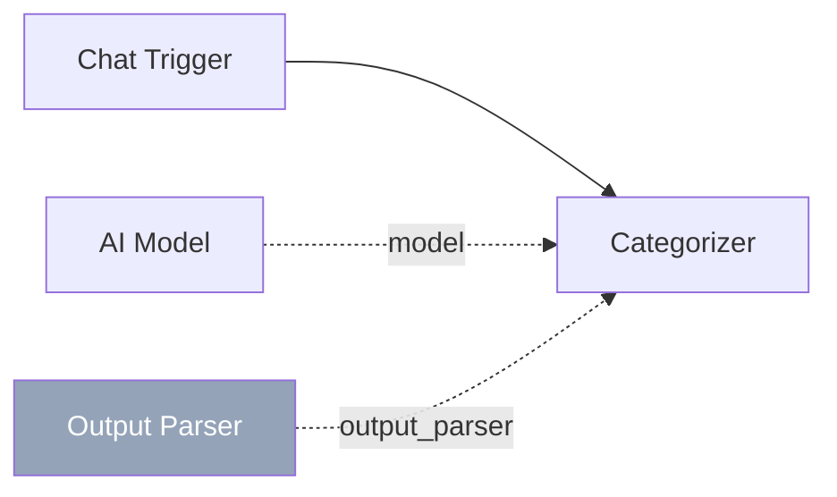

# Output Parser

The **Output Parser** sub-component transforms raw LLM text output into structured data. It supports JSON extraction, regex matching, and list parsing, making it essential for nodes that need to produce machine-readable outputs from natural language responses.

| Property | Value |
|----------|-------|
| **Component Type** | `output_parser` |
| **Category** | Sub-component |
| **Display Name** | Output Parser |
| **Executable** | No (configuration only) |

## Ports

### Inputs

| Port | Data Type | Required | Description |
|------|-----------|----------|-------------|
| `text` | STRING | No | Raw text to parse (typically from an AI node's LLM response) |

### Outputs

| Port | Data Type | Description |
|------|-----------|-------------|
| `parsed` | OBJECT | Structured data extracted from the raw text |

## Configuration

The Output Parser component accepts the following configuration in `extra_config`:

| Field | Type | Default | Description |
|-------|------|---------|-------------|
| `parser_type` | string | `json` | Parsing strategy: `json`, `regex`, or `list` |
| `source_node` | string | -- | Node ID to read raw text from (optional) |
| `pattern` | string | -- | Regex pattern (required when `parser_type` is `regex`) |

### Parser types

#### JSON parser (`json`)

Extracts JSON from the LLM response. Handles two formats:

1. **Direct JSON** -- the entire response is valid JSON
2. **Markdown code blocks** -- JSON wrapped in `` ```json ... ``` `` fences

If neither format is found, the raw text is returned as-is.

#### Regex parser (`regex`)

Applies the configured `pattern` as a Python regular expression to the text and returns all matches via `re.findall()`. If no matches are found, the raw text is returned.

#### List parser (`list`)

Splits the text by newlines and strips common list prefixes (bullets, numbers, dashes). Each non-empty line becomes an element in the output array.

Input:
```
1. First item
2. Second item
- Third item
* Fourth item
```

Output:
```json
["First item", "Second item", "Third item", "Fourth item"]
```

## Usage

1. Add an **Output Parser** node from the Node Palette (Sub-components category)
2. Configure the `parser_type` and any parser-specific settings in Extra Config
3. Connect the Output Parser to an AI node via the slate diamond **output_parser** handle

### Source resolution

The Output Parser reads its input text in this order:

1. If `source_node` is set, reads that node's output from `state.node_outputs`
2. Otherwise, reads the last message's content from the `messages` list in state

### Compatible AI nodes

The Output Parser connects to these AI node types:

| AI Node | Uses Output Parser |
|---------|-------------------|
| Categorizer | Parses the LLM response into a category label |
| Router | Parses the LLM response into a route identifier |
| Extractor | Parses the LLM response into structured data |
| Agent | Not supported (agents use tools, not parsers) |

## Example

A categorizer uses an output parser to extract the category from the LLM's JSON response:



Output Parser Extra Config:

```json
{
  "parser_type": "json"
}
```

If the LLM responds with:

```json
{"category": "technical_support", "confidence": 0.92}
```

The Output Parser produces `{"category": "technical_support", "confidence": 0.92}` as structured data that the Categorizer can use to set its `category` output.

### Regex example

Extract email addresses from LLM output:

```json
{
  "parser_type": "regex",
  "pattern": "[a-zA-Z0-9._%+-]+@[a-zA-Z0-9.-]+\\.[a-zA-Z]{2,}"
}
```

Input: `"Contact us at support@example.com or sales@example.com"`

Output: `["support@example.com", "sales@example.com"]`

!!! note "Graceful fallback"
    If parsing fails (e.g., invalid JSON, no regex matches), the Output Parser returns the raw text rather than raising an error. This ensures the workflow continues even when the LLM produces unexpected output formats.
