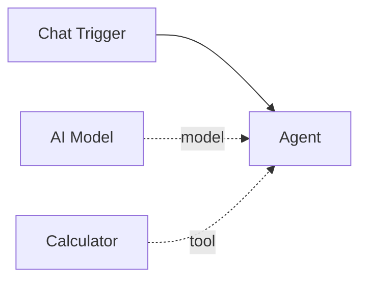

# Calculator

The **Calculator** tool evaluates mathematical expressions safely and returns the numeric result. It gives agents the ability to perform accurate arithmetic without relying on the LLM's inherently unreliable math capabilities.

| Property | Value |
|----------|-------|
| **Component Type** | `calculator` |
| **Category** | Sub-component (Tool) |
| **Display Name** | Calculator |

## Ports

### Inputs

| Port | Data Type | Required | Description |
|------|-----------|----------|-------------|
| `expression` | STRING | No | Mathematical expression to evaluate |

The `expression` input is provided by the agent's LLM at invocation time.

### Outputs

| Port | Data Type | Description |
|------|-----------|-------------|
| `result` | STRING | The numeric result as a string |

## Configuration

The Calculator tool has no configuration options. It works out of the box with no `extra_config` needed.

## Usage

1. Add a **Calculator** node from the Node Palette
2. Connect it to an agent node via the green diamond **tools** handle

The agent's LLM can then call the `calculator` tool with any supported mathematical expression.

### Supported operators

| Operator | Description | Example |
|----------|-------------|---------|
| `+` | Addition | `2 + 3` |
| `-` | Subtraction | `10 - 4` |
| `*` | Multiplication | `6 * 7` |
| `/` | Division | `15 / 4` |
| `//` | Floor division | `15 // 4` |
| `%` | Modulo (remainder) | `17 % 5` |
| `**` | Exponentiation | `2 ** 10` |
| `-` (unary) | Negation | `-5` |
| `+` (unary) | Positive | `+5` |

Parentheses are supported for grouping: `(2 + 3) * 4`.

### Safety

The calculator uses Python's `ast` module to parse expressions into an abstract syntax tree, then evaluates only numeric constants and the operators listed above. It does **not** use `eval()` and cannot execute arbitrary code. Function calls, variable references, string operations, and all other Python syntax are rejected.

## Example

An agent helping with a financial calculation:

```
calculator("(1500 * 12) + (500 * 0.08)")
```

Returns:

```
18040.0
```

A more complex expression:

```
calculator("2 ** 32 - 1")
```

Returns:

```
4294967295
```



!!! tip "When to use Calculator"
    LLMs frequently make arithmetic errors, especially with large numbers, decimals, or multi-step calculations. Connect a Calculator tool whenever your agent needs to perform math -- even simple operations -- to ensure accurate results.

!!! note "Numeric types"
    The calculator handles both integers and floating-point numbers. Division (`/`) always returns a float. Floor division (`//`) returns an integer when both operands are integers.
