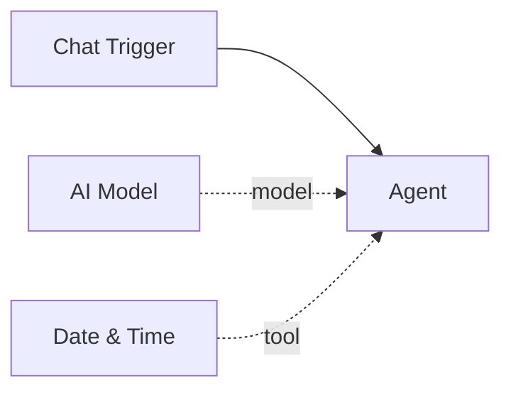

# Date & Time

The **Date & Time** tool returns the current date and time. It gives agents awareness of the current moment, which is essential for time-sensitive tasks, scheduling, logging, and answering questions about "now."

| Property | Value |
|----------|-------|
| **Component Type** | `datetime` |
| **Category** | Sub-component (Tool) |
| **Display Name** | Date & Time |

## Ports

### Inputs

The Date & Time tool has no inputs. It takes no parameters from the agent's LLM -- the tool simply returns the current timestamp when called.

### Outputs

| Port | Data Type | Description |
|------|-----------|-------------|
| `result` | STRING | Current date and time as a formatted string |

The output format is `YYYY-MM-DD HH:MM:SS TZ` (e.g., `2026-02-16 14:30:00 UTC`).

## Configuration

The Date & Time tool accepts the following optional configuration in `extra_config`:

| Field | Type | Default | Description |
|-------|------|---------|-------------|
| `timezone` | string | UTC | IANA timezone name (e.g., `America/New_York`, `Europe/London`, `Asia/Tokyo`) |

### Example extra_config

```json
{
  "timezone": "America/New_York"
}
```

If no timezone is configured, the tool defaults to UTC.

## Usage

1. Add a **Date & Time** node from the Node Palette
2. Connect it to an agent node via the green diamond **tools** handle
3. Optionally set a timezone in the node's Extra Config field

The agent's LLM can then call the `get_datetime` tool with no arguments to get the current time.

## Example

An agent answering "What time is it?":

```
get_datetime()
```

Returns (with default UTC timezone):

```
2026-02-16 14:30:00 UTC
```

With `timezone` set to `Asia/Tokyo`:

```
2026-02-16 23:30:00 JST
```



!!! tip "Why agents need a clock"
    LLMs have no inherent sense of time. Their training data has a cutoff date, and they cannot determine the current moment. Connecting a Date & Time tool is the simplest way to give an agent temporal awareness for tasks like "send a reminder tomorrow" or "what day of the week is it?"

!!! note "Timezone support"
    The tool uses Python's `zoneinfo` module, which supports all [IANA timezone names](https://en.wikipedia.org/wiki/List_of_tz_database_time_zones). Common examples: `US/Eastern`, `Europe/Berlin`, `Asia/Shanghai`, `Pacific/Auckland`.
