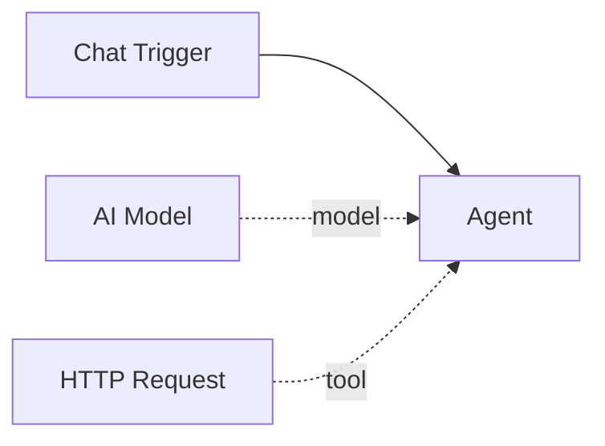

# HTTP Request

The **HTTP Request** tool makes HTTP requests to external URLs and returns the status code and response body. It gives agents the ability to interact with REST APIs, fetch web pages, post data to webhooks, and communicate with any HTTP-accessible service.

| Property | Value |
|----------|-------|
| **Component Type** | `http_request` |
| **Category** | Sub-component (Tool) |
| **Display Name** | HTTP Request |

## Ports

### Inputs

| Port | Data Type | Required | Description |
|------|-----------|----------|-------------|
| `url` | STRING | Yes | The URL to send the request to |

The `url` input is provided by the agent's LLM at invocation time. The agent can also specify `method` and `body` parameters in the tool call.

### Outputs

| Port | Data Type | Description |
|------|-----------|-------------|
| `result` | STRING | HTTP status code and response body |

The output format is `HTTP {status_code}\n{response_body}`.

## Configuration

The HTTP Request tool accepts the following optional configuration in `extra_config`:

| Field | Type | Default | Description |
|-------|------|---------|-------------|
| `method` | string | `"GET"` | Default HTTP method (GET, POST, PUT, DELETE, PATCH, etc.) |
| `headers` | object | `{}` | Default headers to include with every request |
| `timeout` | integer | `30` | Request timeout in seconds |

### Example extra_config

```json
{
  "method": "POST",
  "headers": {
    "Content-Type": "application/json",
    "Authorization": "Bearer sk-..."
  },
  "timeout": 60
}
```

## Usage

1. Add an **HTTP Request** node from the Node Palette
2. Connect it to an agent node via the green diamond **tools** handle
3. Optionally configure default method, headers, and timeout in Extra Config

The agent's LLM can then call the `http_request` tool with the following parameters:

| Parameter | Required | Description |
|-----------|----------|-------------|
| `url` | Yes | Target URL |
| `method` | No | HTTP method (overrides the default from extra_config) |
| `body` | No | Request body content |

### Response handling

- Response bodies longer than 4,000 characters are truncated
- The result always starts with `HTTP {status_code}` followed by the response body
- Network errors and timeouts return `Error: {details}`

## Example

An agent with an HTTP Request tool can fetch data from an API:

```
http_request(url="https://api.github.com/repos/theuselessai/Pipelit")
```

Returns:

```
HTTP 200
{"id":123456,"name":"Pipelit","full_name":"theuselessai/Pipelit",...}
```

A more advanced example with a POST request:

```
http_request(
    url="https://hooks.slack.com/services/T.../B.../xxx",
    method="POST",
    body='{"text": "Workflow completed successfully"}'
)
```



!!! tip "Setting default headers"
    If your agent frequently calls the same API, set the `Authorization` and `Content-Type` headers in extra_config so the LLM does not need to include them in every tool call.

!!! note "HTTP client"
    The tool uses [httpx](https://www.python-httpx.org/) for making requests, which supports HTTP/2, connection pooling, and modern TLS.
